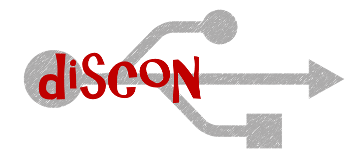
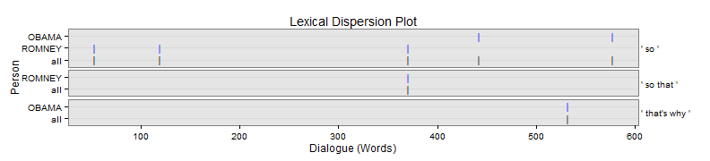
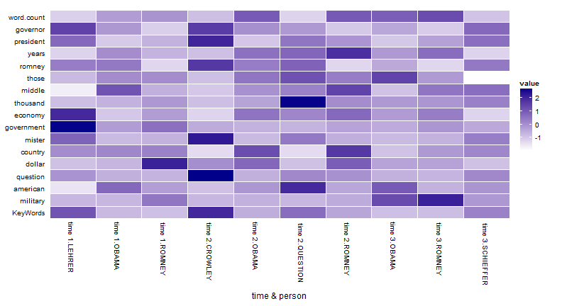
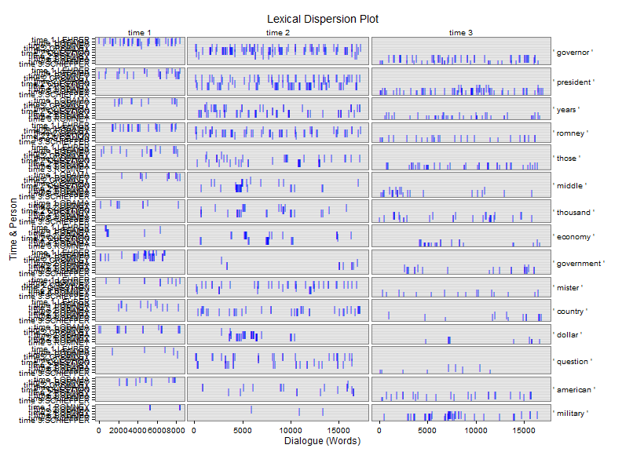

# discon


[](https://travis-ci.org/trinker/discon)
[](https://coveralls.io/r/trinker/discon)
[](http://dx.doi.org/10.5281/zenodo.15611)
<a href="https://img.shields.io/badge/Version-0.1.0-orange.svg"></a></p>


   


[discon](http://trinker.github.com/discon_dev) is a collection of R tools for analysing *discourse connectors* in text.  Discourse connectors are cohesive devices that can be used to help identify themes within a text.  This package provides computational means of extracting various elements from the text that contain discourse connectors.  This can assist in qualitative analysis of discourse by identifying categories that may aide analysis (using the computer for efficiency and data coverage) towards generating themes.

> Discourse connectors are devices used to bridge between turns (in speech) and sentences, indicating the logical relations among the parts of a the logical relations among the parts of a framework for the listener/reader.  There are two major classes of discourse connectors: discourse markers and linking adverbials. Discourse markers &ndash; forms like *ok*, *well*, and *now* &ndash; are restricted primarily to spoken discourse. These forms have distinct discourse functions, but it is difficult to identify the specific meaning of the word itself. In contrast, linking adverbials &ndash; forms like *however*, *thus*, *therefore*, *for example* (*e.g.*), and *that is* (*i.e.*) &ndash; are found in both spoken and written registers, and they have greater inherent meaning than discourse markers. (Biber, 2006, p. 66)

Please see the following resources for additional information:

- Alemany, L. A. (2005). [Representing discourse for automatic text summarization via shallow NLP techniques](http://www.cs.famaf.unc.edu.ar/~laura/shallowdisc4summ/tesi_electronica.pdf) (Unpublished doctoral dissertation). Universitat de Barcelona, Barcelona.     
  - [Web Site](http://russell.famaf.unc.edu.ar/~laura/shallowdisc4summ/discmar)    
- Biber, D. (2006). *University language: A corpus-based study of spoken and written registers*. Amsterdam: John Benjamins Publishing Company.
- Halliday, M. A. K. & Hasan, R. (1976). *Cohesion in English*. English Language Series. London: Longman.
- Kalajahi, S. A. R., Abdullah, A. N., Mukundan, J., & Tannacito, D. J. (2012). [Discourse connectors: An overview of the history, definition and classification of the term](http://goo.gl/eS0OwV) *World Applied Sciences Journal, 19*(11), 1659-1673. 
- Ryan, G. W. & Bernard, H. R. (2003). [Techniques to identify themes](http://goo.gl/KdYxB8). *Field Methods.  15*(1), 85-109. doi:[10.1177/1525822X02239569.](http://fmx.sagepub.com/content/15/1/85)
- Schiffrin, D. (1987). *Discourse markers*. London: Cambridge University Press.      
- Schiffrin, D. (2001). [Discourse markers: Language, meaning, and context](http://goo.gl/KbwG9I). In D. Schiffrin, D., D. Tannen, & H. E. Hamilton, (Eds.) *The handbook of discourse analysis* (pp. 54-75). Malden, MA: Blackwell Publishing.


## Installation

To download the development version of discon:

Download the [zip ball](https://github.com/trinker/discon/zipball/master) or [tar ball](https://github.com/trinker/discon/tarball/master), decompress and run `R CMD INSTALL` on it, or use the **devtools** package to install the development version:

```r
if (!require("pacman")) install.packages("pacman")
pacman::p_load_gh(
    "trinker/qdapRegex", 
    "trinker/qdapTools", 
    "trinker/qdapDictionaries", 
    "trinker/qdap",
    "trinker/discon"
)
```

## Help

- [Web Page](http://trinker.github.com/discon/)     
- [Package PDF Help Manual](https://dl.dropboxusercontent.com/u/61803503/discon.pdf)   

## Contact

You are welcome to:
* submit suggestions and bug-reports at: <https://github.com/trinker/discon/issues>
* send a pull request on: <https://github.com/trinker/discon/>
* compose a friendly e-mail to: <tyler.rinker@gmail.com>

## List of Functions

1. `discourse_connector`
2. `dc_causality` & `dc_causality_sub`
3. `dc_context` & `dc_context_sub`
4. `dc_equality` & `dc_equality_sub`
5. `dc_negator`
6. `dc_revision`
6. `dc_timing`
7. `dc_typology`
8. `kwic` (Key Words in Context)

\****Note*** *that all `discourse_connector` based functions (incuding functions prefixed with `dc_`) have generic `plot` method that utilizes `qdap::dispersion_plot` to generate a lexical dispersion plot.*

## Examples


### Specific Discourse Connector/Connector Functions

Specific discourse connector functions for exploring the context in which such markers are used.  Note these functions are prefixed with a `dc_` (for discourse connector).

<h4 id = "causality" >Causality</h4>


```r
causality_1 <- with(pres_debates2012[1:60, ], dc_causality(dialogue, person))
causality_1[1]
```

```
$counts
  person word.count causality
1  OBAMA        194  3(1.55%)
2 ROMNEY        442   4(.90%)
3 LEHRER         89         0
```

```r
causality_1[2]
```

```
$causality
===================================
Event 1: [lines 5-7]

    LEHRER: And what about the vouchers?

 ** ROMNEY: <<So that>>'s that's number one.

    ROMNEY: Number two is for people coming along that are young,
            what I do to make sure that we can keep Medicare in place
            for them is to allow them either to choose the current
            Medicare program or a private plan. 
 
===================================
Event 2: [lines 9-11]

    ROMNEY: They get to choose and they'll have at least two plans
            that will be entirely at no cost to them.

 ** ROMNEY: <<So>> they don't have to pay additional money, no
            additional dollar six thousand.

    ROMNEY: That's not going to happen. 
 
===================================
Event 3: [lines 23-25]

    ROMNEY: And, by the way the idea came not even from Paul Ryan or
            or Senator Wyden, who's the co author of the bill with
            with Paul Ryan in the Senate, but also it came from Bill
            Bill Clinton's chief of staff.

 ** ROMNEY: This is an idea that's been around a long time, which is
            saying, hey, let's see if we can't get competition into
            the Medicare world <<so that>> people can get the choice
            of different plans at lower cost, better quality.

    ROMNEY: I believe in competition. 
 
===================================
Event 4: [lines 29-31]

    OBAMA:  That's what they do.

 ** OBAMA:  And <<so>> you've got higher administrative costs, plus
            profit on top of that.

    OBAMA:  And if you are going to save any money through what
            Governor Romney's proposing, what has to happen is, is
            that the money has to come from somewhere. 
 
===================================
Event 5: [lines 34-36]

    OBAMA:  And this is the reason why AARP has said that your plan
            would weaken Medicare substantially.

 ** OBAMA:  And <<that's why>> they were supportive of the approach
            that we took.

    OBAMA:  One last point I want to make. 
 
===================================
Event 6: [lines 40-42]

    LEHRER: OK.

 ** OBAMA:  And <<so>>|

    ROMNEY: That's that's a big topic. 
```

```r
plot(causality_1) 
```

 

<h4 id = "causality2" >Causality: Subgroups</h4>


```r
causality_2 <- with(pres_debates2012[100:120, ], dc_causality_sub(dialogue, person))
causality_2[1]
```

```
$counts
  person word.count continuation elaboration
1  OBAMA        315     5(1.59%)     1(.32%)
2 ROMNEY         12            0           0
3 LEHRER         23            0           0
```

```r
causality_2[2]
```

```
$continuation
===================================
Event 1: [lines 10-12]

    OBAMA: You had credit agencies that were stamping these as Aone
           great investments when they weren't.

 ** OBAMA: But you also had banks making money hand over fist,
           churning out products that the bankers themselves didn't
           even understand, <<in order to>> make big profits, but
           knowing that it made the entire system vulnerable.

    OBAMA: So what did we do? 
 
===================================
Event 2: [lines 11-13]

    OBAMA: But you also had banks making money hand over fist,
           churning out products that the bankers themselves didn't
           even understand, in order to make big profits, but knowing
           that it made the entire system vulnerable.

 ** OBAMA: <<So>> what did we do?

    OBAMA: We stepped in and had the toughest reforms on Wall Street
           since the one thousand nine hundred thirtys. 
 
===================================
Event 3: [lines 15-17]

    OBAMA: You can't engage in some of this risky behavior that is
           putting Main Street at risk.

 ** OBAMA: We've going to make sure that you've got to have a living
           will <<so>> <<so>> we can know how you're going to wind
           things down if you make a bad bet <<so>> we don't have
           other taxpayer bailouts.

    OBAMA: In the meantime, by the way, we also made sure that all
           the help that we provided those banks was paid back every
           single dime, with interest. 
 
===================================
Event 4: [lines 20-21]

    OBAMA: But in the past, Governor Romney has said he just want to
           repeal Dodd Frank, roll it back.

 ** OBAMA: And <<so>> the question is: Does anybody out there think
           that the big problem we had is that there was too much
           oversight and regulation of Wall Street? 
```

```r
causality_2[3]
```

```
$elaboration
===================================
Event 1: [lines 7-9]

    OBAMA: Now, it wasn't just on Wall Street.

 ** OBAMA: You had loan officers were that were giving loans and
           mortgages that really shouldn't have been given,
           <<because>> the folks didn't qualify.

    OBAMA: You had people who were borrowing money to buy a house
           that they couldn't afford. 
```

<h4 id="revision">Revision</h4>


```r
revision <- with(pres_debates2012[1:25, ], dc_revision(dialogue, person))
revision[1]
```

```
$counts
  person word.count revision
1 ROMNEY        365  3(.82%)
2 LEHRER         24 1(4.17%)
```

```r
revision[2]
```

```
$revision
===================================
Event 1: [lines 1-3]

    LEHRER: We'll talk about specifically about health care in a
            moment.

 ** LEHRER: <<But>> what do you support the voucher system, Governor?

    ROMNEY: What I support is no change for current retirees and near
            retirees to Medicare. 
 
===================================
Event 2: [lines 17-19]

    ROMNEY: If I don't like them, I can get rid of them and find a
            different insurance company.

 ** ROMNEY: <<But>> people make their own choice.

    ROMNEY: The other thing we have to do to save Medicare? 
 
===================================
Event 3: [lines 19-21]

    ROMNEY: The other thing we have to do to save Medicare?

 ** ROMNEY: We have to have the benefits high for those that are low
            income, <<but>> for higher income people, we're going to
            have to lower some of the benefits.

    ROMNEY: We have to make sure this program is there for the long
            term. 
 
===================================
Event 4: [lines 22-24]

    ROMNEY: That's the plan that I've put forward.

 ** ROMNEY: And, by the way the idea came not even from Paul Ryan or
            or Senator Wyden, who's the co author of the bill with
            with Paul Ryan in the Senate, <<but>> also it came from
            Bill Bill Clinton's chief of staff.

    ROMNEY: This is an idea that's been around a long time, which is
            saying, hey, let's see if we can't get competition into
            the Medicare world so that people can get the choice of
            different plans at lower cost, better quality. 
```

<h4 id="typology">Typology</h4>


```r
typology <- with(pres_debates2012[1:120, ], dc_typology(dialogue, person))
typology[1]
```

```
$counts
  person word.count positive negative
1  OBAMA        510  1(.20%)        0
2 ROMNEY        718  3(.42%)        0
3 LEHRER        203  1(.49%)  1(.49%)
```

```r
typology[2]
```

```
$positive
===================================
Event 1: [lines 41-43]

    OBAMA:  And so|

 ** ROMNEY: That's <<that's a>> big topic.

    ROMNEY: Can we can we stay on Medicare? 
 
===================================
Event 2: [lines 98-100]

    ROMNEY: You need transparency, you need to have leverage limits
            for|

 ** LEHRER: Well, <<here's a>> specific|

    ROMNEY: But let's let's mention let me mention the other one. 
 
===================================
Event 3: [lines 103-105]

    LEHRER: Let's let him respond let's let him respond to this
            specific on Dodd Frank and what the governor just said.

 ** OBAMA:  I think this <<is a>> great example.

    OBAMA:  The reason we have been in such a enormous economic
            crisis was prompted by reckless behavior across the
            board. 
```

```r
typology[3]
```

```
$negative
===================================
Event 1: [lines 66-68]

    LEHRER: Beginning with you.

 ** LEHRER: This <<is not a>> new two minute segment to start.

    LEHRER: And we'll go for a few minutes, and then we're going to
            go to health care, OK? 
```

### Generalizable Discourse Connector Function

We will now examine `discourse_connector`, the basic root function that all of the other `dc_` prefixed functions are based upon.  This can be used by the researcher to find specific *text elements* + *surrounding context*.


```r
## Marker with one type (just: "I")
with(pres_debates2012[1:15, ], discourse_connector(dialogue, person,
    names = c("I"),
    regex = "\\bI('[a-z]+)*\\b",
    terms = list(I = c(" I ", " I'"))
))
```

```
$counts
  person word.count        I
1 ROMNEY        190 6(3.16%)
2 LEHRER         24        0

$I
===================================
Event 1: [lines 2-4]

    LEHRER: But what do you support the voucher system, Governor?

 ** ROMNEY: What <<I>> support is no change for current retirees and
            near retirees to Medicare.

    ROMNEY: And the president supports taking dollar seven hundred
            sixteen billion out of that program. 
 
===================================
Event 2: [lines 6-8]

    ROMNEY: So that's that's number one.

 ** ROMNEY: Number two is for people coming along that are young,
            what <<I>> do to make sure that we can keep Medicare in
            place for them is to allow them either to choose the
            current Medicare program or a private plan.

    ROMNEY: Their choice. 
 
===================================
Event 3: [lines 13-15]

    ROMNEY: And by the way, if the government can be as efficient as
            the private sector and offer premiums that are as low as
            the private sector, people will be happy to get
            traditional Medicare or they'll be able to get a private
            plan.

 ** ROMNEY: <<I>> know my own view is <<I'd>> rather have a private
            plan.

    ROMNEY: I'd just assume not have the government telling me what
            kind of health care I get. 
 
===================================
Event 4: [lines 14-15]

    ROMNEY: I know my own view is I'd rather have a private plan.

 ** ROMNEY: <<I'd>> just assume not have the government telling me
            what kind of health care <<I>> get. 
```

```r
## Marker with two types (both: "I" & "you")
with(pres_debates2012[1:15, ], discourse_connector(dialogue, person,
    names = c("I", "you"),
    regex =  list(
        I = "I('[a-z]+)*\\b",
        you = "(\\b[Yy]ou('[a-z]+)*\\b)"
    ),
    terms = list(
        I = c(" I ", " I'"),
        you = c(" you ", " you'")
    )
))
```

```
$counts
  person word.count        I      you
1 ROMNEY        190 6(3.16%)        0
2 LEHRER         24        0 1(4.17%)

$I
===================================
Event 1: [lines 2-4]

    LEHRER: But what do you support the voucher system, Governor?

 ** ROMNEY: What <<I>> support is no change for current retirees and
            near retirees to Medicare.

    ROMNEY: And the president supports taking dollar seven hundred
            sixteen billion out of that program. 
 
===================================
Event 2: [lines 6-8]

    ROMNEY: So that's that's number one.

 ** ROMNEY: Number two is for people coming along that are young,
            what <<I>> do to make sure that we can keep Medicare in
            place for them is to allow them either to choose the
            current Medicare program or a private plan.

    ROMNEY: Their choice. 
 
===================================
Event 3: [lines 13-15]

    ROMNEY: And by the way, if the government can be as efficient as
            the private sector and offer premiums that are as low as
            the private sector, people will be happy to get
            traditional Medicare or they'll be able to get a private
            plan.

 ** ROMNEY: <<I>> know my own view is <<I'd>> rather have a private
            plan.

    ROMNEY: I'd just assume not have the government telling me what
            kind of health care I get. 
 
===================================
Event 4: [lines 14-15]

    ROMNEY: I know my own view is I'd rather have a private plan.

 ** ROMNEY: <<I'd>> just assume not have the government telling me
            what kind of health care <<I>> get. 

$you
===================================
Event 1: [lines 1-3]

    LEHRER: We'll talk about specifically about health care in a
            moment.

 ** LEHRER: But what do <<you>> support the voucher system, Governor?

    ROMNEY: What I support is no change for current retirees and near
            retirees to Medicare. 
```

### Key Words in Context


```r
keyWords <- with(pres_debates2012, kwic(dialogue, list(time, person)))
plot(keyWords[[1]], high = "red")
```

 


```r
plot(keyWords, rm.vars = pres_debates2012[["time"]], total.color = NULL)
```

 

```r
head(keyWords[[2]])
```

```
===================================
Event 1: [lines 3-5]

    time 1.ROMNEY: What I support is no change for current retirees
                   and near retirees to Medicare.

 ** time 1.ROMNEY: And the <<president>> supports taking <<dollar>>
                   seven hundred sixteen billion out of that program.

    time 1.LEHRER: And what about the vouchers? 
 
===================================
Event 2: [lines 9-11]

    time 1.ROMNEY: They get to choose and they'll have at least two
                   plans that will be entirely at no cost to them.

 ** time 1.ROMNEY: So they don't have to pay additional money, no
                   additional <<dollar>> six <<thousand>>.

    time 1.ROMNEY: That's not going to happen. 
```


