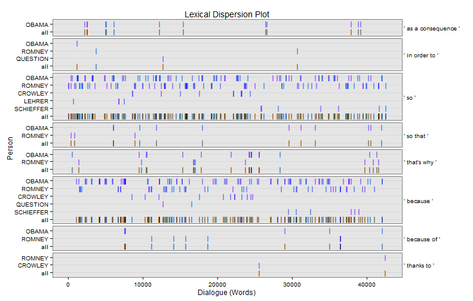

# discon


[](https://travis-ci.org/trinker/discon)
[](https://coveralls.io/r/trinker/discon)
[](http://dx.doi.org/10.5281/zenodo.15611)
<a href="https://img.shields.io/badge/Version-0.1.0-orange.svg"></a></p>


   


[discon](http://trinker.github.com/discon_dev) is a collection of R tools for analysing *discourse connectors* in text.  Discourse connectors are cohesive devices that can be used to help identify themes within a text.  This package provides computational means of extracting various elements from the text that contain discourse connectors.  This can assist in qualitative analysis of discourse by identifying categories that may aide analysis (using the computer for efficiency and data coverage) towards generating themes.

> Discourse connectors are devices used to bridge between turns (in speech) and sentences, indicating the logical relations among the parts of a the logical relations among the parts of a framework for the listener/reader.  There are two major classes of discourse connectors: discourse markers and linking adverbials. Discourse markers &ndash; forms like *ok*, *well*, and *now* &ndash; are restricted primarily to spoken discourse. These forms have distinct discourse functions, but it is difficult to identify the specific meaning of the word itself. In contrast, linking adverbials &ndash; forms like *however*, *thus*, *therefore*, *for example* (*e.g.*), and *that is* (*i.e.*) &ndash; are found in both spoken and written registers, and they have greater inherent meaning than discourse markers. (Biber, 2006, p. 66)

Please see the following resources for additional information:

- Alemany, L. A. (2005). [Representing discourse for automatic text summarization via shallow NLP techniques](http://www.cs.famaf.unc.edu.ar/~laura/shallowdisc4summ/tesi_electronica.pdf) (Unpublished doctoral dissertation). Universitat de Barcelona, Barcelona.     
  - [Web Site](http://russell.famaf.unc.edu.ar/~laura/shallowdisc4summ/discmar)    
- Biber, D. (2006). *University language: A corpus-based study of spoken and written registers*. Amsterdam: John Benjamins Publishing Company.
- Halliday, M. A. K. & Hasan, R. (1976). *Cohesion in English*. English Language Series. London: Longman.
- Kalajahi, S. A. R., Abdullah, A. N., Mukundan, J., & Tannacito, D. J. (2012). [Discourse connectors: An overview of the history, definition and classification of the term](http://goo.gl/eS0OwV). *World Applied Sciences Journal, 19*(11), 1659-1673. 
- Linguistic Data Consortium. (2004) [*Simple metadata annotation specification (MDE)*](http://www.itl.nist.gov/iad/mig/tests/rt/2004-fall/docs/SimpleMDE_V6.2-draft.pdf). University of Pennsylvania.  Retrieved from [http://www.itl.nist.gov/iad/mig/tests/rt/2004-fall/docs/SimpleMDE_V6.2-draft.pdf](http://www.itl.nist.gov/iad/mig/tests/rt/2004-fall/docs/SimpleMDE_V6.2-draft.pdf)
- Ryan, G. W. & Bernard, H. R. (2003). [Techniques to identify themes](http://goo.gl/KdYxB8). *Field Methods.  15*(1), 85-109. doi:[10.1177/1525822X02239569.](http://fmx.sagepub.com/content/15/1/85)
- Schiffrin, D. (1987). *Discourse markers*. London: Cambridge University Press.      
- Schiffrin, D. (2001). [Discourse markers: Language, meaning, and context](http://goo.gl/KbwG9I). In D. Schiffrin, D., D. Tannen, & H. E. Hamilton, (Eds.) *The handbook of discourse analysis* (pp. 54-75). Malden, MA: Blackwell Publishing.
- Ward, N. (2000, October). [Issues in the Transcription of English Conversational Grunts](http://www.aclweb.org/anthology/W00-1004). *Proceedings of the 1st SIGdial Workshop on Discourse and Dialogue* (pp. 29&mdash;35). Hong Kong: Association for Computational Linguistics.  Retrieved from [http://www.aclweb.org/anthology/W00-1004](http://www.aclweb.org/anthology/W00-1004)


## Installation

To download the development version of discon:

Download the [zip ball](https://github.com/trinker/discon/zipball/master) or [tar ball](https://github.com/trinker/discon/tarball/master), decompress and run `R CMD INSTALL` on it, or use the **devtools** package to install the development version:

```r
if (!require("pacman")) install.packages("pacman")
pacman::p_load_gh(
    "trinker/qdapRegex", 
    "trinker/qdapTools", 
    "trinker/qdapDictionaries", 
    "trinker/qdap",
    "trinker/discon"
)
```

## Help

- [Web Page](http://trinker.github.com/discon/)     
- [Package PDF Help Manual](https://dl.dropboxusercontent.com/u/61803503/discon.pdf)   

## Contact

You are welcome to:
* submit suggestions and bug-reports at: <https://github.com/trinker/discon/issues>
* send a pull request on: <https://github.com/trinker/discon/>
* compose a friendly e-mail to: <tyler.rinker@gmail.com>

## List of Functions

1. `discourse_connector`
2. `dc_causality` & `dc_causality_sub`
3. `dc_comparison` 
4. `dc_context` & `dc_context_sub`
5. `dc_equality` & `dc_equality_sub`
6. `dc_filled_pause`
7. `dc_negator`
8. `dc_oh`
9. `dc_revision`
10. `dc_timing`
11. `dc_typology`
12. `kwic` (Key Words in Context)

\****Note*** *that all `discourse_connector` based functions (incuding functions prefixed with `dc_`) have generic `plot` method that utilizes `qdap::dispersion_plot` to generate a lexical dispersion plot.*

## Examples


```
## Loading required package: pacman
```

### Specific Discourse Connector/Connector Functions

Specific discourse connector functions for exploring the context in which such markers are used.  Note these functions are prefixed with a `dc_` (for discourse connector).

<h4 id = "causality" >Causality</h4>


```r
causality_1 <- with(pres_debates2012, dc_causality(dialogue, person))
plot(causality_1)
```

 


```r
plot(causality_1[[1]], high = "darkgreen")
```

 

```r
causality_1[1]
```

```
$counts
     person word.count  causality
1     OBAMA      18317 220(1.20%)
2    ROMNEY      19923  148(.74%)
3   CROWLEY       1670  24(1.44%)
4    LEHRER        765    4(.52%)
5  QUESTION        583    3(.51%)
6 SCHIEFFER       1445   13(.90%)
```

```r
head(causality_1[[2]])
```

```
===================================
Event 1: [lines 5-7]

    LEHRER: And what about the vouchers?

 ** ROMNEY: <<So that>>'s that's number one.

    ROMNEY: Number two is for people coming along that are young,
            what I do to make sure that we can keep Medicare in place
            for them is to allow them either to choose the current
            Medicare program or a private plan. 
 
===================================
Event 2: [lines 9-11]

    ROMNEY: They get to choose and they'll have at least two plans
            that will be entirely at no cost to them.

 ** ROMNEY: <<So>> they don't have to pay additional money, no
            additional dollar six thousand.

    ROMNEY: That's not going to happen. 
```

<h4 id = "causality2" >Causality: Subgroups</h4>


```r
causality_2 <- with(pres_debates2012, dc_causality_sub(dialogue, person))
plot(causality_2, bg.color = "grey60", color = "blue", 
    total.color = "grey40", horiz.color="grey20")
```

 

```r
causality_2[1]
```

```
$counts
     person word.count continuation elaboration
1     OBAMA      18317    127(.69%)    93(.51%)
2    ROMNEY      19923     93(.47%)    55(.28%)
3   CROWLEY       1670     11(.66%)    13(.78%)
4    LEHRER        765      4(.52%)           0
5  QUESTION        583      1(.17%)     2(.34%)
6 SCHIEFFER       1445      7(.48%)     6(.42%)
```

```r
head(causality_2[[2]])
```

```
===================================
Event 1: [lines 5-7]

    LEHRER: And what about the vouchers?

 ** ROMNEY: <<So that>>'s that's number one.

    ROMNEY: Number two is for people coming along that are young,
            what I do to make sure that we can keep Medicare in place
            for them is to allow them either to choose the current
            Medicare program or a private plan. 
 
===================================
Event 2: [lines 9-11]

    ROMNEY: They get to choose and they'll have at least two plans
            that will be entirely at no cost to them.

 ** ROMNEY: <<So>> they don't have to pay additional money, no
            additional dollar six thousand.

    ROMNEY: That's not going to happen. 
```

```r
head(causality_2[[3]])
```

```
===================================
Event 1: [lines 106-108]

    OBAMA: Now, it wasn't just on Wall Street.

 ** OBAMA: You had loan officers were that were giving loans and
           mortgages that really shouldn't have been given,
           <<because>> the folks didn't qualify.

    OBAMA: You had people who were borrowing money to buy a house
           that they couldn't afford. 
 
===================================
Event 2: [lines 120-122]

    OBAMA: And so the question is: Does anybody out there think that
           the big problem we had is that there was too much
           oversight and regulation of Wall Street?

 ** OBAMA: <<Because>> if you do, then Governor Romney is your
           candidate.

    OBAMA: But that's not what I believe. 
```

<h4 id="revision">Revision</h4>


```r
revision <- with(pres_debates2012[1:20, ], dc_revision(dialogue, person))
revision[1]
```

```
$counts
  person word.count revision
1 ROMNEY        260  2(.77%)
2 LEHRER         24 1(4.17%)
```

```r
revision[2]
```

```
$revision
===================================
Event 1: [lines 1-3]

    LEHRER: We'll talk about specifically about health care in a
            moment.

 ** LEHRER: <<But>> what do you support the voucher system, Governor?

    ROMNEY: What I support is no change for current retirees and near
            retirees to Medicare. 
 
===================================
Event 2: [lines 17-19]

    ROMNEY: If I don't like them, I can get rid of them and find a
            different insurance company.

 ** ROMNEY: <<But>> people make their own choice.

    ROMNEY: The other thing we have to do to save Medicare? 
 
===================================
Event 3: [lines 19-20]

    ROMNEY: The other thing we have to do to save Medicare?

 ** ROMNEY: We have to have the benefits high for those that are low
            income, <<but>> for higher income people, we're going to
            have to lower some of the benefits. 
```

<h4 id="typology">Typology</h4>


```r
typology <- with(pres_debates2012[1:120, ], dc_typology(dialogue, person))
typology[1]
```

```
$counts
  person word.count positive negative
1  OBAMA        510  1(.20%)        0
2 ROMNEY        718  3(.42%)        0
3 LEHRER        203  1(.49%)  1(.49%)
```

```r
typology[2]
```

```
$positive
===================================
Event 1: [lines 41-43]

    OBAMA:  And so|

 ** ROMNEY: That's <<that's a>> big topic.

    ROMNEY: Can we can we stay on Medicare? 
 
===================================
Event 2: [lines 98-100]

    ROMNEY: You need transparency, you need to have leverage limits
            for|

 ** LEHRER: Well, <<here's a>> specific|

    ROMNEY: But let's let's mention let me mention the other one. 
 
===================================
Event 3: [lines 103-105]

    LEHRER: Let's let him respond let's let him respond to this
            specific on Dodd Frank and what the governor just said.

 ** OBAMA:  I think this <<is a>> great example.

    OBAMA:  The reason we have been in such a enormous economic
            crisis was prompted by reckless behavior across the
            board. 
```

```r
typology[3]
```

```
$negative
===================================
Event 1: [lines 66-68]

    LEHRER: Beginning with you.

 ** LEHRER: This <<is not a>> new two minute segment to start.

    LEHRER: And we'll go for a few minutes, and then we're going to
            go to health care, OK? 
```

### Generalizable Discourse Connector Function

We will now examine `discourse_connector`, the basic root function that all of the other `dc_` prefixed functions are based upon.  This can be used by the researcher to find specific *text elements* + *surrounding context*.


```r
## Marker with one type (just: "I")
i_disc <- with(pres_debates2012, discourse_connector(dialogue, person,
    names = c("I"),
    regex = "\\bI('[a-z]+)*\\b",
    terms = list(I = c(" I ", " I'"))
))
i_disc[[1]]
```

```
     person word.count          I
1     OBAMA      18317 330(1.80%)
2    ROMNEY      19923 505(2.53%)
3   CROWLEY       1670  49(2.93%)
4    LEHRER        765   9(1.18%)
5  QUESTION        583  18(3.09%)
6 SCHIEFFER       1445  25(1.73%)
```

```r
head(i_disc[[2]])
```

```
===================================
Event 1: [lines 2-4]

    LEHRER: But what do you support the voucher system, Governor?

 ** ROMNEY: What <<I>> support is no change for current retirees and
            near retirees to Medicare.

    ROMNEY: And the president supports taking dollar seven hundred
            sixteen billion out of that program. 
 
===================================
Event 2: [lines 6-8]

    ROMNEY: So that's that's number one.

 ** ROMNEY: Number two is for people coming along that are young,
            what <<I>> do to make sure that we can keep Medicare in
            place for them is to allow them either to choose the
            current Medicare program or a private plan.

    ROMNEY: Their choice. 
```

```r
## Marker with two types (both: "I" & "you")
i_you_disc <- with(pres_debates2012, discourse_connector(dialogue, person,
    names = c("I", "you"),
    regex =  list(
        I = "I('[a-z]+)*\\b",
        you = "(\\b[Yy]ou('[a-z]+)*\\b)"
    ),
    terms = list(
        I = c(" I ", " I'"),
        you = c(" you ", " you'")
    )
))
i_you_disc[[1]]
```

```
     person word.count          I        you
1     OBAMA      18317 330(1.80%) 252(1.38%)
2    ROMNEY      19923 505(2.53%) 227(1.14%)
3   CROWLEY       1670  49(2.93%)  73(4.37%)
4    LEHRER        765   9(1.18%)  36(4.71%)
5  QUESTION        583  18(3.09%)  22(3.77%)
6 SCHIEFFER       1445  25(1.73%)  61(4.22%)
```

```r
head(i_you_disc[[2]])
```

```
===================================
Event 1: [lines 2-4]

    LEHRER: But what do you support the voucher system, Governor?

 ** ROMNEY: What <<I>> support is no change for current retirees and
            near retirees to Medicare.

    ROMNEY: And the president supports taking dollar seven hundred
            sixteen billion out of that program. 
 
===================================
Event 2: [lines 6-8]

    ROMNEY: So that's that's number one.

 ** ROMNEY: Number two is for people coming along that are young,
            what <<I>> do to make sure that we can keep Medicare in
            place for them is to allow them either to choose the
            current Medicare program or a private plan.

    ROMNEY: Their choice. 
```

```r
head(i_you_disc[[3]])
```

```
===================================
Event 1: [lines 1-3]

    LEHRER: We'll talk about specifically about health care in a
            moment.

 ** LEHRER: But what do <<you>> support the voucher system, Governor?

    ROMNEY: What I support is no change for current retirees and near
            retirees to Medicare. 
 
===================================
Event 2: [lines 29-31]

    OBAMA:  That's what they do.

 ** OBAMA:  And so <<you've>> got higher administrative costs, plus
            profit on top of that.

    OBAMA:  And if you are going to save any money through what
            Governor Romney's proposing, what has to happen is, is
            that the money has to come from somewhere. 
```

### Key Words in Context


```r
keyWords <- with(pres_debates2012, kwic(dialogue, list(time, person)))
plot(keyWords[[1]], high = "red")
```

 


```r
with(pres_debates2012, plot(keyWords, grouping.var = person, rm.vars = time, 
    total.color = NULL, bg.color = "black", color = "yellow", 
    horiz.color="grey20"))
```

 

```r
head(keyWords[[2]])
```

```
===================================
Event 1: [lines 3-5]

    time 1.ROMNEY: What I support is no change for current retirees
                   and near retirees to Medicare.

 ** time 1.ROMNEY: And the <<president>> supports taking <<dollar>>
                   seven hundred sixteen billion out of that program.

    time 1.LEHRER: And what about the vouchers? 
 
===================================
Event 2: [lines 9-11]

    time 1.ROMNEY: They get to choose and they'll have at least two
                   plans that will be entirely at no cost to them.

 ** time 1.ROMNEY: So they don't have to pay additional money, no
                   additional <<dollar>> six <<thousand>>.

    time 1.ROMNEY: That's not going to happen. 
```


