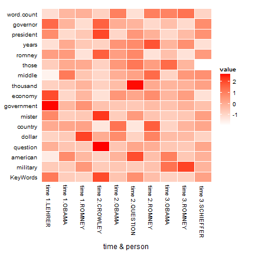
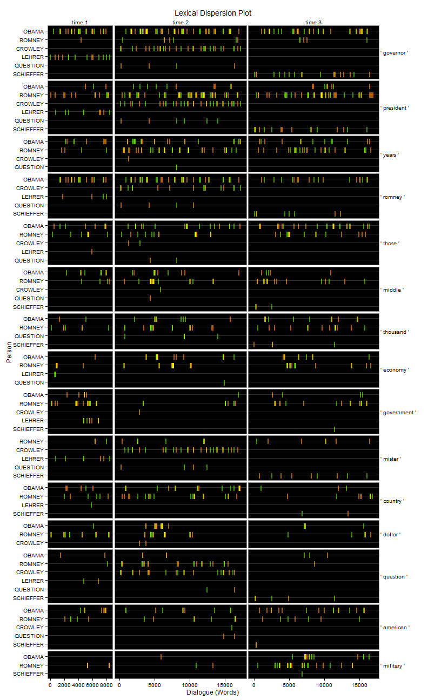

# discon


[](https://travis-ci.org/trinker/discon)
[](https://coveralls.io/r/trinker/discon)
[](http://dx.doi.org/10.5281/zenodo.15611)
<a href="https://img.shields.io/badge/Version-0.1.0-orange.svg"></a></p>


   


[discon](http://trinker.github.com/discon_dev) is a collection of R tools for analysing *discourse connectors* in text.  Discourse connectors are cohesive devices that can be used to help identify themes within a text.  This package provides computational means of extracting various elements from the text that contain discourse connectors.  This can assist in qualitative analysis of discourse by identifying categories that may aide analysis (using the computer for efficiency and data coverage) towards generating themes.

> Discourse connectors are devices used to bridge between turns (in speech) and sentences, indicating the logical relations among the parts of a the logical relations among the parts of a framework for the listener/reader.  There are two major classes of discourse connectors: discourse markers and linking adverbials. Discourse markers &ndash; forms like *ok*, *well*, and *now* &ndash; are restricted primarily to spoken discourse. These forms have distinct discourse functions, but it is difficult to identify the specific meaning of the word itself. In contrast, linking adverbials &ndash; forms like *however*, *thus*, *therefore*, *for example* (*e.g.*), and *that is* (*i.e.*) &ndash; are found in both spoken and written registers, and they have greater inherent meaning than discourse markers. (Biber, 2006, p. 66)

Please see the following resources for additional information:

- Alemany, L. A. (2005). [Representing discourse for automatic text summarization via shallow NLP techniques](http://www.cs.famaf.unc.edu.ar/~laura/shallowdisc4summ/tesi_electronica.pdf) (Unpublished doctoral dissertation). Universitat de Barcelona, Barcelona.     
  - [Web Site](http://russell.famaf.unc.edu.ar/~laura/shallowdisc4summ/discmar)    
- Biber, D. (2006). *University language: A corpus-based study of spoken and written registers*. Amsterdam: John Benjamins Publishing Company.
- Halliday, M. A. K. & Hasan, R. (1976). *Cohesion in English*. English Language Series. London: Longman.
- Kalajahi, S. A. R., Abdullah, A. N., Mukundan, J., & Tannacito, D. J. (2012). [Discourse connectors: An overview of the history, definition and classification of the term](http://goo.gl/eS0OwV). *World Applied Sciences Journal, 19*(11), 1659-1673. 
- Ryan, G. W. & Bernard, H. R. (2003). [Techniques to identify themes](http://goo.gl/KdYxB8). *Field Methods.  15*(1), 85-109. doi:[10.1177/1525822X02239569.](http://fmx.sagepub.com/content/15/1/85)
- Schiffrin, D. (1987). *Discourse markers*. London: Cambridge University Press.      
- Schiffrin, D. (2001). [Discourse markers: Language, meaning, and context](http://goo.gl/KbwG9I). In D. Schiffrin, D., D. Tannen, & H. E. Hamilton, (Eds.) *The handbook of discourse analysis* (pp. 54-75). Malden, MA: Blackwell Publishing.


## Installation

To download the development version of discon:

Download the [zip ball](https://github.com/trinker/discon/zipball/master) or [tar ball](https://github.com/trinker/discon/tarball/master), decompress and run `R CMD INSTALL` on it, or use the **devtools** package to install the development version:

```r
if (!require("pacman")) install.packages("pacman")
pacman::p_load_gh(
    "trinker/qdapRegex", 
    "trinker/qdapTools", 
    "trinker/qdapDictionaries", 
    "trinker/qdap",
    "trinker/discon"
)
```

## Help

- [Web Page](http://trinker.github.com/discon/)     
- [Package PDF Help Manual](https://dl.dropboxusercontent.com/u/61803503/discon.pdf)   

## Contact

You are welcome to:
* submit suggestions and bug-reports at: <https://github.com/trinker/discon/issues>
* send a pull request on: <https://github.com/trinker/discon/>
* compose a friendly e-mail to: <tyler.rinker@gmail.com>

## List of Functions

1. `discourse_connector`
2. `dc_causality` & `dc_causality_sub`
3. `dc_comparison` 
4. `dc_context` & `dc_context_sub`
5. `dc_equality` & `dc_equality_sub`
6. `dc_negator`
7. `dc_revision`
8. `dc_timing`
9. `dc_typology`
10. `kwic` (Key Words in Context)

\****Note*** *that all `discourse_connector` based functions (incuding functions prefixed with `dc_`) have generic `plot` method that utilizes `qdap::dispersion_plot` to generate a lexical dispersion plot.*

## Examples


### Specific Discourse Connector/Connector Functions

Specific discourse connector functions for exploring the context in which such markers are used.  Note these functions are prefixed with a `dc_` (for discourse connector).

<h4 id = "causality" >Causality</h4>


```r
causality_1 <- with(pres_debates2012, dc_causality(dialogue, person))
plot(causality_1)
```

 


```r
plot(causality_1[[1]], high = "darkgreen")
```

 

```r
causality_1[1]
```

```
$counts
     person word.count  causality
1     OBAMA      18317 220(1.20%)
2    ROMNEY      19923  148(.74%)
3   CROWLEY       1670  24(1.44%)
4    LEHRER        765    4(.52%)
5  QUESTION        583    3(.51%)
6 SCHIEFFER       1445   13(.90%)
```

```r
head(causality_1[2])
```

```
$causality
===================================
Event 1: [lines 5-7]

    LEHRER:    And what about the vouchers?

 ** ROMNEY:    <<So that>>'s that's number one.

    ROMNEY:    Number two is for people coming along that are young,
               what I do to make sure that we can keep Medicare in
               place for them is to allow them either to choose the
               current Medicare program or a private plan. 
 
===================================
Event 2: [lines 9-11]

    ROMNEY:    They get to choose and they'll have at least two plans
               that will be entirely at no cost to them.

 ** ROMNEY:    <<So>> they don't have to pay additional money, no
               additional dollar six thousand.

    ROMNEY:    That's not going to happen. 
 
===================================
Event 3: [lines 23-25]

    ROMNEY:    And, by the way the idea came not even from Paul Ryan
               or or Senator Wyden, who's the co author of the bill
               with with Paul Ryan in the Senate, but also it came
               from Bill Bill Clinton's chief of staff.

 ** ROMNEY:    This is an idea that's been around a long time, which
               is saying, hey, let's see if we can't get competition
               into the Medicare world <<so that>> people can get the
               choice of different plans at lower cost, better
               quality.

    ROMNEY:    I believe in competition. 
 
===================================
Event 4: [lines 29-31]

    OBAMA:     That's what they do.

 ** OBAMA:     And <<so>> you've got higher administrative costs,
               plus profit on top of that.

    OBAMA:     And if you are going to save any money through what
               Governor Romney's proposing, what has to happen is, is
               that the money has to come from somewhere. 
 
===================================
Event 5: [lines 34-36]

    OBAMA:     And this is the reason why AARP has said that your
               plan would weaken Medicare substantially.

 ** OBAMA:     And <<that's why>> they were supportive of the
               approach that we took.

    OBAMA:     One last point I want to make. 
 
===================================
Event 6: [lines 40-42]

    LEHRER:    OK.

 ** OBAMA:     And <<so>>|

    ROMNEY:    That's that's a big topic. 
 
===================================
Event 7: [lines 62-64]

    LEHRER:    All right.

 ** LEHRER:    <<So>> to finish quickly, briefly, on the economy,
               what is your view about the level of federal
               regulation of the economy right now?

    LEHRER:    Is there too much? 
 
===================================
Event 8: [lines 73-75]

    ROMNEY:    You couldn't have people opening up banks in their in
               their garage and making loans.

 ** ROMNEY:    I mean, you have to have regulations <<so that>> you
               can have an economy work.

    ROMNEY:    Every free economy has good regulation. 
 
===================================
Event 9: [lines 89-91]

    ROMNEY:    There've been one hundred twenty two community and
               small banks have closed since Dodd Frank.

 ** ROMNEY:    <<So>> there's one example.

    ROMNEY:    Here's another. 
 
===================================
Event 10: [lines 106-108]

    OBAMA:     Now, it wasn't just on Wall Street.

 ** OBAMA:     You had loan officers were that were giving loans and
               mortgages that really shouldn't have been given,
               <<because>> the folks didn't qualify.

    OBAMA:     You had people who were borrowing money to buy a house
               that they couldn't afford. 
 
===================================
Event 11: [lines 109-111]

    OBAMA:     You had credit agencies that were stamping these as
               Aone great investments when they weren't.

 ** OBAMA:     But you also had banks making money hand over fist,
               churning out products that the bankers themselves
               didn't even understand, <<in order to>> make big
               profits, but knowing that it made the entire system
               vulnerable.

    OBAMA:     So what did we do? 
 
===================================
Event 12: [lines 110-112]

    OBAMA:     But you also had banks making money hand over fist,
               churning out products that the bankers themselves
               didn't even understand, in order to make big profits,
               but knowing that it made the entire system vulnerable.

 ** OBAMA:     <<So>> what did we do?

    OBAMA:     We stepped in and had the toughest reforms on Wall
               Street since the one thousand nine hundred thirtys. 
 
===================================
Event 13: [lines 114-116]

    OBAMA:     You can't engage in some of this risky behavior that
               is putting Main Street at risk.

 ** OBAMA:     We've going to make sure that you've got to have a
               living will <<so>> <<so>> we can know how you're going
               to wind things down if you make a bad bet <<so>> we
               don't have other taxpayer bailouts.

    OBAMA:     In the meantime, by the way, we also made sure that
               all the help that we provided those banks was paid
               back every single dime, with interest. 
 
===================================
Event 14: [lines 119-121]

    OBAMA:     But in the past, Governor Romney has said he just want
               to repeal Dodd Frank, roll it back.

 ** OBAMA:     And <<so>> the question is: Does anybody out there
               think that the big problem we had is that there was
               too much oversight and regulation of Wall Street?

    OBAMA:     Because if you do, then Governor Romney is your
               candidate. 
 
===================================
Event 15: [lines 120-122]

    OBAMA:     And so the question is: Does anybody out there think
               that the big problem we had is that there was too much
               oversight and regulation of Wall Street?

 ** OBAMA:     <<Because>> if you do, then Governor Romney is your
               candidate.

    OBAMA:     But that's not what I believe. 
 
===================================
Event 16: [lines 124-126]

    ROMNEY:    Look, we have to have regulation on Wall Street.

 ** ROMNEY:    <<That's why>> I'd have regulation.

    ROMNEY:    But I wouldn't designate five banks as too big to fail
               and give them a blank check. 
 
===================================
Event 17: [lines 128-130]

    ROMNEY:    It wasn't thought through properly.

 ** ROMNEY:    We need to get rid of that provision <<because>> it's
               killing regional and small banks.

    ROMNEY:    They're getting hurt. 
 
===================================
Event 18: [lines 134-136]

    ROMNEY:    It's one of the reasons for the great financial
               calamity we had.

 ** ROMNEY:    And <<so>> Dodd Frank correctly says we need to have
               qualified mortgages, and if you give a mortgage that's
               not qualified, there are big penalties, except they
               didn't ever go on and define what a qualified mortgage
               was.

    ROMNEY:    It's been two years. 
 
===================================
Event 19: [lines 137-139]

    ROMNEY:    We don't know what a qualified mortgage is yet.

 ** ROMNEY:    <<So>> banks are reluctant to make loans, mortgages.

    ROMNEY:    Try and get a mortgage these days. 
 
===================================
Event 20: [lines 139-141]

    ROMNEY:    Try and get a mortgage these days.

 ** ROMNEY:    It's hurt the housing market <<because>> Dodd Frank
               didn't anticipate putting in place the kinds of
               regulations you have to have.

    ROMNEY:    It's not that Dodd Frank always was wrong with too
               much regulation. 
 
===================================
Event 21: [lines 142-144]

    ROMNEY:    Sometimes they didn't come out with a clear
               regulation.

 ** ROMNEY:    I will make sure we don't hurt the functioning of our
               of our marketplace and our business, <<because>> I
               want to bring back housing and get good jobs.

    LEHRER:    All right. 
 
===================================
Event 22: [lines 156-158]

    ROMNEY:    I met a couple in Appleton, Wisconsin, and they said,
               we're thinking of dropping our insurance, we can't
               afford it.

 ** ROMNEY:    And the number of small businesses I've gone to that
               are saying they're dropping insurance <<because>> they
               can't afford it, the cost of health care is just
               prohibitive.

    ROMNEY:    And and we've got to deal with cost. 
 
===================================
Event 23: [lines 159-161]

    ROMNEY:    And, unfortunately, when when when you look at
               Obamacare, the Congressional Budget Office has said it
               will cost dollar two thousand five hundred a year more
               than traditional insurance.

 ** ROMNEY:    <<So>> it's adding to cost.

    ROMNEY:    And as a matter of fact, when the president ran for
               office, he said that, by this year, he would have
               brought down the cost of insurance for each family by
               dollar two thousand five hundred a family. 
 
===================================
Event 24: [lines 162-164]

    ROMNEY:    Instead, it's gone up by that amount.

 ** ROMNEY:    <<So>> it's expensive.

    ROMNEY:    Expensive things hurt families. 
 
===================================
Event 25: [lines 164-166]

    ROMNEY:    Expensive things hurt families.

 ** ROMNEY:    <<So that>>'s one reason I don't want it.

    ROMNEY:    Second reason, it cuts dollar seven hundred sixteen
               billion from Medicare to pay for it. 
 
===================================
Event 26: [lines 181-183]

    OBAMA:     If they did have coverage, insurance companies might
               impose an arbitrary limit.

 ** OBAMA:     And <<so>> <<as a consequence>>, they're paying their
               premiums, somebody gets really sick, lo and behold,
               they don't have enough money to pay the bills,
               <<because>> the insurance companies say that they've
               hit the limit.

    OBAMA:     So we did work on this, alongside working on jobs,
               because this is part of making sure that middle class
               families are secure in this country. 
 
===================================
Event 27: [lines 182-184]

    OBAMA:     And so as a consequence, they're paying their
               premiums, somebody gets really sick, lo and behold,
               they don't have enough money to pay the bills, because
               the insurance companies say that they've hit the
               limit.

 ** OBAMA:     <<So>> we did work on this, alongside working on jobs,
               <<because>> this is part of making sure that middle
               class families are secure in this country.

    OBAMA:     And let me tell you exactly what Obamacare did. 
 
===================================
Event 28: [lines 194-196]

    LEHRER:    Two minutes two minutes is up, sir.

 ** OBAMA:     No, I think I had five seconds before you interrupted
               me, was the irony is that we've seen this model work
               really well in Massachusetts, <<because>> Governor
               Romney did a good thing, working with Democrats in the
               state to set up what is essentially the identical
               model and <<as a consequence>> people are covered
               there.

    OBAMA:     It hasn't destroyed jobs. 
 
===================================
Event 29: [lines 196-198]

    OBAMA:     It hasn't destroyed jobs.

 ** OBAMA:     And <<as a consequence>>, we now have a system in
               which we have the opportunity to start bringing down
               costs, as opposed to just leaving millions of people
               out in the cold.

    LEHRER:    Your five seconds went away a long time ago. 
 
===================================
Event 30: [lines 205-207]

    ROMNEY:    As a matter of fact, when Massachusetts did something
               quite extraordinary elected a Republican senator to
               stop Obamacare, you pushed it through anyway.

 ** ROMNEY:    <<So>> entirely on a partisan basis, instead of
               bringing America together and having a discussion on
               this important topic, you pushed through something
               that you and Nancy Pelosi and Harry Reid thought was
               the best answer and drove it through.

    ROMNEY:    What we did in a legislature eighty seven percent
               Democrat, we worked together; two hundred legislators
               in my legislature, only two voted against the plan by
               the time we were finished. 
 
===================================
Event 31: [lines 216-218]

    ROMNEY:    And likewise, a study by McKinsey and Company of
               American businesses said thirty percent of them are
               anticipating dropping people from coverage.

 ** ROMNEY:    <<So>> for those reasons, for the tax, for Medicare,
               for this board, and for people losing their insurance,
               this is why the American people don't want Medicare
               don't want Obamacare.

    ROMNEY:    It's why Republicans said, do not do this, and the
               Republicans had had the plan. 
 
===================================
Event 32: [lines 229-231]

    OBAMA:     It when Governor Romney talks about this board, for
               example, unelected board that we've created, what this
               is, is a group of health care experts, doctors, et
               cetera, to figure out, how can we reduce the cost of
               care in the system overall?

 ** OBAMA:     <<Because>> there there are two ways of dealing with
               our health care crisis.

    OBAMA:     One is to simply leave a whole bunch of people
               uninsured and let them fend for themselves, to let
               businesses figure out how long they can continue to
               pay premiums until finally they just give up, and
               their workers are no longer getting insured, and
               that's been the trend line. 
 
===================================
Event 33: [lines 233-235]

    OBAMA:     And there are ways of doing it.

 ** OBAMA:     <<So>> at Cleveland Clinic, one of the best health
               care systems in the world, they actually provide great
               care cheaper than average.

    OBAMA:     And the reason they do is because they do some smart
               things. 
 
===================================
Event 34: [lines 234-236]

    OBAMA:     So at Cleveland Clinic, one of the best health care
               systems in the world, they actually provide great care
               cheaper than average.

 ** OBAMA:     And the reason they do is <<because>> they do some
               smart things.

    OBAMA:     They they say, if a patient's coming in, let's get all
               the doctors together at once, do one test instead of
               having the patient run around with ten tests. 
 
===================================
Event 35: [lines 236-238]

    OBAMA:     They they say, if a patient's coming in, let's get all
               the doctors together at once, do one test instead of
               having the patient run around with ten tests.

 ** OBAMA:     Let's make sure that we're providing preventive care
               <<so>> we're catching the onset of something like
               diabetes.

    OBAMA:     Let's let's pay providers on the basis of performance
               as opposed to on the basis of how many procedures
               they've they've engaged in. 
 
===================================
Event 36: [lines 238-240]

    OBAMA:     Let's let's pay providers on the basis of performance
               as opposed to on the basis of how many procedures
               they've they've engaged in.

 ** OBAMA:     Now, <<so>> what this board does is basically
               identifies best practices and says, let's use the
               purchasing power of Medicare and Medicaid to help to
               institutionalize all these good things that we do.

    OBAMA:     And the fact of the matter is that, when Obamacare is
               fully implemented, we're going to be in a position to
               show that costs are going down. 
 
===================================
Event 37: [lines 241-243]

    OBAMA:     And over the last two years, health care premiums have
               gone up it's true but they've gone up slower than any
               time in the last fifty years.

 ** OBAMA:     <<So>> we're already beginning to see progress.

    OBAMA:     In the meantime, folks out there with insurance,
               you're already getting a rebate. 
 
===================================
Event 38: [lines 259-261]

    ROMNEY:    You don't have to have the government mandate that for
               that to occur.

 ** ROMNEY:    But let's come back to something the president and I
               agree on, which is the key task we have in health care
               is to get the cost down <<so>> it's more affordable
               for families.

    ROMNEY:    And then he has as a model for doing that a board of
               people at the government, an unelected board,
               appointed board, who are going to decide what kind of
               treatment you ought to have. 
 
===================================
Event 39: [lines 268-270]

    ROMNEY:    I was astonished at the creativity and innovation that
               exists in the American people.

 ** ROMNEY:    <<In order to>> bring the cost of health care down, we
               don't need to have a board of fifteen people telling
               us what kinds of treatments we should have.

    ROMNEY:    We instead need to put insurance plans, providers,
               hospitals, doctors on target such that they have an
               incentive, as you say, performance pay, for doing an
               excellent job, for keeping costs down, and that's
               happening. 
 
===================================
Event 40: [lines 285-287]

    OBAMA:     Now, that also means that you've got more customers.

 ** OBAMA:     But when when Governor Romney says that he'll replace
               it with something, but can't detail how it will be in
               fact replaced and the reason he set up the system he
               did in Massachusetts was <<because>> there isn't a
               better way of dealing with the preexisting conditions
               problem.

    OBAMA:     It just reminds me of, you know, he says that he's
               going to close deductions and loopholes for his tax
               plan. 
 
===================================
Event 41: [lines 291-293]

    OBAMA:     He now says he's going to replace Obamacare and ensure
               that all the good things that are in it are going to
               be in there and you don't have to worry.

 ** OBAMA:     And at some point, I think the American people have to
               ask themselves, is the reason that Governor Romney is
               keeping all these plans to replace secret <<because>>
               they're too good?

    OBAMA:     Is it is it because that somehow middle class families
               are going to benefit too much from them? 
 
===================================
Event 42: [lines 292-294]

    OBAMA:     And at some point, I think the American people have to
               ask themselves, is the reason that Governor Romney is
               keeping all these plans to replace secret because
               they're too good?

 ** OBAMA:     Is it is it <<because>> that somehow middle class
               families are going to benefit too much from them?

    OBAMA:     No. 
 
===================================
Event 43: [lines 294-296]

    OBAMA:     No.

 ** OBAMA:     The reason is, is <<because>>, when we reform Wall
               Street, when we tackle the problem of pre existing
               conditions, then, you know, these are tough problems
               and we've got to make choices.

    OBAMA:     And the choices we've made have been ones that
               ultimately are benefiting middle class families all
               across the country. 
 
===================================
Event 44: [lines 337-339]

    OBAMA:     But as Abraham Lincoln understood, there are also some
               things we do better together.

 ** OBAMA:     <<So>>, in the middle of the Civil War, Abraham
               Lincoln said, let's help to finance the
               Transcontinental Railroad, let's start the National
               Academy of Sciences, let's start land grant colleges,
               <<because>> we want to give these gateways of
               opportunity for all Americans, <<because>> if all
               Americans are getting opportunity, we're all going to
               be better off.

    OBAMA:     That doesn't restrict people's freedom. 
 
===================================
Event 45: [lines 340-342]

    OBAMA:     That enhances it.

 ** OBAMA:     And <<so>> what I've tried to do as president is to
               apply those same principles.

    OBAMA:     And when it comes to education what I've said is we've
               got to reform schools that are not working. 
 
===================================
Event 46: [lines 344-346]

    OBAMA:     Wasn't a top down approach, Governor.

 ** OBAMA:     What we've said is to states, we'll give you more
               money if you initiate refor Miss And <<as a
               consequence>>, you had forty six states around the
               country who have made a real difference.

    OBAMA:     But what I've also said is let's hire another one
               hundred thousand math and science teachers to make
               sure we maintain our technological lead and our people
               are skilled and able to succeed. 
 
===================================
Event 47: [lines 348-350]

    OBAMA:     In fact we've seen layoffs of hundreds of thousands of
               teachers over the last several years, and Governor
               Romney doesn't think we need more teachers.

 ** OBAMA:     I do, <<because>> I think that that is the kind of
               investment where the federal government can help.

    OBAMA:     It can't do it all, but it can make a difference. 
 
===================================
Event 48: [lines 350-352]

    OBAMA:     It can't do it all, but it can make a difference.

 ** OBAMA:     And <<as a consequence>> we'll have a better trained
               workforce and that will create jobs <<because>>
               companies want to locate in places where we've got a
               skilled workforce.

    LEHRER:    Two minutes, Governor, on the role of government. 
 
===================================
Event 49: [lines 356-358]

    ROMNEY:    And the key to great schools, great teachers.

 ** ROMNEY:    <<So>> I reject the idea that I don't believe in great
               teachers or more teachers.

    ROMNEY:    Every school district, every state should make that
               decision on their own. 
 
===================================
Event 50: [lines 390-392]

    ROMNEY:    I happen to believe, I want the kids that are getting
               federal dollars from IDEA or Title I these are
               disabled kids or or or poor kids or or lower income
               kids, rather, I want them to be able to go to the
               school of their choice.

 ** ROMNEY:    <<So>> all federal funds, instead of going to the to
               the state or to the school district, I'd have go, if
               you will, follow the child and let the parent and the
               child decide where to send their their their student.

    LEHRER:    How do you see the federal government's responsibility
               to, as I say, to improve the quality of public
               education in this country? 
 
===================================
Event 51: [lines 395-397]

    LEHRER:    Do you think you have a difference with your views and
               and those of Governor Romney on about education and
               the federal government?

 ** OBAMA:     You know, this is where budgets matter, <<because>>
               budgets reflect choices.

    OBAMA:     So when Governor Romney indicates that he wants to cut
               taxes and potentially benefit folks like me and him,
               and to pay for it we're having to initiate significant
               cuts in federal support for education, that makes a
               difference. 
 
===================================
Event 52: [lines 396-398]

    OBAMA:     You know, this is where budgets matter, because
               budgets reflect choices.

 ** OBAMA:     <<So>> when Governor Romney indicates that he wants to
               cut taxes and potentially benefit folks like me and
               him, and to pay for it we're having to initiate
               significant cuts in federal support for education,
               that makes a difference.

    OBAMA:     You know, his his running mate, Congressman Ryan, put
               forward a budget that reflects many of the principles
               that Governor Romney's talked about. 
 
===================================
Event 53: [lines 401-403]

    OBAMA:     But but what it did do is to if you extrapolated how
               much money we're talking about, you'd look at cutting
               the education budget by up to twenty percent.

 ** OBAMA:     When it comes to community colleges, we are seeing
               great work done out there all over the country
               <<because>> we have the opportunity to train people
               for jobs that exist right now.

    OBAMA:     And one of the things I suspect Governor Romney and I
               probably agree on is getting businesses to work with
               community colleges so that they're setting up their
               training progra Miss | 
 
===================================
Event 54: [lines 402-404]

    OBAMA:     When it comes to community colleges, we are seeing
               great work done out there all over the country because
               we have the opportunity to train people for jobs that
               exist right now.

 ** OBAMA:     And one of the things I suspect Governor Romney and I
               probably agree on is getting businesses to work with
               community colleges <<so that>> they're setting up
               their training progra Miss |

    LEHRER:    Do you do you agree, Governor? 
 
===================================
Event 55: [lines 405-407]

    OBAMA:     Let me just finish the point.

 ** OBAMA:     The where they're partnering <<so that>> they're
               designing training progra Miss And people who are
               going through them know that there's a job waiting for
               them if they complete it.

    OBAMA:     That makes a big difference, but that requires some
               federal support. 
 
===================================
Event 56: [lines 409-411]

    OBAMA:     When it comes to making college affordable, whether
               it's two year or four year, one of the things that I
               did as president was we were sending dollar sixty
               billion to banks and lenders as middlemen for the
               student loan program, even though the loans were
               guaranteed.

 ** OBAMA:     <<So>> there was no risk for the banks or the lenders,
               but they were taking billions out of the system.

    OBAMA:     And we said, Why not cut out the middleman? 
 
===================================
Event 57: [lines 411-413]

    OBAMA:     And we said, Why not cut out the middleman?

 ** OBAMA:     And <<as a consequence>>, what we've been able to do
               is to provide millions more students assistance, lower
               or keep low interest rates on student loans.

    OBAMA:     And this is an example of where our priorities make a
               difference. 
 
===================================
Event 58: [lines 421-423]

    ROMNEY:    I'm planning on to grow.

 ** ROMNEY:    <<So>> I'm not planning on making changes there.

    ROMNEY:    But you make a very good point, which is that the
               place you put your money just makes a pretty clear
               indication of where your heart is. 
 
===================================
Event 59: [lines 433-435]

    ROMNEY:    Let's grade them.

 ** ROMNEY:    I propose we grade our schools <<so>> parents know
               which schools are succeeding and failing, <<so>> they
               can take their child to a to a school that he's being
               more successful.

    ROMNEY:    I don't want to cut our commitment to education. 
 
===================================
Event 60: [lines 440-442]

    ROMNEY:    Massachusetts schools are ranked number one in the
               nation.

 ** ROMNEY:    This is not <<because>> I didn't have commitment to
               education.

    ROMNEY:    It's because I care about education for all of our
               kids. 
 
===================================
Event 61: [lines 441-443]

    ROMNEY:    This is not because I didn't have commitment to
               education.

 ** ROMNEY:    It's <<because>> I care about education for all of our
               kids.

    LEHRER:    All right, gentlemen| 
 
===================================
Event 62: [lines 450-452]

    LEHRER:    But the fact is government the role of government and
               governing, we've lost a pod in other words.

 ** LEHRER:    <<So>> we only have three three minutes left in the in
               the debate before we go to your closing statements.

    LEHRER:    And so I want to ask finally here, and remember, we've
               got three minutes total time here and the question is
               this. 
 
===================================
Event 63: [lines 451-453]

    LEHRER:    So we only have three three minutes left in the in the
               debate before we go to your closing statements.

 ** LEHRER:    And <<so>> I want to ask finally here, and remember,
               we've got three minutes total time here and the
               question is this.

    LEHRER:    Many of the legislative functions of the federal
               government right now are in a state of paralysis as a
               result of partisan gridlock. 
 
===================================
Event 64: [lines 461-463]

    ROMNEY:    We as president, I will sit on day one actually, the
               day after I get elected I'll sit down with leaders the
               Democratic leaders, as well as Republican leaders, and
               continue as we did in my state we met every Monday for
               a couple hours, talked about the issues and the
               challenges in the in the in our state in that case.

 ** ROMNEY:    We have to work on a collaborative basis, not
               <<because>> we're going to compromise our principle,
               but <<because>> there's common ground.

    ROMNEY:    And the challenges America faces right now look, the
               reason I'm in this race is there are people that are
               really hurting today in this country. 
 
===================================
Event 65: [lines 471-473]

    LEHRER:    Mister President?

 ** OBAMA:     Well, first of all, I think Governor Romney's going to
               have a busy first day, <<because>> he's also going to
               repeal Obamacare, which will not be very popular among
               Democrats as you're sitting down with them.

    OBAMA:     But, look, my philosophy has been, I will take ideas
               from anybody, Democrat or Republican, as long as
               they're advancing the cause of making middle class
               families stronger and giving ladders of opportunity to
               the middle class. 
 
===================================
Event 66: [lines 479-481]

    OBAMA:     That's how we went after Al Qaida and bin Laden.

 ** OBAMA:     <<So>> we've we've seen progress even under Republican
               control of the House of Representatives.

    OBAMA:     But, ultimately, part of being principled, part of
               being a leader is, A, being able to describe exactly
               what it is that you intend to do, not just saying,
               I'll sit down, but you have to have a plan. 
 
===================================
Event 67: [lines 483-485]

    OBAMA:     And, you know, yes, have we had some fights between me
               and the Republicans when when they fought back against
               us reining in the excesses of Wall Street?

 ** OBAMA:     Absolutely, <<because>> that was a fight that needed
               to be had.

    OBAMA:     When when we were fighting about whether or not we
               were going to make sure that Americans had more
               security with their health insurance and they said no,
               yes, that was a fight that we needed to have. 
 
===================================
Event 68: [lines 486-488]

    LEHRER:    NA

 ** OBAMA:     And <<so>> part of leadership and governing is both
               saying what it is that you are for, but also being
               willing to say no to some things.

    OBAMA:     And I've got to tell you, Governor Romney, when it
               comes to his own party during the course of this
               campaign, has not displayed that willingness to say no
               to some of the more extreme parts of his party. 
 
===================================
Event 69: [lines 490-492]

    LEHRER:    It was a coin toss.

 ** LEHRER:    Governor Romney, you won the toss and you elected to
               go last, <<so>> you have a closing two minutes, Mister
               President.

    OBAMA:     Well, Jim, I want to thank you, and I want to thank
               Governor Romney, because I think was a terrific
               debate, and I very much appreciate it. 
 
===================================
Event 70: [lines 491-493]

    LEHRER:    Governor Romney, you won the toss and you elected to
               go last, so you have a closing two minutes, Mister
               President.

 ** OBAMA:     Well, Jim, I want to thank you, and I want to thank
               Governor Romney, <<because>> I think was a terrific
               debate, and I very much appreciate it.

    OBAMA:     And I want to thank the University of Denver. 
 
===================================
Event 71: [lines 495-497]

    OBAMA:     And yet my faith and confidence in the American future
               is undiminished.

 ** OBAMA:     And the reason is <<because of>> its people, <<because
               of>> the woman I met in North Carolina who decided at
               fifty five to go back to school <<because>> she wanted
               to inspire her daughter and now has a job from that
               new training that she's gotten; <<because>> a company
               in Minnesota who was willing to give up salaries and
               perks for their executives to make sure that they
               didn't lay off workers during a recession.

    OBAMA:     The auto workers that you meet in Toledo or Detroit
               take such pride in building the best cars in the
               world, not just because of a paycheck, but because it
               gives them that sense of pride, that they're helping
               to build America. 
 
===================================
Event 72: [lines 496-498]

    OBAMA:     And the reason is because of its people, because of
               the woman I met in North Carolina who decided at fifty
               five to go back to school because she wanted to
               inspire her daughter and now has a job from that new
               training that she's gotten; because a company in
               Minnesota who was willing to give up salaries and
               perks for their executives to make sure that they
               didn't lay off workers during a recession.

 ** OBAMA:     The auto workers that you meet in Toledo or Detroit
               take such pride in building the best cars in the
               world, not just <<because of>> a paycheck, but
               <<because>> it gives them that sense of pride, that
               they're helping to build America.

    OBAMA:     And so the question now is how do we build on those
               strengths. 
 
===================================
Event 73: [lines 497-499]

    OBAMA:     The auto workers that you meet in Toledo or Detroit
               take such pride in building the best cars in the
               world, not just because of a paycheck, but because it
               gives them that sense of pride, that they're helping
               to build America.

 ** OBAMA:     And <<so>> the question now is how do we build on
               those strengths.

    OBAMA:     And everything that I've tried to do, and everything
               that I'm now proposing for the next four years in
               terms of improving our education system or developing
               American energy or making sure that we're closing
               loopholes for companies that are shipping jobs
               overseas and focusing on small businesses and
               companies that are creating jobs here in the United
               States, or closing our deficit in a responsible,
               balanced way that allows us to invest in our future. 
 
===================================
Event 74: [lines 555-557]

    CROWLEY:   I hope to get to as many questions as possible.

 ** CROWLEY:   And <<because>> I am the optimistic sort, I'm sure the
               candidates will oblige by keeping their answers
               concise and on point.

    CROWLEY:   Each candidate has as much as two minutes to respond
               to a common question, and there will be a two minute
               follow up. 
 
===================================
Event 75: [lines 560-562]

    CROWLEY:   Gentlemen, thank you both for joining us here tonight.

 ** CROWLEY:   We have a lot of folks who've been waiting all day to
               talk to you, <<so>> I want to get right to it.

    CROWLEY:   Governor Romney, as you know, you won the coin toss,
               so the first question will go to you. 
 
===================================
Event 76: [lines 561-563]

    CROWLEY:   We have a lot of folks who've been waiting all day to
               talk to you, so I want to get right to it.

 ** CROWLEY:   Governor Romney, as you know, you won the coin toss,
               <<so>> the first question will go to you.

    CROWLEY:   And I want to turn to a first time voter, Jeremy
               Epstein, who has a question for you. 
 
===================================
Event 77: [lines 575-577]

    ROMNEY:    I can't begin to pay back my student loans.

 ** ROMNEY:    <<So>> what we have to do is two things.

    ROMNEY:    We have to make sure that we make it easier for kids
               to afford college. 
 
===================================
Event 78: [lines 581-583]

    ROMNEY:    I want to make sure we keep our Pell grant program
               growing.

 ** ROMNEY:    We're also going to have our loan program, <<so that>>
               people are able to afford school.

    ROMNEY:    But the key thing is to make sure you can get a job
               when you get out of school. 
 
===================================
Event 79: [lines 589-591]

    ROMNEY:    And likewise you've got more and more debt on your
               back.

 ** ROMNEY:    <<So>> more debt and less jobs.

    ROMNEY:    I'm going to change that. 
 
===================================
Event 80: [lines 615-617]

    OBAMA:     I said we're going to bet on American workers and the
               American auto industry and it's come surging back.

 ** OBAMA:     I want to do that in industries, not just in Detroit,
               but all across the country and that means we change
               our tax code <<so>> we're giving incentives to
               companies that are investing here in the United States
               and creating jobs here.

    OBAMA:     It also means we're helping them and small businesses
               to export all around the world to new markets. 
 
===================================
Event 81: [lines 621-623]

    OBAMA:     Now, not only oil and natural gas, which we've been
               investing in; but also, we've got to make sure we're
               building the energy source of the future, not just
               thinking about next year, but ten years from now,
               twenty years from now.

 ** OBAMA:     <<That's why>> we've invested in solar and wind and
               biofuels, energy efficient cars.

    OBAMA:     We've got to reduce our deficit, but we've got to do
               it in a balanced way. 
 
===================================
Event 82: [lines 623-625]

    OBAMA:     We've got to reduce our deficit, but we've got to do
               it in a balanced way.

 ** OBAMA:     Asking the wealthy to pay a little bit more along with
               cuts <<so that>> we can invest in education like
               yours.

    OBAMA:     And let's take the money that we've been spending on
               war over the last decade to rebuild America, roads,
               bridges schools. 
 
===================================
Event 83: [lines 640-642]

    ROMNEY:    We have not made the progress we need to make to put
               people back to work.

 ** ROMNEY:    <<That's why>> I put out a five point plan that gets
               America twelve million new jobs in four years and
               rising take home pay.

    ROMNEY:    It's going to help Jeremy get a job when he comes out
               of school. 
 
===================================
Event 84: [lines 650-652]

    ROMNEY:    You took Chrysler bankrupt.

 ** ROMNEY:    <<So>> when you say that I wanted to take the auto
               industry bankrupt, you actually did.

    ROMNEY:    And I think it's important to know that that was a
               process that was necessary to get those companies back
               on their feet, so they could start hiring more people. 
 
===================================
Event 85: [lines 651-653]

    ROMNEY:    So when you say that I wanted to take the auto
               industry bankrupt, you actually did.

 ** ROMNEY:    And I think it's important to know that that was a
               process that was necessary to get those companies back
               on their feet, <<so>> they could start hiring more
               people.

    ROMNEY:    That was precisely what I recommended and ultimately
               what happened. 
 
===================================
Event 86: [lines 681-683]

    CROWLEY:   Will will you certainly will have lots of time here
               coming up.

 ** CROWLEY:   <<Because>> I want to move you on to something that's
               sort of connected to cars here, and and go over.

    CROWLEY:   And we want to get a question from Phillip Tricolla. 
 
===================================
Event 87: [lines 686-688]

    OBAMA:     The most important thing we can do is to make sure we
               control our own energy.

 ** OBAMA:     <<So>> here's what I've done since I've been
               president.

    OBAMA:     We have increased oil production to the highest levels
               in sixteen years. 
 
===================================
Event 88: [lines 692-694]

    OBAMA:     We've also got to look to the future.

 ** OBAMA:     <<That's why>> we doubled fuel efficiency standards on
               cars.

    OBAMA:     That means that in the middle of the next decade, any
               car you buy, you're going to end up going twice as far
               on a gallon of gas. 
 
===================================
Event 89: [lines 694-696]

    OBAMA:     That means that in the middle of the next decade, any
               car you buy, you're going to end up going twice as far
               on a gallon of gas.

 ** OBAMA:     <<That's why>> we doubled clean clean energy
               production like wind and solar and biofuels.

    OBAMA:     And all these things have contributed to us lowering
               our oil imports to the lowest levels in sixteen years. 
 
===================================
Event 90: [lines 701-703]

    OBAMA:     And we can do it in an environmentally sound way.

 ** OBAMA:     But we've also got to continue to figure out how we
               have efficiency energy, <<because>> ultimately that's
               how we're going to reduce demand and that's what's
               going to keep gas prices lower.

    OBAMA:     Now, Governor Romney will say he's got an all of the
               above plan, but basically his plan is to let the oil
               companies write the energy policies. 
 
===================================
Event 91: [lines 703-705]

    OBAMA:     Now, Governor Romney will say he's got an all of the
               above plan, but basically his plan is to let the oil
               companies write the energy policies.

 ** OBAMA:     <<So>> he's got the oil and gas part, but he doesn't
               have the clean energy part.

    OBAMA:     And if we are only thinking about tomorrow or the next
               day and not thinking about ten years from now, we're
               not going to control our own economic future. 
 
===================================
Event 92: [lines 705-707]

    OBAMA:     And if we are only thinking about tomorrow or the next
               day and not thinking about ten years from now, we're
               not going to control our own economic future.

 ** OBAMA:     <<Because>> China, Germany, they're making these
               investments.

    OBAMA:     And I'm not going to cede those jobs of the future to
               those countries. 
 
===================================
Event 93: [lines 711-713]

    CROWLEY:   Governor, on the subject of gas prices?

 ** ROMNEY:    Well, let's look at the president's policies, all
               right, as opposed to the rhetoric, <<because>> we've
               had four years of policies being played out.

    ROMNEY:    And the president's right in terms of the additional
               oil production, but none of it came on federal land. 
 
===================================
Event 94: [lines 715-717]

    ROMNEY:    Why?

 ** ROMNEY:    <<Because>> the president cut in half the number of
               licenses and permits for drilling on federal lands,
               and in federal waters.

    ROMNEY:    So where'd the increase come from? 
 
===================================
Event 95: [lines 716-718]

    ROMNEY:    Because the president cut in half the number of
               licenses and permits for drilling on federal lands,
               and in federal waters.

 ** ROMNEY:    <<So>> where'd the increase come from?

    ROMNEY:    Well a lot of it came from the Bakken Range in North
               Dakota. 
 
===================================
Event 96: [lines 735-737]

    ROMNEY:    And if we do that, if we do what I'm planning on
               doing, which is getting us energy independent, North
               America energy independence within eight years, you're
               going to see manufacturing jobs come back.

 ** ROMNEY:    <<Because>> our energy is low cost, that are already
               beginning to come back <<because of>> our abundant
               energy.

    ROMNEY:    I'll get America and North America energy independent. 
 
===================================
Event 97: [lines 753-755]

    OBAMA:     And now suddenly you're a big champion of coal.

 ** OBAMA:     <<So>> what I've tried to do is be consistent.

    OBAMA:     With respect to something like coal, we made the
               largest investment in clean coal technology, to make
               sure that even as we're producing more coal, we're
               producing it cleaner and smarter. 
 
===================================
Event 98: [lines 765-767]

    OBAMA:     Not true, Governor Romney.

 ** ROMNEY:    <<So>> how much did you cut?

    OBAMA:     Not true. 
 
===================================
Event 99: [lines 781-783]

    OBAMA:     You had a whole bunch of oil companies who had leases
               on public lands that they weren't using.

 ** OBAMA:     <<So>> what we said was you can't just sit on this for
               ten, twenty, thirty years, decide when you want to
               drill, when you want to produce, when it's most
               profitable for you.

    OBAMA:     These are public lands. 
 
===================================
Event 100: [lines 783-785]

    OBAMA:     These are public lands.

 ** OBAMA:     <<So>> if you want to drill on public lands, you use
               it or you lose it.

    ROMNEY:    OK, | 
 
===================================
Event 101: [lines 785-787]

    ROMNEY:    OK, |

 ** OBAMA:     And <<so>> what we did was take away those leases.

    OBAMA:     And we are now reletting them so that we can actually
               make a profit. 
 
===================================
Event 102: [lines 786-788]

    OBAMA:     And so what we did was take away those leases.

 ** OBAMA:     And we are now reletting them <<so that>> we can
               actually make a profit.

    ROMNEY:    And production on private on government land. 
 
===================================
Event 103: [lines 823-825]

    ROMNEY:    Those things will get us the energy we need.

 ** CROWLEY:   Mister President, could you address, <<because>> we
               did finally get to gas prices here, could you address
               what the governor said, which is if your energy policy
               was working, the price of gasoline would not be dollar
               four a gallon here.

    CROWLEY:   Is that true? 
 
===================================
Event 104: [lines 830-832]

    OBAMA:     Why is that?

 ** OBAMA:     <<Because>> the economy was on the verge of collapse,
               <<because>> we were about to go through the worst
               recession since the Great Depression, <<as a
               consequence>> of some of the same policies that
               Governor Romney's now promoting.

    OBAMA:     So, it's conceivable that Governor Romney could bring
               down gas prices because with his policies, we might be
               back in that same mess. 
 
===================================
Event 105: [lines 831-833]

    OBAMA:     Because the economy was on the verge of collapse,
               because we were about to go through the worst
               recession since the Great Depression, as a consequence
               of some of the same policies that Governor Romney's
               now promoting.

 ** OBAMA:     <<So>>, it's conceivable that Governor Romney could
               bring down gas prices <<because>> with his policies,
               we might be back in that same mess.

    OBAMA:     What I want to do is to create an economy that is
               strong, and at the same time produce energy. 
 
===================================
Event 106: [lines 834-836]

    OBAMA:     And with respect to this pipeline that Governor Romney
               keeps on talking about, we've we've built enough
               pipeline to wrap around the entire earth once.

 ** OBAMA:     <<So>>, I'm all for pipelines.

    OBAMA:     I'm all for oil production. 
 
===================================
Event 107: [lines 837-839]

    OBAMA:     What I'm not for is us ignoring the other half of the
               equation.

 ** OBAMA:     <<So>>, for example, on wind energy, when Governor
               Romney says these are imaginary jobs.

    OBAMA:     When you've got thousands of people right now in Iowa,
               right now in Colorado, who are working, creating wind
               power with good paying manufacturing jobs, and the
               Republican senator in that in Iowa is all for it,
               providing tax breaks to help this work and Governor
               Romney says I'm opposed. 
 
===================================
Event 108: [lines 849-851]

    ROMNEY:    He actually got the first question.

 ** ROMNEY:    <<So>> I get the last question last answer|

    CROWLEY:   in the follow up, it doesn't quite work like that. 
 
===================================
Event 109: [lines 854-856]

    CROWLEY:   And the next question is for you.

 ** CROWLEY:   <<So>> if you want to, you know, continue on but I
               don't want to leave all|

    ROMNEY:    Candy, Candy| 
 
===================================
Event 110: [lines 875-877]

    ROMNEY:    Hi, Mary.

 ** QUESTION:  Governor Romney, you have stated that if you're
               elected president, you would plan to reduce the tax
               rates for all the tax brackets and that you would work
               with the Congress to eliminate some deductions <<in
               order to>> make up for the loss in revenue.

    QUESTION:  Concerning the these various deductions, the mortgage
               deductions, the charitable deductions, the child tax
               credit and also the oh, what's that other credit? 
 
===================================
Event 111: [lines 880-882]

    QUESTION:  Oh, I remember.

 ** QUESTION:  The education credits, which are important to me,
               <<because>> I have children in college.

    QUESTION:  What would be your position on those things, which are
               important to the middle class? 
 
===================================
Event 112: [lines 884-886]

    ROMNEY:    And let me tell you, you're absolutely right about
               part of that, which is I want to bring the rates down,
               I want to simplify the tax code, and I want to get
               middle income taxpayers to have lower taxes.

 ** ROMNEY:    And the reason I want middle income taxpayers to have
               lower taxes is <<because>> middle income taxpayers
               have been buried over the past four years.

    ROMNEY:    You've seen, as middle income people in this country,
               incomes go down dollar four thousand three hundred a
               family, even as gasoline prices have gone up dollar
               two thousand. 
 
===================================
Event 113: [lines 890-892]

    ROMNEY:    The middle income families in America have been
               crushed over the last four years.

 ** ROMNEY:    <<So>> I want to get some relief to middle income
               families.

    ROMNEY:    That's part that's part one. 
 
===================================
Event 114: [lines 893-895]

    ROMNEY:    Now, how about deductions?

 ** ROMNEY:    'Cause I'm going to bring rates down across the board
               for everybody, but I'm going to limit deductions and
               exemptions and credits, particularly for people at the
               high end, <<because>> I am not going to have people at
               the high end pay less than they're paying now.

    ROMNEY:    The top five percent of taxpayers will continue to pay
               sixty percent of the income tax the nation collects. 
 
===================================
Event 115: [lines 895-897]

    ROMNEY:    The top five percent of taxpayers will continue to pay
               sixty percent of the income tax the nation collects.

 ** ROMNEY:    <<So that>>'ll stay the same.

    ROMNEY:    Middle income people are going to get a tax break. 
 
===================================
Event 116: [lines 897-899]

    ROMNEY:    Middle income people are going to get a tax break.

 ** ROMNEY:    And <<so>>, in terms of bringing down deductions, one
               way of doing that would be say everybody gets I'll
               pick a number dollar twenty five thousand of
               deductions and credits, and you can decide which ones
               to use.

    ROMNEY:    Your home mortgage interest deduction, charity, child
               tax credit, and so forth, you can use those as part of
               filling that bucket, if you will, of deductions. 
 
===================================
Event 117: [lines 898-900]

    ROMNEY:    And so, in terms of bringing down deductions, one way
               of doing that would be say everybody gets I'll pick a
               number dollar twenty five thousand of deductions and
               credits, and you can decide which ones to use.

 ** ROMNEY:    Your home mortgage interest deduction, charity, child
               tax credit, and <<so>> forth, you can use those as
               part of filling that bucket, if you will, of
               deductions.

    ROMNEY:    But your rate comes down and the burden also comes
               down on you for one more reason, and that is every
               middle income taxpayer no longer will pay any tax on
               interest, dividends or capital gains. 
 
===================================
Event 118: [lines 902-904]

    ROMNEY:    That makes life a lot easier.

 ** ROMNEY:    If you're getting interest from a bank, if you're
               getting a statement from a mutual fund or any other
               kind of investment you have, you don't have to worry
               about filing taxes on that, <<because>> there'll be no
               taxes for anybody making dollar two hundred thousand.

    ROMNEY:    per year and less, on your interest, dividends and
               capital gains. 
 
===================================
Event 119: [lines 905-907]

    ROMNEY:    Why am I lowering taxes on the middle class?

 ** ROMNEY:    <<Because>> under the last four years, they've been
               buried.

    ROMNEY:    And I want to help people in the middle class. 
 
===================================
Event 120: [lines 920-922]

    OBAMA:     And that is, I want to give middle class families and
               folks who are striving to get into the middle class
               some relief.

 ** OBAMA:     <<Because>> they have been hit hard over the last
               decade.

    OBAMA:     Over the last fifteen, over the last twenty years. 
 
===================================
Event 121: [lines 922-924]

    OBAMA:     Over the last fifteen, over the last twenty years.

 ** OBAMA:     <<So>> four years ago I stood on a stage just like
               this one.

    OBAMA:     Actually it was a town hall, and I said I would cut
               taxes for middle class families, and that's what I've
               done, by dollar three thousand six hundred| 
 
===================================
Event 122: [lines 928-930]

    OBAMA:     But what I've also said is, if we're serious about
               reducing the deficit, if this is genuinely a moral
               obligation to the next generation, then in addition to
               some tough spending cuts, we've also got to make sure
               that the wealthy do a little bit more.

 ** OBAMA:     <<So>> what I've said is, your first dollar two
               hundred fifty thousand.

    OBAMA:     worth of income, no change. 
 
===================================
Event 123: [lines 932-934]

    OBAMA:     I'm ready to sign that bill right now.

 ** OBAMA:     The only reason it's not happening is <<because>>
               Governor Romney's allies in Congress have held the
               ninety eight percent hostage <<because>> they want tax
               breaks for the top two percent.

    OBAMA:     But what I've also says is for above dollar two
               hundred fifty thousand, we can go back to the tax
               rates we had when Bill Clinton was president. 
 
===================================
Event 124: [lines 946-948]

    OBAMA:     That grows our economy.

 ** OBAMA:     <<So>> we just have a different theory.

    OBAMA:     And when Governor Romney stands here, after a year of
               campaigning, when during a Republican primary he stood
               on stage and said I'm going to give tax cuts he didn't
               say tax rate cuts, he said tax cuts to everybody,
               including the top one percent, you should believe him
               because that's been his history. 
 
===================================
Event 125: [lines 947-949]

    OBAMA:     So we just have a different theory.

 ** OBAMA:     And when Governor Romney stands here, after a year of
               campaigning, when during a Republican primary he stood
               on stage and said I'm going to give tax cuts he didn't
               say tax rate cuts, he said tax cuts to everybody,
               including the top one percent, you should believe him
               <<because>> that's been his history.

    OBAMA:     And that's exactly the kind of top down economics that
               is not going to work if we want a strong middle class
               and an economy that's striving for everybody. 
 
===================================
Event 126: [lines 956-958]

    ROMNEY:    And why do I want to bring rates down, and at the same
               time lower exemptions and deductions, particularly for
               people at the high end?

 ** ROMNEY:    <<Because>> if you bring rates down, it makes it
               easier for small business to keep more of their
               capital and hire people.

    ROMNEY:    And for me, this is about jobs. 
 
===================================
Event 127: [lines 960-962]

    ROMNEY:    Fifty four percent of America's workers work in
               businesses that are taxed as individuals.

 ** ROMNEY:    <<So>> when you bring those rates down, those small
               businesses are able to keep more money and hire more
               people.

    ROMNEY:    For me, I look at what's happened in the last four
               years and say this has been a disappointment. 
 
===================================
Event 128: [lines 979-981]

    ROMNEY:    I know why jobs come and why they go.

 ** ROMNEY:    And they're going now <<because of>> the policies of
               this administration.

    CROWLEY:   Governor, let me ask the president something about
               what you just said. 
 
===================================
Event 129: [lines 994-996]

    OBAMA:     The the fact that he only has to pay fourteen percent
               on his taxes when a lot of you are paying much higher.

 ** OBAMA:     He's already taken that off the board, capital gains
               are going to continue to be at a low rate <<so>> we
               we're not going to get money that way.

    OBAMA:     We haven't heard from the governor any specifics
               beyond Big Bird and eliminating funding for Planned
               Parenthood in terms of how he pays for that. 
 
===================================
Event 130: [lines 997-999]

    OBAMA:     Now, Governor Romney was a very successful investor.

 ** OBAMA:     If somebody came to you, Governor, with a plan that
               said, here, I want to spend dollar seven or dollar
               eight trillion, and then we're going to pay for it,
               but we can't tell you until maybe after the election
               how we're going to do it, you wouldn't take such a
               sketchy deal and neither should you, the American
               people, <<because>> the math doesn't add up.

    OBAMA:     And and what's at stake here is one of two things,
               either Candy this blows up the deficit because keep in
               mind, this is just to pay for the additional spending
               that he's talking about, dollar seven trillion dollar
               eight trillion before we even get to the deficit we
               already have. 
 
===================================
Event 131: [lines 998-1000]

    OBAMA:     If somebody came to you, Governor, with a plan that
               said, here, I want to spend dollar seven or dollar
               eight trillion, and then we're going to pay for it,
               but we can't tell you until maybe after the election
               how we're going to do it, you wouldn't take such a
               sketchy deal and neither should you, the American
               people, because the math doesn't add up.

 ** OBAMA:     And and what's at stake here is one of two things,
               either Candy this blows up the deficit <<because>>
               keep in mind, this is just to pay for the additional
               spending that he's talking about, dollar seven
               trillion dollar eight trillion before we even get to
               the deficit we already have.

    OBAMA:     Or, alternatively, it's got to be paid for, not only
               by closing deductions for wealthy individuals, that
               that will pay for about four percent reduction in tax
               rates. 
 
===================================
Event 132: [lines 1023-1025]

    ROMNEY:    I've done it my entire life.

 ** ROMNEY:    <<So>> for instance when he says, Yours is a dollar
               five trillion cut.

    ROMNEY:    Well, no it's not. 
 
===================================
Event 133: [lines 1025-1027]

    ROMNEY:    Well, no it's not.

 ** ROMNEY:    <<Because>> I'm offsetting some of the reductions with
               holding down some of the deductions.

    ROMNEY:    And| 
 
===================================
Event 134: [lines 1033-1035]

    CROWLEY:   Mister President, we're keeping track, I promise you.

 ** CROWLEY:   And Mister President, the next question is for you,
               <<so>> stay standing.

    OBAMA:     Great. 
 
===================================
Event 135: [lines 1048-1050]

    OBAMA:     And this is one of the reasons why one of the first
               the first bill I signed was something called the Lily
               Ledbetter bill.

 ** OBAMA:     And it's named after this amazing woman who had been
               doing the same job as a man for years, found out that
               she was getting paid less, and the Supreme Court said
               that she couldn't bring suit <<because>> she should
               have found about it earlier, whereas she had no way of
               finding out about it.

    OBAMA:     So we fixed that. 
 
===================================
Event 136: [lines 1049-1051]

    OBAMA:     And it's named after this amazing woman who had been
               doing the same job as a man for years, found out that
               she was getting paid less, and the Supreme Court said
               that she couldn't bring suit because she should have
               found about it earlier, whereas she had no way of
               finding out about it.

 ** OBAMA:     <<So>> we fixed that.

    OBAMA:     And that's an example of the kind of advocacy that we
               need, because women are increasingly the breadwinners
               in the family. 
 
===================================
Event 137: [lines 1050-1052]

    OBAMA:     So we fixed that.

 ** OBAMA:     And that's an example of the kind of advocacy that we
               need, <<because>> women are increasingly the
               breadwinners in the family.

    OBAMA:     This is not just a women's issue, this is a family
               issue, this is a middle class issue, and that's why
               we've got to fight for it. 
 
===================================
Event 138: [lines 1051-1053]

    OBAMA:     And that's an example of the kind of advocacy that we
               need, because women are increasingly the breadwinners
               in the family.

 ** OBAMA:     This is not just a women's issue, this is a family
               issue, this is a middle class issue, and <<that's
               why>> we've got to fight for it.

    OBAMA:     It also means that we've got to make sure that young
               people like yourself are able to afford a college
               education. 
 
===================================
Event 139: [lines 1058-1060]

    OBAMA:     Let's give the money directly to students.

 ** OBAMA:     And <<as a consequence>>, we've seen millions of young
               people be able to afford college, and that's going to
               make sure that young women are going to be able to
               compete in that marketplace.

    OBAMA:     But we've got to enforce the laws, which is what we
               are doing, and we've also got to make sure that in
               every walk of life we do not tolerate discrimination. 
 
===================================
Event 140: [lines 1064-1066]

    ROMNEY:    Thank you.

 ** ROMNEY:    And important topic, and one which I learned a great
               deal about, particularly as I was serving as governor
               of my state, <<because>> I had the chance to pull
               together a cabinet and all the applicants seemed to be
               men.

    ROMNEY:    And I and I went to my staff, and I said, How come all
               the people for these jobs are are all men. 
 
===================================
Event 141: [lines 1068-1070]

    ROMNEY:    And I said, Well, gosh, can't we can't we find some
               some women that are also qualified?

 ** ROMNEY:    And and <<so>> we we took a concerted effort to go out
               and find women who had backgrounds that could be
               qualified to become members of our cabinet.

    ROMNEY:    I went to a number of women's groups and said, Can you
               help us find folks, and they brought us whole binders
               full of women. 
 
===================================
Event 142: [lines 1071-1073]

    ROMNEY:    I was proud of the fact that after I staffed my
               Cabinet and my senior staff, that the University of
               New York in Albany did a survey of all fifty states,
               and concluded that mine had more women in senior
               leadership positions than any other state in America.

 ** ROMNEY:    Now one of the reasons I was able to get <<so>> many
               good women to be part of that team was <<because of>>
               our recruiting effort.

    ROMNEY:    But number two, because I recognized that if you're
               going to have women in the workforce that sometimes
               you need to be more flexible. 
 
===================================
Event 143: [lines 1072-1074]

    ROMNEY:    Now one of the reasons I was able to get so many good
               women to be part of that team was because of our
               recruiting effort.

 ** ROMNEY:    But number two, <<because>> I recognized that if
               you're going to have women in the workforce that
               sometimes you need to be more flexible.

    ROMNEY:    My chief of staff, for instance, had two kids that
               were still in school. 
 
===================================
Event 144: [lines 1075-1077]

    ROMNEY:    She said, I can't be here until seven or eight o'clock
               at night.

 ** ROMNEY:    I need to be able to get home at five o'clock <<so>> I
               can be there for making dinner for my kids and being
               with them when they get home from school.

    ROMNEY:    So we said fine. 
 
===================================
Event 145: [lines 1076-1078]

    ROMNEY:    I need to be able to get home at five o'clock so I can
               be there for making dinner for my kids and being with
               them when they get home from school.

 ** ROMNEY:    <<So>> we said fine.

    ROMNEY:    Let's have a flexible schedule so you can have hours
               that work for you. 
 
===================================
Event 146: [lines 1077-1079]

    ROMNEY:    So we said fine.

 ** ROMNEY:    Let's have a flexible schedule <<so>> you can have
               hours that work for you.

    ROMNEY:    We're going to have to have employers in the new
               economy, in the economy I'm going to bring to play,
               that are going to be so anxious to get good workers
               they're going to be anxious to hire women. 
 
===================================
Event 147: [lines 1078-1080]

    ROMNEY:    Let's have a flexible schedule so you can have hours
               that work for you.

 ** ROMNEY:    We're going to have to have employers in the new
               economy, in the economy I'm going to bring to play,
               that are going to be <<so>> anxious to get good
               workers they're going to be anxious to hire women.

    ROMNEY:    In the in the last women have lost five hundred eighty
               thousand jobs. 
 
===================================
Event 148: [lines 1083-1085]

    ROMNEY:    I mentioned thirty one/two million women, more now in
               poverty than four years ago.

 ** ROMNEY:    What we can do to help young women and women of all
               ages is to have a strong economy, <<so>> strong that
               employers that are looking to find good employees and
               bringing them into their workforce and adapting to a
               flexible work schedule that gives women opportunities
               that they would otherwise not be able to afford.

    ROMNEY:    This is what I have done. 
 
===================================
Event 149: [lines 1101-1103]

    OBAMA:     In my health care bill, I said insurance companies
               need to provide contraceptive coverage to everybody
               who is insured.

 ** OBAMA:     <<Because>> this is not just a a health issue, it's an
               economic issue for women.

    OBAMA:     It makes a difference. 
 
===================================
Event 150: [lines 1120-1122]

    CROWLEY:   And, Governor, it's for you.

 ** QUESTION:  Governor Romney, I am an undecided voter, <<because>>
               I'm disappointed with the lack of progress I've seen
               in the last four years.

    QUESTION:  However, I do attribute much of America's economic and
               international problems to the failings and missteps of
               the Bush administration. 
 
===================================
Event 151: [lines 1129-1131]

    ROMNEY:    I just want to make sure that, I think I was supposed
               to get that last answer, but I want to point out that
               that I don't believe|

 ** OBAMA:     I don't think <<so>>, Candy.

    ROMNEY:    I don't believe| 
 
===================================
Event 152: [lines 1143-1145]

    ROMNEY:    Let me come back and and answer your question.

 ** ROMNEY:    President Bush and I are are different people and
               these are different times and <<that's why>> my five
               point plan is <<so>> different than what he would have
               done.

    ROMNEY:    I mean for instance, we can now, by virtue of new
               technology actually get all the energy we need in
               North America without having to go to the the Arabs or
               the Venezuelans or anyone else. 
 
===================================
Event 153: [lines 1145-1147]

    ROMNEY:    I mean for instance, we can now, by virtue of new
               technology actually get all the energy we need in
               North America without having to go to the the Arabs or
               the Venezuelans or anyone else.

 ** ROMNEY:    That wasn't true in his time, <<that's why>> my policy
               starts with a very robust policy to get all that
               energy in North America become energy secure.

    ROMNEY:    Number two, trade I'll crack down on China, President
               Bush didn't. 
 
===================================
Event 154: [lines 1149-1151]

    ROMNEY:    It's been growing about twelve percent per year over a
               long period of time.

 ** ROMNEY:    I want to add more free trade agreements <<so>> we'll
               have more trade.

    ROMNEY:    Number three, I'm going to get us to a balanced
               budget. 
 
===================================
Event 155: [lines 1155-1157]

    ROMNEY:    And his forecast for the next four years is more
               deficits, almost that large.

 ** ROMNEY:    <<So that>>'s the next area I'm different than
               President Bush.

    ROMNEY:    And then let's take the last one, championing small
               business. 
 
===================================
Event 156: [lines 1160-1162]

    ROMNEY:    I understand how hard it is to start a small business.

 ** ROMNEY:    <<That's why>> everything I'll do is designed to help
               small businesses grow and add jobs.

    ROMNEY:    I want to keep their taxes down on small business. 
 
===================================
Event 157: [lines 1190-1192]

    OBAMA:     He didn't call for self deportation.

 ** OBAMA:     George Bush never suggested that we eliminate funding
               for Planned Parenthood, <<so>> there are differences
               between Governor Romney and George Bush, but they're
               not on economic policy.

    OBAMA:     In some ways, he's gone to a more extreme place when
               it comes to social policy. 
 
===================================
Event 158: [lines 1194-1196]

    OBAMA:     That's not how we're going to move our economy
               forward.

 ** CROWLEY:   I want to move you both along to the next question,
               <<because>> it's in the same wheelhouse, <<so>> you
               will be able to respond.

    CROWLEY:   But the president does get this question. 
 
===================================
Event 159: [lines 1215-1217]

    OBAMA:     A lot of us are.

 ** OBAMA:     And <<that's why>> the plan that I've put forward for
               manufacturing and education, and reducing our deficit
               in a sensible way, using the savings from ending wars,
               to rebuild America and putting people back to work.

    OBAMA:     Making sure that we are controlling our own energy,
               but not only the energy of today, but also the energy
               of the future. 
 
===================================
Event 160: [lines 1217-1219]

    OBAMA:     Making sure that we are controlling our own energy,
               but not only the energy of today, but also the energy
               of the future.

 ** OBAMA:     All of those things will make a difference, <<so>> the
               point is the commitments I've made, I've kept.

    OBAMA:     And those that I haven't been able to keep, it's not
               for lack of trying and we're going to get it done in a
               second term. 
 
===================================
Event 161: [lines 1219-1221]

    OBAMA:     And those that I haven't been able to keep, it's not
               for lack of trying and we're going to get it done in a
               second term.

 ** OBAMA:     But, you should pay attention to this campaign,
               <<because>> Governor Romney has made some commitments
               as well.

    OBAMA:     And I suspect he'll keep those too. 
 
===================================
Event 162: [lines 1221-1223]

    OBAMA:     And I suspect he'll keep those too.

 ** OBAMA:     You know when members of the Republican Congress say,
               We're going to sign a no tax pledge, <<so that>> we
               don't ask a dime for millionaires and billionaires to
               reduce our deficit <<so>> we can still invest in
               education, and helping kids go to college.

    OBAMA:     He said, Me too. 
 
===================================
Event 163: [lines 1239-1241]

    ROMNEY:    I think you know better.

 ** ROMNEY:    I think you know that these last four years haven't
               been <<so>> good as the president just described and
               that you don't feel like your confident that the next
               four years are going to be much better either.

    ROMNEY:    I can tell you that if you were to elect President
               Obama, you know what you're going to get. 
 
===================================
Event 164: [lines 1251-1253]

    ROMNEY:    Didn't get there.

 ** ROMNEY:    He said he would have by now put forward a plan to
               reform Medicare and Social Security, <<because>> he
               pointed out they're on the road to bankruptcy.

    ROMNEY:    He would reform them. 
 
===================================
Event 165: [lines 1282-1284]

    ROMNEY:    Five million jobs doesn't even keep up with our
               population growth.

 ** ROMNEY:    And the only reason the unemployment rate seems a
               little lower today is <<because of>> all the people
               that have dropped out of the workforce.

    ROMNEY:    The president has tried, but his policies haven't
               worked. 
 
===================================
Event 166: [lines 1329-1331]

    ROMNEY:    Those who've come here illegally take their place.

 ** ROMNEY:    <<So>> I will not grant amnesty to those who have come
               here illegally.

    ROMNEY:    What I will do is I'll put in place an employment
               verification system and make sure that employers that
               hire people who have come here illegally are
               sanctioned for doing so. 
 
===================================
Event 167: [lines 1330-1332]

    ROMNEY:    So I will not grant amnesty to those who have come
               here illegally.

 ** ROMNEY:    What I will do is I'll put in place an employment
               verification system and make sure that employers that
               hire people who have come here illegally are
               sanctioned for doing <<so>>.

    ROMNEY:    I won't put in place magnets for people coming here
               illegally. 
 
===================================
Event 168: [lines 1332-1334]

    ROMNEY:    I won't put in place magnets for people coming here
               illegally.

 ** ROMNEY:    <<So>> for instance, I would not give driver's
               licenses to those that have come here illegally as the
               president would.

    ROMNEY:    The kids of those that came here illegally, those
               kids, I think, should have a pathway to become a
               permanent resident of the United States and military
               service, for instance, is one way they would have that
               kind of pathway to become a permanent resident. 
 
===================================
Event 169: [lines 1342-1344]

    OBAMA:     I mean we're just a few miles away from Ellis Island.

 ** OBAMA:     We all understand what this country has become
               <<because>> talent from all around the world wants to
               come here.

    OBAMA:     People are willing to take risks. 
 
===================================
Event 170: [lines 1346-1348]

    OBAMA:     But we're also a nation of laws.

 ** OBAMA:     <<So>> what I've said is we need to fix a broken
               immigration system and I've done everything that I can
               on my own and sought cooperation from Congress to make
               sure that we fix the system.

    OBAMA:     The first thing we did was to streamline the legal
               immigration system, to reduce the backlog, make it
               easier, simpler and cheaper for people who are waiting
               in line, obeying the law to make sure that they can
               come here and contribute to our country and that's
               good for our economic growth. 
 
===================================
Event 171: [lines 1350-1352]

    OBAMA:     They'll make things happen to create jobs here in the
               United States.

 ** OBAMA:     Number two, we do have to deal with our border <<so>>
               we put more border patrol on the any time in history
               and the flow of undocumented works across the border
               is actually lower than it's been in forty years.

    OBAMA:     What I've also said is if we're going to go after
               folks who are here illegally, we should do it smartly
               and go after folks who are criminals, gang bangers,
               people who are hurting the community, not after
               students, not after folks who are here just because
               they're trying to figure out how to feed their
               families. 
 
===================================
Event 172: [lines 1351-1353]

    OBAMA:     Number two, we do have to deal with our border so we
               put more border patrol on the any time in history and
               the flow of undocumented works across the border is
               actually lower than it's been in forty years.

 ** OBAMA:     What I've also said is if we're going to go after
               folks who are here illegally, we should do it smartly
               and go after folks who are criminals, gang bangers,
               people who are hurting the community, not after
               students, not after folks who are here just
               <<because>> they're trying to figure out how to feed
               their families.

    OBAMA:     And that's what we've done. 
 
===================================
Event 173: [lines 1361-1363]

    OBAMA:     His main strategy during the Republican primary was to
               say, We're going to encourage self deportation.

 ** OBAMA:     Making life <<so>> miserable on folks that they'll
               leave.

    OBAMA:     He called the Arizona law a model for the nation. 
 
===================================
Event 174: [lines 1363-1365]

    OBAMA:     He called the Arizona law a model for the nation.

 ** OBAMA:     Part of the Arizona law said that law enforcement
               officers could stop folks <<because>> they suspected
               maybe they looked like they might be undocumented
               workers and check their papers.

    OBAMA:     You know what? 
 
===================================
Event 175: [lines 1366-1368]

    OBAMA:     If my daughter or yours looks to somebody like they're
               not a citizen, I don't want I don't want to empower
               somebody like that.

 ** OBAMA:     <<So>>, we can fix this system in a comprehensive way.

    OBAMA:     And when Governor Romney says, the challenge is, Well
               Obama didn't try. 
 
===================================
Event 176: [lines 1399-1401]

    ROMNEY:    Let me mention something else the president said.

 ** ROMNEY:    It was a moment ago and I didn't get a chance to, when
               he was describing Chinese investments and <<so>>
               forth.

    OBAMA:     Candy? 
 
===================================
Event 177: [lines 1418-1420]

    OBAMA:     You know, I I don't look at my pension.

 ** OBAMA:     It's not as big as yours <<so>> it doesn't take as
               long.

    ROMNEY:    Well, let me give you some advice. 
 
===================================
Event 178: [lines 1451-1453]

    CROWLEY:   Don't go away, though right.

 ** CROWLEY:   Don't go away <<because>> I I want you to talk to
               Kerry Ladka who wants to switch the topic for us.

    OBAMA:     OK. 
 
===================================
Event 179: [lines 1463-1465]

    QUESTION:  Who was it that denied enhanced security and why?

 ** OBAMA:     Well, let me first of all talk about our diplomats,
               <<because>> they serve all around the world and do an
               incredible job in a very dangerous situation.

    OBAMA:     And these aren't just representatives of the United
               States, they are my representatives. 
 
===================================
Event 180: [lines 1467-1469]

    OBAMA:     I know these folks and I know their families.

 ** OBAMA:     <<So>> nobody is more concerned about their safety and
               security than I am.

    OBAMA:     So as soon as we found out that the Benghazi consulate
               was being overrun, I was on the phone with my national
               security team and I gave them three instructions. 
 
===================================
Event 181: [lines 1468-1470]

    OBAMA:     So nobody is more concerned about their safety and
               security than I am.

 ** OBAMA:     <<So>> as soon as we found out that the Benghazi
               consulate was being overrun, I was on the phone with
               my national security team and I gave them three
               instructions.

    OBAMA:     Number one, beef up our security and procedures, not
               just in Libya, but at every embassy and consulate in
               the region. 
 
===================================
Event 182: [lines 1471-1473]

    OBAMA:     Number two, investigate exactly what happened,
               regardless of where the facts lead us, to make sure
               folks are held accountable and it doesn't happen
               again.

 ** OBAMA:     And number three, we are going to find out who did
               this and we're going to hunt them down, <<because>>
               one of the things that I've said throughout my
               presidency is when folks mess with Americans, we go
               after them.

    OBAMA:     Now Governor Romney had a very different response. 
 
===================================
Event 183: [lines 1482-1484]

    OBAMA:     And when it comes to this issue, when I say that we
               are going to find out exactly what happened, everybody
               will be held accountable.

 ** OBAMA:     And I am ultimately responsible for what's taking
               place there <<because>> these are my folks, and I'm
               the one who has to greet those coffins when they come
               home.

    OBAMA:     You know that I mean what I say. 
 
===================================
Event 184: [lines 1508-1510]

    ROMNEY:    The president's policies throughout the Middle East
               began with an apology tour and and and pursue a
               strategy of leading from behind, and this strategy is
               unraveling before our very eyes.

 ** CROWLEY:   <<Because>> we're we're closing in, I want to still
               get a lot of people in.

    CROWLEY:   I want to ask you something, Mister President, and
               then have the governor just quickly. 
 
===================================
Event 185: [lines 1514-1516]

    OBAMA:     But she works for me.

 ** OBAMA:     I'm the president and I'm always responsible, and
               <<that's why>> nobody's more interested in finding out
               exactly what happened than I do.

    OBAMA:     The day after the attack, governor, I stood in the
               Rose Garden and I told the American people in the
               world that we are going to find out exactly what
               happened. 
 
===================================
Event 186: [lines 1531-1533]

    OBAMA:     Please proceed governor.

 ** ROMNEY:    I want to make sure we get that for the record
               <<because>> it took the president fourteen days before
               he called the attack in Benghazi an act of terror.

    OBAMA:     Get the transcript. 
 
===================================
Event 187: [lines 1534-1536]

    CROWLEY:   It it it he did in fact, sir.

 ** CROWLEY:   <<So>> let me let me call it an act of terror|

    OBAMA:     Can you say that a little louder, Candy? 
 
===================================
Event 188: [lines 1537-1539]

    CROWLEY:   He he did call it an act of terror.

 ** CROWLEY:   It did as well take it did as well take two weeks or
               <<so>> for the whole idea there being a riot out there
               about this tape to come out.

    CROWLEY:   You are correct about that. 
 
===================================
Event 189: [lines 1560-1562]

    OBAMA:     all of these wonderful folks are going to have a
               chance to get some of their questions answered.

 ** CROWLEY:   <<Because>> what I what I want to do, Mister
               President, stand there a second, <<because>> I want to
               introduce you to Nina Gonzalez, who brought up a
               question that we hear a lot, both over the Internet
               and from this crowd.

    QUESTION:  President Obama, during the Democratic National
               Convention in two thousand eight, you stated you
               wanted to keep AK forty sevens out of the hands of
               criminals. 
 
===================================
Event 190: [lines 1571-1573]

    OBAMA:     But there were a lot of families who didn't have that
               good fortune and whose sons or daughters or husbands
               didn't survive.

 ** OBAMA:     <<So>> my belief is that,, we have to enforce the laws
               we've already got, make sure that we're keeping guns
               out of the hands of criminals, those who are mentally
               ill.

    OBAMA:     We've done a much better job in terms of background
               checks, but we've got more to do when it comes to
               enforcement. 
 
===================================
Event 191: [lines 1574-1576]

    OBAMA:     But I also share your belief that weapons that were
               designed for soldiers in war theaters don't belong on
               our streets.

 ** OBAMA:     And <<so>> what I'm trying to do is to get a broader
               conversation about how do we reduce the violence
               generally.

    OBAMA:     Part of it is seeing if we can get an assault weapons
               ban reintroduced. 
 
===================================
Event 192: [lines 1577-1579]

    OBAMA:     But part of it is also looking at other sources of the
               violence.

 ** OBAMA:     <<Because>> frankly, in my home town of Chicago,
               there's an awful lot of violence and they're not using
               AK forty sevens.

    OBAMA:     They're using cheap hand guns. 
 
===================================
Event 193: [lines 1579-1581]

    OBAMA:     They're using cheap hand guns.

 ** OBAMA:     And <<so>> what can we do to intervene, to make sure
               that young people have opportunity; that our schools
               are working; that if there's violence on the streets,
               that working with faith groups and law enforcement, we
               can catch it before it gets out of control.

    OBAMA:     And so what I want is a is a comprehensive strategy. 
 
===================================
Event 194: [lines 1580-1582]

    OBAMA:     And so what can we do to intervene, to make sure that
               young people have opportunity; that our schools are
               working; that if there's violence on the streets, that
               working with faith groups and law enforcement, we can
               catch it before it gets out of control.

 ** OBAMA:     And <<so>> what I want is a is a comprehensive
               strategy.

    OBAMA:     Part of it is seeing if we can get automatic weapons
               that kill folks in amazing numbers out of the hands of
               criminals and the mentally ill. 
 
===================================
Event 195: [lines 1585-1587]

    ROMNEY:    Yeah, I'm not in favor of new pieces of legislation on
               on guns and taking guns away or making certain guns
               illegal.

 ** OBAMA:     <<because>> I do believe that if our young people have
               opportunity, then they're less likely to engage in
               these kind of violent acts.

    OBAMA:     We're not going to eliminate everybody who is mentally
               disturbed, and we've got to make sure they don't get
               weapons. 
 
===================================
Event 196: [lines 1592-1594]

    OBAMA:     And in fact, employers are looking for skilled
               workers.

 ** OBAMA:     And <<so>> we're matching them up.

    OBAMA:     Giving them access to higher education. 
 
===================================
Event 197: [lines 1602-1604]

    OBAMA:     CROWLEY: One|

 ** OBAMA:     <<Because>> <<because>> this is important.

    OBAMA:     This is part of the choice in this election. 
 
===================================
Event 198: [lines 1606-1608]

    OBAMA:     When when he was asked would class size|

 ** CROWLEY:   The question, Mister President, was guns here, <<so>>
               I need to move us along.

    OBAMA:     I understand. 
 
===================================
Event 199: [lines 1609-1611]

    CROWLEY:   You know, the question was guns.

 ** CROWLEY:   <<So>> let me let me bring in another|

    OBAMA:     But this will make a difference in terms of whether or
               not we can move this economy forward for these young
               people| 
 
===================================
Event 200: [lines 1614-1616]

    CROWLEY:   OK.

 ** CROWLEY:   Thank you <<so>> much.

    CROWLEY:   I want to ask Carol Goldberg to stand up, because she
               gets to a question that both these men have been
               passionate about. 
 
===================================
Event 201: [lines 1615-1617]

    CROWLEY:   Thank you so much.

 ** CROWLEY:   I want to ask Carol Goldberg to stand up, <<because>>
               she gets to a question that both these men have been
               passionate about.

    CROWLEY:   It's for Governor Romney. 
 
===================================
Event 202: [lines 1619-1621]

    QUESTION:  What plans do you have to put back and keep jobs here
               in the United States?

 ** ROMNEY:    Boy, great question and important question,
               <<because>> you're absolutely right.

    ROMNEY:    The place where we've seen manufacturing go has been
               China. 
 
===================================
Event 203: [lines 1636-1638]

    ROMNEY:    One of the reasons or one of the ways they don't play
               by the rules is artificially holding down the value of
               their currency.

 ** ROMNEY:    <<Because>> if they put their currency down low, that
               means their prices on their goods are low.

    ROMNEY:    And that makes them advantageous in the marketplace. 
 
===================================
Event 204: [lines 1643-1645]

    ROMNEY:    China has been a currency manipulator for years and
               years and years.

 ** ROMNEY:    And the president has a regular opportunity to label
               them as a currency manipulator, but refuses to do
               <<so>>.

    ROMNEY:    On day one, I will label China a currency manipulator,
               which will allow me as president to be able to put in
               place, if necessary, tariffs where I believe that they
               are taking unfair advantage of our manufacturers. 
 
===================================
Event 205: [lines 1645-1647]

    ROMNEY:    On day one, I will label China a currency manipulator,
               which will allow me as president to be able to put in
               place, if necessary, tariffs where I believe that they
               are taking unfair advantage of our manufacturers.

 ** ROMNEY:    <<So>> we're going to make sure that people we trade
               with around the world play by the rules.

    ROMNEY:    But let me let me not just stop there. 
 
===================================
Event 206: [lines 1648-1650]

    ROMNEY:    Don't forget, what's key to bringing back jobs here is
               not just finding someone else to punish, and I'm going
               to be strict with people who we trade with to make
               sure they they follow the law and play by the rules,
               but it's also to make America the most attractive
               place in the world for businesses of all kinds.

 ** ROMNEY:    <<That's why>> I want to down the tax rates on small
               employers, big employers, <<so>> they want to be here.

    ROMNEY:    Canada's tax rate on companies is now fifteen percent. 
 
===================================
Event 207: [lines 1651-1653]

    ROMNEY:    Ours is thirty five percent.

 ** ROMNEY:    <<So>> if you're starting a business, where would you
               rather start it?

    ROMNEY:    We have to be competitive if we're going to create
               more jobs here. 
 
===================================
Event 208: [lines 1661-1663]

    ROMNEY:    If we have more people hired, if we get back
               manufacturing jobs, if we get back all kinds of jobs
               into this country, then you're going to see rising
               incomes again.

 ** ROMNEY:    The reason incomes are down is <<because>>
               unemployment is <<so>> high.

    ROMNEY:    I know what it takes to get this to happen, and my
               plan will do that, and one part of it is to make sure
               that we keep China playing by the rules. 
 
===================================
Event 209: [lines 1663-1665]

    ROMNEY:    I know what it takes to get this to happen, and my
               plan will do that, and one part of it is to make sure
               that we keep China playing by the rules.

 ** CROWLEY:   Mister President, two minutes here, <<because>> we are
               then going to go to our last question.

    OBAMA:     OK. 
 
===================================
Event 210: [lines 1669-1671]

    OBAMA:     But there's a difference in terms of how we would do
               it.

 ** OBAMA:     I want to close loopholes that allow companies to
               deduct expenses when they move to China; that allow
               them to profit offshore and not have to get taxed,
               <<so>> they have tax advantages offshore.

    OBAMA:     All those changes in our tax code would make a
               difference. 
 
===================================
Event 211: [lines 1684-1686]

    OBAMA:     That's creating tens of thousands of jobs all across
               the country.

 ** OBAMA:     <<That's why>> we've kept on pushing trade deals, but
               trade deals that make sure that American workers and
               American businesses are getting a good deal.

    OBAMA:     Now, Governor Romney talked about China, as I already
               indicated. 
 
===================================
Event 212: [lines 1689-1691]

    OBAMA:     That's what reporters called it.

 ** OBAMA:     And as far as currency manipulation, the currency has
               actually gone up eleven percent since I've been
               president <<because>> we have pushed them hard.

    OBAMA:     And we've put unprecedented trade pressure on China. 
 
===================================
Event 213: [lines 1691-1693]

    OBAMA:     And we've put unprecedented trade pressure on China.

 ** OBAMA:     <<That's why>> exports have significantly increased
               under my presidency.

    OBAMA:     That's going to help to create jobs here. 
 
===================================
Event 214: [lines 1695-1697]

    CROWLEY:   iPad, the Macs, the iPhones, they are all manufactured
               in China.

 ** CROWLEY:   One of the major reasons is labor is <<so>> much
               cheaper here.

    CROWLEY:   How do you convince a great American company to bring
               that manufacturing back here? 
 
===================================
Event 215: [lines 1712-1714]

    ROMNEY:    Let me tell you|

 ** CROWLEY:   Let me to go the president here <<because>> we really
               are running out of time.

    CROWLEY:   And the question is can we ever get we can't get wages
               like that. 
 
===================================
Event 216: [lines 1716-1718]

    OBAMA:     Candy, there are some jobs that are not going to come
               back.

 ** OBAMA:     <<Because>> they are low wage, low skill jobs.

    OBAMA:     I want high wage, high skill jobs. 
 
===================================
Event 217: [lines 1718-1720]

    OBAMA:     I want high wage, high skill jobs.

 ** OBAMA:     <<That's why>> we have to emphasize manufacturing.

    OBAMA:     That's why we have to invest in advanced
               manufacturing. 
 
===================================
Event 218: [lines 1719-1721]

    OBAMA:     That's why we have to emphasize manufacturing.

 ** OBAMA:     <<That's why>> we have to invest in advanced
               manufacturing.

    OBAMA:     That's why we've got to make sure that we've got the
               best science and research in the world. 
 
===================================
Event 219: [lines 1720-1722]

    OBAMA:     That's why we have to invest in advanced
               manufacturing.

 ** OBAMA:     <<That's why>> we've got to make sure that we've got
               the best science and research in the world.

    OBAMA:     And when we talk about deficits, if we're adding to
               our deficit for tax cuts for folks who don't need
               them, and we're cutting investments in research and
               science that will create the next Apple, create the
               next new innovation that will sell products around the
               world, we will lose that race. 
 
===================================
Event 220: [lines 1729-1731]

    ROMNEY:    Government does not create jobs.

 ** CROWLEY:   Governor Romney, I want to introduce you to Barry
               Green, <<because>> he's going to have the last
               question to you first?

    ROMNEY:    Barry? 
 
===================================
Event 221: [lines 1754-1756]

    ROMNEY:    And as governor of my state, I was able to get one
               hundred percent of my people insured, all my kids,
               about ninety eight percent of the adults.

 ** ROMNEY:    I was able also to get our schools ranked number one
               in the nation, <<so>> one hundred percent of our kids
               would have a bright opportunity for a future.

    ROMNEY:    I understand that I can get this country on track
               again. 
 
===================================
Event 222: [lines 1778-1780]

    OBAMA:     I believe in self reliance and individual initiative
               and risk takers being rewarded.

 ** OBAMA:     But I also believe that everybody should have a fair
               shot and everybody should do their fair share and
               everybody should play by the same rules, <<because>>
               that's how our economy's grown.

    OBAMA:     That's how we built the world's greatest middle class. 
 
===================================
Event 223: [lines 1791-1793]

    OBAMA:     That's what I've been doing for the last four years.

 ** OBAMA:     <<Because>> if they succeed, I believe the country
               succeeds.

    OBAMA:     When my grandfather fought in World War II and he came
               back and he got a G. 
 
===================================
Event 224: [lines 1797-1799]

    OBAMA:     And I want to make sure that the next generation has
               those same opportunities.

 ** OBAMA:     <<That's why>> I'm asking for your vote and <<that's
               why>> I'm asking for another four years.

    CROWLEY:   President Obama, Governor Romney, thank you for being
               here tonight. 
 
===================================
Event 225: [lines 1800-1802]

    CROWLEY:   On that note we have come to an end of this town hall
               debate.

 ** CROWLEY:   Our <<thanks to>> the participants for their time and
               to the people of Hofstra University for their
               hospitality.

    CROWLEY:   The next and final debate takes place Monday night at
               Lynn University in Boca Raton, Florida. 
 
===================================
Event 226: [lines 1817-1819]

    SCHIEFFER: And it is a sobering reminder that every president
               faces at some point an unexpected threat to our
               national security from abroad.

 ** SCHIEFFER: <<So>> let's begin.

    SCHIEFFER: The first segment is the challenge of a changing
               Middle East and the new face of terrorism. 
 
===================================
Event 227: [lines 1819-1821]

    SCHIEFFER: The first segment is the challenge of a changing
               Middle East and the new face of terrorism.

 ** SCHIEFFER: I'm going to put this into two segments <<so>> you'll
               have two topic questions within this one segment on
               the subject.

    SCHIEFFER: The first question, and it concerns Libya. 
 
===================================
Event 228: [lines 1848-1850]

    ROMNEY:    We have in in Egypt, a Muslim Brotherhood president.

 ** ROMNEY:    And <<so>> what we're seeing is a pretty dramatic
               reversal in the kind of hopes we had for that region.

    ROMNEY:    Of course the greatest threat of all is Iran, four
               years closer to a nuclear weapon. 
 
===================================
Event 229: [lines 1860-1862]

    OBAMA:     We ended the war in Iraq, refocused our attention on
               those who actually killed us on nine/eleven.

 ** OBAMA:     And <<as a consequence>>, Al Qaeda's core leadership
               has been decimated.

    OBAMA:     In addition, we're now able to transition out of
               Afghanistan in a responsible way, making sure that
               Afghans take responsibility for their own security. 
 
===================================
Event 230: [lines 1867-1869]

    OBAMA:     Keep in mind that I and Americans took leadership in
               organizing an international coalition that made sure
               that we were able to, without putting troops on the
               ground at the cost of less than what we spent in two
               weeks in Iraq, liberate a country that had been under
               the yoke of dictatorship for forty years.

 ** OBAMA:     Got rid of a despot who had killed Americans and <<as
               a consequence>>, despite this tragedy, you had tens of
               thousands of Libyans after the events in Benghazi
               marching and saying America is our friend.

    OBAMA:     We stand with them. 
 
===================================
Event 231: [lines 1897-1899]

    SCHIEFFER: We'll get to that, but let's give the president a
               chance.

 ** OBAMA:     Governor Romney, I'm glad that you recognize that Al
               Qaida is a threat, <<because>> a few months ago when
               you were asked what's the biggest geopolitical threat
               facing America, you said Russia, not Al Qaida; you
               said Russia, in the one thousand nine hundred eightys,
               they're now calling to ask for their foreign policy
               back <<because>>, you know, the Cold War's been over
               for twenty years.

    OBAMA:     But Governor, when it comes to our foreign policy, you
               seem to want to import the foreign policies of the one
               thousand nine hundred eightys, just like the social
               policies of the one thousand nine hundred fiftys and
               the economic policies of the one thousand nine hundred
               twentys. 
 
===================================
Event 232: [lines 1908-1910]

    OBAMA:     Now you say maybe or it depends, which means not only
               were you wrong, but you were also confusing in sending
               mixed messages both to our troops and our allies.

 ** OBAMA:     <<So>>, what what we need to do with respect to the
               Middle East is strong, steady leadership, not wrong
               and reckless leadership that is all over the map.

    OBAMA:     And unfortunately, that's the kind of opinions that
               you've offered throughout this campaign, and it is not
               a recipe for American strength, or keeping America
               safe over the long haul. 
 
===================================
Event 233: [lines 1959-1961]

    OBAMA:     Now, it is absolutely true that we cannot just meet
               these challenges militarily.

 ** OBAMA:     And <<so>> what I've done throughout my presidency and
               will continue to do is, number one, make sure that
               these countries are supporting our counterterrorism
               efforts.

    OBAMA:     Number two, make sure that they are standing by our
               interests in Israel's security, because it is a true
               friend and our greatest ally in the region. 
 
===================================
Event 234: [lines 1960-1962]

    OBAMA:     And so what I've done throughout my presidency and
               will continue to do is, number one, make sure that
               these countries are supporting our counterterrorism
               efforts.

 ** OBAMA:     Number two, make sure that they are standing by our
               interests in Israel's security, <<because>> it is a
               true friend and our greatest ally in the region.

    OBAMA:     Number three, we do have to make sure that we're
               protecting religious minorities and women because
               these countries can't develop unless all the
               population, not just half of it, is developing. 
 
===================================
Event 235: [lines 1961-1963]

    OBAMA:     Number two, make sure that they are standing by our
               interests in Israel's security, because it is a true
               friend and our greatest ally in the region.

 ** OBAMA:     Number three, we do have to make sure that we're
               protecting religious minorities and women <<because>>
               these countries can't develop unless all the
               population, not just half of it, is developing.

    OBAMA:     Number four, we do have to develop their economic
               their economic capabilities. 
 
===================================
Event 236: [lines 1966-1968]

    OBAMA:     That will help us maintain the kind of American
               leadership that we need.

 ** SCHIEFFER: Let me interject the second topic question in this
               segment about the Middle East and <<so>> on, and that
               is, you both mentioned alluded to this, and that is
               Syria.

    SCHIEFFER: The war in Syria has now spilled over into Lebanon. 
 
===================================
Event 237: [lines 1983-1985]

    OBAMA:     But ultimately, Syrians are going to have to determine
               their own future.

 ** OBAMA:     And <<so>> everything we're doing, we're doing in
               consultation with our partners in the region,
               including Israel which obviously has a huge interest
               in seeing what happens in Syria; coordinating with
               Turkey and other countries in the region that have a
               great interest in this.

    OBAMA:     This what we're seeing taking place in Syria is
               heartbreaking, and that's why we are going to do
               everything we can to make sure that we are helping the
               opposition. 
 
===================================
Event 238: [lines 1984-1986]

    OBAMA:     And so everything we're doing, we're doing in
               consultation with our partners in the region,
               including Israel which obviously has a huge interest
               in seeing what happens in Syria; coordinating with
               Turkey and other countries in the region that have a
               great interest in this.

 ** OBAMA:     This what we're seeing taking place in Syria is
               heartbreaking, and <<that's why>> we are going to do
               everything we can to make sure that we are helping the
               opposition.

    OBAMA:     But we also have to recognize that, you know, for us
               to get more entangled militarily in Syria is a serious
               step, and we have to do so making absolutely certain
               that we know who we are helping; that we're not
               putting arms in the hands of folks who eventually
               could turn them against us or allies in the region. 
 
===================================
Event 239: [lines 1985-1987]

    OBAMA:     This what we're seeing taking place in Syria is
               heartbreaking, and that's why we are going to do
               everything we can to make sure that we are helping the
               opposition.

 ** OBAMA:     But we also have to recognize that, you know, for us
               to get more entangled militarily in Syria is a serious
               step, and we have to do <<so>> making absolutely
               certain that we know who we are helping; that we're
               not putting arms in the hands of folks who eventually
               could turn them against us or allies in the region.

    OBAMA:     And I am confident that Assad's days are numbered. 
 
===================================
Event 240: [lines 1991-1993]

    ROMNEY:    First of all, thirty thousand people being killed by
               their government is a humanitarian disaster.

 ** ROMNEY:    Secondly, Syria is an opportunity for us <<because>>
               Syria plays an important role in the Middle East,
               particularly right now.

    ROMNEY:    Syria is Iran's only ally in the Arab world. 
 
===================================
Event 241: [lines 1995-1997]

    ROMNEY:    It's the route for them to arm Hezbollah in Lebanon,
               which threatens, of course, our ally, Israel.

 ** ROMNEY:    And <<so>> seeing Syria remove Assad is a very high
               priority for us.

    ROMNEY:    Number two, seeing a a replacement government being
               responsible people is critical for us. 
 
===================================
Event 242: [lines 1999-2001]

    ROMNEY:    We don't want to get drawn into a military conflict.

 ** ROMNEY:    And <<so>> the right course for us, is working through
               our partners and with our own resources, to identify
               responsible parties within Syria, organize them, bring
               them together in a in a form of if not government, a
               form of of of council that can take the lead in Syria.

    ROMNEY:    And then make sure they have the arms necessary to
               defend themselves. 
 
===================================
Event 243: [lines 2011-2013]

    ROMNEY:    This this is a critical opportunity for America.

 ** ROMNEY:    And what I'm afraid of is we've watched over the past
               year or <<so>>, first the president saying, well we'll
               let the U.

    ROMNEY:    N. 
 
===================================
Event 244: [lines 2024-2026]

    OBAMA:     And we are making sure that those we help are those
               who will be friends of ours in the long term and
               friends of our allies in the region over the long
               term.

 ** OBAMA:     But going back to Libya <<because>> this is an example
               of how we make choices.

    OBAMA:     When we went in to Libya, and we were able to
               immediately stop the massacre there, because of the
               unique circumstances and the coalition that we had
               helped to organize. 
 
===================================
Event 245: [lines 2025-2027]

    OBAMA:     But going back to Libya because this is an example of
               how we make choices.

 ** OBAMA:     When we went in to Libya, and we were able to
               immediately stop the massacre there, <<because of>>
               the unique circumstances and the coalition that we had
               helped to organize.

    OBAMA:     We also had to make sure that Moammar Gadhafi didn't
               stay there. 
 
===================================
Event 246: [lines 2031-2033]

    OBAMA:     You know, Moammar Gadhafi had more American blood on
               his hands than any individual other than Osama bin
               Laden.

 ** OBAMA:     And <<so>> we were going to make sure that we finished
               the job.

    OBAMA:     That's part of the reason why the Libyans stand with
               us. 
 
===================================
Event 247: [lines 2033-2035]

    OBAMA:     That's part of the reason why the Libyans stand with
               us.

 ** OBAMA:     But we did <<so>> in a careful, thoughtful way, making
               certain that we knew who we were dealing with, that
               those forces of moderation on the ground were ones
               that we could work with, and we have to take the same
               kind of steady, thoughtful leadership when it comes to
               Syria.

    OBAMA:     That's exactly what we're doing. 
 
===================================
Event 248: [lines 2054-2056]

    ROMNEY:    And we need to make sure they have the arms they need
               to carry out the very important role which is getting
               rid of Assad.

 ** SCHIEFFER: Can we get a quick response, Mister President,
               <<because>> I want to|

    OBAMA:     Well, I'll I'll be very quick. 
 
===================================
Event 249: [lines 2057-2059]

    OBAMA:     What you just heard Governor Romney said is he doesn't
               have different ideas.

 ** OBAMA:     And that's <<because>> we're doing exactly what we
               should be doing to try to promote a moderate Syrian
               leadership and a an effective transition <<so that>>
               we get Assad out.

    OBAMA:     That's the kind of leadership we've shown. 
 
===================================
Event 250: [lines 2064-2066]

    SCHIEFFER: Do you have any regrets about that?

 ** OBAMA:     No, I don't, <<because>> I think that America has to
               stand with democracy.

    OBAMA:     The notion that we would have tanks run over those
               young people who were in Tahrir Square, that is not
               the kind of American leadership that John F. 
 
===================================
Event 251: [lines 2071-2073]

    OBAMA:     They have to abide by their treaty with Israel.

 ** OBAMA:     That is a red line for us, <<because>> not only is
               Israel's security at stake, but our security is at
               stake if that unravels.

    OBAMA:     They have to make sure that they're cooperating with
               us when it comes to counterterrorism. 
 
===================================
Event 252: [lines 2073-2075]

    OBAMA:     They have to make sure that they're cooperating with
               us when it comes to counterterrorism.

 ** OBAMA:     And we will help them with respect to developing their
               own economy, <<because>> ultimately what's going to
               make the Egyptian revolution successful for the people
               of Egypt, but also for the world, is if those young
               people who gathered there are seeing opportunities.

    OBAMA:     Their aspirations are similar to young people's here. 
 
===================================
Event 253: [lines 2077-2079]

    OBAMA:     They want to make sure that they have a roof over
               their heads and that they have the prospects of a
               better life in the future.

 ** OBAMA:     And <<so>> one of the things that we've been doing is,
               is, for example, organizing entrepreneurship
               conferences with these Egyptians to give them a sense
               of how they can start rebuilding their economy in a
               way that's noncorrupt, that's transparent.

    OBAMA:     But what is also important for us to understand is, is
               that for America to be successful in this region
               there's some things that we're going to have to do
               here at home as well. 
 
===================================
Event 254: [lines 2087-2089]

    ROMNEY:    But once it exploded, I felt the same as the president
               did, which is these freedom voices and the streets of
               Egypt, where the people who were speaking of our
               principles and the President Mubarak had done things
               which were unimaginable and the idea of him crushing
               his people was not something that we could possibly
               support.

 ** ROMNEY:    Let me step back and talk about what I think our
               mission has to be in the Middle East and even more
               broadly, <<because>> our purpose is to make sure the
               world is more is peaceful.

    ROMNEY:    We want a peaceful planet. 
 
===================================
Event 255: [lines 2113-2115]

    SCHIEFFER: All right.

 ** ROMNEY:    And that's <<because>> we've become weaker in each of
               those four|

    SCHIEFFER: you're going to get a chance to respond to that,
               because that's a perfect segue into our next segment,
               and that is, what is America's role in the world? 
 
===================================
Event 256: [lines 2114-2116]

    ROMNEY:    And that's because we've become weaker in each of
               those four|

 ** SCHIEFFER: you're going to get a chance to respond to that,
               <<because>> that's a perfect segue into our next
               segment, and that is, what is America's role in the
               world?

    SCHIEFFER: And that is the question. 
 
===================================
Event 257: [lines 2119-2121]

    ROMNEY:    And those principles include human rights, human
               dignity, free enterprise, freedom of expression,
               elections.

 ** ROMNEY:    <<Because>> when there are elections, people tend to
               vote for peace.

    ROMNEY:    They don't vote for war. 
 
===================================
Event 258: [lines 2121-2123]

    ROMNEY:    They don't vote for war.

 ** ROMNEY:    <<So>> we want to promote those principles around the
               world.

    ROMNEY:    We recognize that there are places of conflict in the
               world. 
 
===================================
Event 259: [lines 2124-2126]

    ROMNEY:    We want to end those conflicts to the extent humanly
               possible.

 ** ROMNEY:    But <<in order to>> be able to fulfill our role in the
               world, America must be strong.

    ROMNEY:    America must lead. 
 
===================================
Event 260: [lines 2136-2138]

    ROMNEY:    And a year later, nine/eleven happened.

 ** ROMNEY:    <<So>>, we have to make decisions based upon
               uncertainty, and that means a strong military.

    ROMNEY:    I will not cut our military budget. 
 
===================================
Event 261: [lines 2146-2148]

    OBAMA:     And the world needs a strong America, and it is
               stronger now than when I came into office.

 ** OBAMA:     <<Because>> we ended the war in Iraq, we were able to
               refocus our attention on not only the terrorist
               threat, but also beginning a transition process in
               Afghanistan.

    OBAMA:     It also allowed us to refocus on alliances and
               relationships that had been neglected for a decade. 
 
===================================
Event 262: [lines 2149-2151]

    OBAMA:     And Governor Romney, our alliances have never been
               stronger, in Asia, in Europe, in Africa, with Israel,
               where we have unprecedented military and intelligence
               cooperation, including dealing with the Iranian
               threat.

 ** OBAMA:     But what we also have been able to do is position
               ourselves <<so>> we can start rebuilding America, and
               that's what my plan does.

    OBAMA:     Making sure that we're bringing manufacturing back to
               our shores so that we're creating jobs here, as we've
               done with the auto industry, not rewarding companies
               that are shipping jobs overseas. 
 
===================================
Event 263: [lines 2150-2152]

    OBAMA:     But what we also have been able to do is position
               ourselves so we can start rebuilding America, and
               that's what my plan does.

 ** OBAMA:     Making sure that we're bringing manufacturing back to
               our shores <<so that>> we're creating jobs here, as
               we've done with the auto industry, not rewarding
               companies that are shipping jobs overseas.

    OBAMA:     Making sure that we've got the best education system
               in the world, including retraining our workers for the
               jobs of tomorrow. 
 
===================================
Event 264: [lines 2153-2155]

    OBAMA:     Doing everything we can to control our own energy.

 ** OBAMA:     We've cut our oil imports to the lowest level in two
               decades <<because>> we've developed oil and natural
               gas.

    OBAMA:     But we also have to develop clean energy technologies
               that will allow us to cut our exports in half by two
               thousand twenty. 
 
===================================
Event 265: [lines 2176-2178]

    ROMNEY:    Trade grows about twelve percent year.

 ** ROMNEY:    It doubles about every every five or <<so>> years.

    ROMNEY:    We can do better than that, particularly in Latin
               America. 
 
===================================
Event 266: [lines 2194-2196]

    OBAMA:     First of all, Governor Romney talks about small
               businesses.

 ** OBAMA:     But, Governor, when you were in Massachusetts, small
               businesses development ranked about forty eightth, I
               think out of fifty states in Massachusetts,
               <<because>> the policies that you are promoting
               actually don't help small businesses.

    OBAMA:     And the way you define small businesses includes folks
               at the very top. 
 
===================================
Event 267: [lines 2203-2205]

    OBAMA:     And they're starting to finally make progress.

 ** OBAMA:     And what I now want to do is to hire more teachers,
               especially in math and science, <<because>> we know
               that we've fallen behind when it comes to math and
               science.

    OBAMA:     And those teachers can make a difference. 
 
===================================
Event 268: [lines 2218-2220]

    SCHIEFFER: OK.

 ** ROMNEY:    <<because>> I'm I'm <<so>> proud of the state that I
               had the chance to be governor of.

    ROMNEY:    We have every two years tests that look at how well
               our kids are doing. 
 
===================================
Event 269: [lines 2238-2240]

    ROMNEY:    You got that fact wrong.

 ** SCHIEFFER: Let me get I want to try to shift it, <<because>> we
               have heard some of this in the other debates.

    SCHIEFFER: Governor, you say you want a bigger military. 
 
===================================
Event 270: [lines 2255-2257]

    ROMNEY:    And that one doesn't sound good and it's not
               affordable.

 ** ROMNEY:    <<So>> I'd get rid of that one from day one.

    ROMNEY:    To the extent humanly possible, we get that out. 
 
===================================
Event 271: [lines 2258-2260]

    ROMNEY:    We take program after program that we don't absolutely
               have to have, and we get rid of them.

 ** ROMNEY:    Number two, we take some programs that we are doing to
               keep, like Medicaid, which is a program for the poor;
               we'll take that healthcare program for the poor and we
               give it to the states to run <<because>> states run
               these programs more efficiently.

    ROMNEY:    As a governor, I thought please, give me this program. 
 
===================================
Event 272: [lines 2286-2288]

    OBAMA:     That's exactly what our budget does, and it also then
               allows us to reduce our deficit, which is a
               significant national security concern.

 ** OBAMA:     <<Because>> we've got to make sure that our economy is
               strong at home <<so that>> we can project military
               power overseas.

    ROMNEY:    I'm pleased that I've balanced budgets. 
 
===================================
Event 273: [lines 2295-2297]

    ROMNEY:    The president hasn't balanced a budget yet.

 ** ROMNEY:    I expect to have the opportunity to do <<so>> myself.

    SCHIEFFER: All right. 
 
===================================
Event 274: [lines 2320-2322]

    OBAMA:     You mentioned the Navy, for example, and that we have
               fewer ships than we did in one thousand nine hundred
               sixteen.

 ** OBAMA:     Well, Governor, we also have fewer horses and
               bayonets, <<because>> the nature of our military's
               changed.

    OBAMA:     We have these things called aircraft carriers, where
               planes land on them. 
 
===================================
Event 275: [lines 2323-2325]

    OBAMA:     We have these ships that go underwater, nuclear
               submarines.

 ** OBAMA:     And <<so>> the question is not a game of Battleship,
               where we're counting slips.

    OBAMA:     It's what are our capabilities. 
 
===================================
Event 276: [lines 2325-2327]

    OBAMA:     It's what are our capabilities.

 ** OBAMA:     And <<so>> when I sit down with the Secretary of the
               Navy and the Joint Chiefs of Staff, we determine how
               are we going to be best able to meet all of our
               defense needs in a way that also keeps faith with our
               troops, that also makes sure that our veterans have
               the kind of support that they need when they come
               home.

    OBAMA:     And that is not reflected in the kind of budget that
               you're putting forward because it just doesn't work. 
 
===================================
Event 277: [lines 2326-2328]

    OBAMA:     And so when I sit down with the Secretary of the Navy
               and the Joint Chiefs of Staff, we determine how are we
               going to be best able to meet all of our defense needs
               in a way that also keeps faith with our troops, that
               also makes sure that our veterans have the kind of
               support that they need when they come home.

 ** OBAMA:     And that is not reflected in the kind of budget that
               you're putting forward <<because>> it just doesn't
               work.

    SCHIEFFER: All right. 
 
===================================
Event 278: [lines 2340-2342]

    OBAMA:     And|

 ** SCHIEFFER: <<So>> you're you're saying we've already made that
               declaration.

    OBAMA:     I will stand with Israel if they are attacked. 
 
===================================
Event 279: [lines 2349-2351]

    OBAMA:     Their oil production has plunged to the lowest level
               since they were fighting a war with Iraq twenty years
               ago.

 ** OBAMA:     <<So>> their economy is in a shambles.

    OBAMA:     And the reason we did this is because a nuclear Iran
               is a threat to our national security, and it is a
               threat to Israel's national security. 
 
===================================
Event 280: [lines 2350-2352]

    OBAMA:     So their economy is in a shambles.

 ** OBAMA:     And the reason we did this is <<because>> a nuclear
               Iran is a threat to our national security, and it is a
               threat to Israel's national security.

    OBAMA:     We cannot afford to have a nuclear arms race in the
               most volatile region of the world. 
 
===================================
Event 281: [lines 2355-2357]

    OBAMA:     And they have said that they want to see Israel wiped
               off the map.

 ** OBAMA:     <<So>> the work that we've done with respect to
               sanctions now offers Iran a choice.

    OBAMA:     They can take the diplomatic route and end their
               nuclear program or they will have to face a united
               world and a United States president, me, who said
               we're not going to take any options off the table. 
 
===================================
Event 282: [lines 2358-2360]

    OBAMA:     The disagreement I have with Governor Romney is that,
               during the course of this campaign, he's often talked
               as if we should take premature military action.

 ** OBAMA:     I think that would be a mistake, <<because>> when I've
               sent young men and women into harm's way, I always
               understand that that is the last resort, not the first
               resort.

    SCHIEFFER: Two minutes. 
 
===================================
Event 283: [lines 2386-2388]

    ROMNEY:    The same way we treated the apartheid diplomats of
               South Africa.

 ** ROMNEY:    We need to increase pressure time, and time again on
               Iran <<because>> anything other than a a a solution to
               this, which says which stops this this nuclear folly
               of theirs, is unacceptable to America.

    ROMNEY:    And of course, a military action is the last resort. 
 
===================================
Event 284: [lines 2397-2399]

    OBAMA:     resolutions that have been in place.

 ** OBAMA:     <<Because>> they have the opportunity to reenter the
               community of nations, and we would welcome that.

    OBAMA:     There there are people in Iran who have the same
               aspirations as people all around the world for a
               better life. 
 
===================================
Event 285: [lines 2406-2408]

    OBAMA:     We started from the day we got into office.

 ** OBAMA:     And the reason is was <<so>> important and this is a
               testament to how we've restored American credibility
               and strength around the world is we had to make sure
               that all the countries participated, even countries
               like Russia and China.

    OBAMA:     Because if it's just us that are imposing sanctions
               we've had sanctions in place a long time. 
 
===================================
Event 286: [lines 2407-2409]

    OBAMA:     And the reason is was so important and this is a
               testament to how we've restored American credibility
               and strength around the world is we had to make sure
               that all the countries participated, even countries
               like Russia and China.

 ** OBAMA:     <<Because>> if it's just us that are imposing
               sanctions we've had sanctions in place a long time.

    OBAMA:     It's because we got everybody to agree that Iran is
               seeing so much pressure. 
 
===================================
Event 287: [lines 2408-2410]

    OBAMA:     Because if it's just us that are imposing sanctions
               we've had sanctions in place a long time.

 ** OBAMA:     It's <<because>> we got everybody to agree that Iran
               is seeing <<so>> much pressure.

    OBAMA:     And we've got to maintain that pressure. 
 
===================================
Event 288: [lines 2419-2421]

    OBAMA:     And I've been very clear to them.

 ** OBAMA:     You know, <<because of>> the intelligence coordination
               that we do with a range of countries, including
               Israel, we have a sense of when they would get
               breakout capacity, which means that we would not be
               able to intervene in time to stop their nuclear
               program.

    OBAMA:     And that clock is ticking. 
 
===================================
Event 289: [lines 2425-2427]

    ROMNEY:    I think they saw weakness where they had expected to
               find American strength.

 ** ROMNEY:    And I say that <<because>> from the very beginning,
               the president in his campaign four years ago, said he
               would meet with all the world's worst actors in his
               first year, he'd sit down with Chavez and Kim Jong il,
               with Castro and President Ahmadinejad of Iran.

    ROMNEY:    And I think they looked and thought, well, that's an
               unusual honor to receive from the President of the
               United States. 
 
===================================
Event 290: [lines 2441-2443]

    ROMNEY:    We need to indict Ahmadinejad.

 ** ROMNEY:    We need to put the pressure on them as hard as we
               possibly can, <<because>> if we do that, we won't have
               to take the military action.

    OBAMA:     Bob, let me just respond. 
 
===================================
Event 291: [lines 2448-2450]

    OBAMA:     And the fact is, while we were coordinating an
               international coalition to make sure these sanctions
               were effective, you were still invested in a Chinese
               state oil company that was doing business with the
               Iranian oil sector.

 ** OBAMA:     <<So>> I'll let the American people decide, judge,
               who's going to be more effective and more credible
               when it comes to imposing crippling sanctions.

    OBAMA:     And with respect to our attitude about the Iranian
               revolution, I was very clear about the murderous
               activities that had taken place and that was contrary
               to international law and everything that civilized
               people stand for. 
 
===================================
Event 292: [lines 2450-2452]

    OBAMA:     And with respect to our attitude about the Iranian
               revolution, I was very clear about the murderous
               activities that had taken place and that was contrary
               to international law and everything that civilized
               people stand for.

 ** OBAMA:     And and <<so>> the strength that we have shown in Iran
               is shown by the fact that we've been able to mobilize
               the world.

    OBAMA:     When I came into office, the world was divided. 
 
===================================
Event 293: [lines 2455-2457]

    OBAMA:     And we are going to continue to keep the pressure on
               to make sure that they do not get a nuclear weapon.

 ** OBAMA:     That's in America's national interest and that will be
               the case <<so>> long as I'm president.

    ROMNEY:    We're four years closer to a nuclear Iran. 
 
===================================
Event 294: [lines 2460-2462]

    ROMNEY:    That's number one.

 ** ROMNEY:    Number two, Mister President, the reason I call it an
               apology tour is <<because>> you went to the Middle
               East and you flew to Egypt and to Saudi Arabia and to
               Turkey and Iraq.

    ROMNEY:    And by the way, you skipped Israel, our closest friend
               in the region, but you went to the other nations. 
 
===================================
Event 295: [lines 2475-2477]

    OBAMA:     Which is why as president, we funded an Iron Dome
               program to stop those missiles.

 ** OBAMA:     <<So that>>'s how I've used my travels, when I travel
               to Israel and when I travel to the region.

    OBAMA:     And the the central question at this point is going to
               be: Who is going to be credible to all parties
               involved? 
 
===================================
Event 296: [lines 2486-2488]

    ROMNEY:    This is the kind of thing that would have been
               discussed and thoroughly evaluated well before that
               kind of |

 ** SCHIEFFER: <<So>> you'd say it just wouldn't happen?

    SCHIEFFER: That's | 
 
===================================
Event 297: [lines 2491-2493]

    ROMNEY:    But let me let me come back we can come back.

 ** ROMNEY:    Let's come back to what the president was speaking
               about, which is what's happening in the world and the
               president's statement that things are going <<so>>
               well.

    ROMNEY:    Look, I look at what's happening around the world, and
               i see Iran four years closer to a bomb. 
 
===================================
Event 298: [lines 2501-2503]

    ROMNEY:    I look around the world, I don't see our influence
               growing around the world.

 ** ROMNEY:    I see our influence receding, in part <<because of>>
               the failure of the president to deal with our economic
               challenges at home; in part <<because of>> our
               withdrawal from our commitment to our military in the
               way I think it ought to be; in part <<because of>> the
               the the turmoil with Israel.

    ROMNEY:    I mean, the president received a letter from thirty
               eight Democrat senators saying the tensions with
               Israel were a real problem. 
 
===================================
Event 299: [lines 2522-2524]

    OBAMA:     And when we do things like that when we bring those
               who have harmed us to justice, that sends a message to
               the world and it tells Peyton that we did not forget
               her father.

 ** OBAMA:     And I make that point <<because>> that's the kind of
               clarity of leadership, and those decisions are not
               always popular.

    OBAMA:     Those decisions generally generally are not poll
               tested. 
 
===================================
Event 300: [lines 2540-2542]

    ROMNEY:    Well, we're going to be finished by two thousand
               fourteen, and when I'm president, we'll make sure we
               bring our troops out by the end of two thousand
               fourteen.

 ** ROMNEY:    The commanders and the generals there are on track to
               do <<so>>.

    ROMNEY:    We've seen progress over the past several years. 
 
===================================
Event 301: [lines 2544-2546]

    ROMNEY:    There are now a large number of Afghan Security
               Forces, three hundred fifty thousand that are ready to
               step in to provide security and we're going to be able
               to make that transition by the end of two thousand
               fourteen.

 ** ROMNEY:    <<So>> our troops will come home at that point.

    ROMNEY:    I can tell you at the same time, that we will make
               sure that we look at what's happening in Pakistan, and
               recognize that what's happening in Pakistan is going
               to have a major impact on the success in Afghanistan. 
 
===================================
Event 302: [lines 2546-2548]

    ROMNEY:    I can tell you at the same time, that we will make
               sure that we look at what's happening in Pakistan, and
               recognize that what's happening in Pakistan is going
               to have a major impact on the success in Afghanistan.

 ** ROMNEY:    And I say that <<because>> I know a lot of people that
               feel like we should just brush our hands and walk
               away.

    ROMNEY:    And I don't mean you, Mister President, but some
               people in the in our nation feel that Pakistan is
               being nice to us, and that we should walk away fro
               mthem. 
 
===================================
Event 303: [lines 2548-2550]

    ROMNEY:    And I don't mean you, Mister President, but some
               people in the in our nation feel that Pakistan is
               being nice to us, and that we should walk away fro
               mthem.

 ** ROMNEY:    But Pakistan is important to the region, to the world
               and to us, <<because>> Pakistan has one hundred
               nuclear warheads and they're rushing to build a lot
               more.

    ROMNEY:    They'll have more than Great Britain sometime in the
               in the relatively near future. 
 
===================================
Event 304: [lines 2551-2553]

    ROMNEY:    They also have the Haqqani Network and the Taliban
               existent within their country.

 ** ROMNEY:    And <<so>> a Pakistan that falls apart, becomes a
               failed state, would be of extraordinary danger to
               Afghanistan and to us.

    ROMNEY:    And so we're going to have to remain helpful in
               encouraging Pakistan to move towards a more stable
               government and rebuild the relationship with us. 
 
===================================
Event 305: [lines 2552-2554]

    ROMNEY:    And so a Pakistan that falls apart, becomes a failed
               state, would be of extraordinary danger to Afghanistan
               and to us.

 ** ROMNEY:    And <<so>> we're going to have to remain helpful in
               encouraging Pakistan to move towards a more stable
               government and rebuild the relationship with us.

    ROMNEY:    And that means that our aid that we provide to
               Pakistan is going to have to be conditioned upon
               certain benchmarks being met. 
 
===================================
Event 306: [lines 2554-2556]

    ROMNEY:    And that means that our aid that we provide to
               Pakistan is going to have to be conditioned upon
               certain benchmarks being met.

 ** ROMNEY:    <<So>> for me, I look at this as both a need to help
               move Pakistan in the right direction, and also to get
               Afghanistan to be ready, and they will be ready by the
               end of two thousand fourteen.

    SCHIEFFER: Mister President? 
 
===================================
Event 307: [lines 2558-2560]

    OBAMA:     We ended the war in Iraq, refocused our attention on
               Afghanistan, and we did deliver a surge of troops.

 ** OBAMA:     That was facilitated in part <<because>> we had ended
               the war in Iraq.

    OBAMA:     And we are now in a position where we have met many of
               the objectives that got us there in the first place. 
 
===================================
Event 308: [lines 2561-2563]

    OBAMA:     Part of what had happened is we'd forgotten why we had
               gone.

 ** OBAMA:     We went <<because>> there were people who were
               responsible for three thousand American deaths.

    OBAMA:     And so we decimated Al Qaida's core leadership in the
               border regions between Afghanistan and Pakistan. 
 
===================================
Event 309: [lines 2562-2564]

    OBAMA:     We went because there were people who were responsible
               for three thousand American deaths.

 ** OBAMA:     And <<so>> we decimated Al Qaida's core leadership in
               the border regions between Afghanistan and Pakistan.

    OBAMA:     We then started to build up Afghan forces. 
 
===================================
Event 310: [lines 2564-2566]

    OBAMA:     We then started to build up Afghan forces.

 ** OBAMA:     And we're now in a position where we can transition
               out, <<because>> there's no reason why Americans
               should die when Afghans are perfectly capable of
               defending their own country.

    OBAMA:     Now, that transition has to take place in a
               responsible fashion. 
 
===================================
Event 311: [lines 2573-2575]

    OBAMA:     The first lady has done great work with an
               organization called Joining Forces putting our
               veterans back to work.

 ** OBAMA:     And <<as a consequence>>, veterans' unemployment is
               actually now lower than general population.

    OBAMA:     It was higher when I came into office. 
 
===================================
Event 312: [lines 2575-2577]

    OBAMA:     It was higher when I came into office.

 ** OBAMA:     <<So>> those are the kinds of things that we can now
               do <<because>> we're making that transition in
               Afghanistan.

    SCHIEFFER: All right. 
 
===================================
Event 313: [lines 2577-2579]

    SCHIEFFER: All right.

 ** SCHIEFFER: Let me go to Governor Romney <<because>> you talked
               about Pakistan and what needs to be done there.

    SCHIEFFER: General Allen, our commander in Afghanistan, says that
               Americans continue to die at the hands of groups who
               are supported by Pakistan. 
 
===================================
Event 314: [lines 2599-2601]

    ROMNEY:    It's important for the success of Afghanistan.

 ** ROMNEY:    <<Because>> inside Pakistan, you have a a large group
               of Pashtun that are that are Taliban.

    ROMNEY:    They're going to come rushing back in to Afghanistan
               when we go. 
 
===================================
Event 315: [lines 2601-2603]

    ROMNEY:    They're going to come rushing back in to Afghanistan
               when we go.

 ** ROMNEY:    And that's one of the reasons the Afghan Security
               Forces have <<so>> much work to do to be able to fight
               against that.

    ROMNEY:    But it's important for us to recognize that we can't
               just walk away from Pakistan. 
 
===================================
Event 316: [lines 2604-2606]

    ROMNEY:    But we do need to make sure that as we as we send
               support for them, that this is tied to them making
               progress on on matters that would lead them to
               becoming a civil society.

 ** SCHIEFFER: Let let me ask you, Governor <<because>> we know
               President Obama's position on this, what is what is
               your position on the use of drones?

    ROMNEY:    Well I believe we should use any and all means
               necessary to take out people who pose a threat to us
               and our friends around the world. 
 
===================================
Event 317: [lines 2623-2625]

    OBAMA:     And what we've also done is engaged these governments
               in the kind of reforms that are actually going to make
               a difference in people's lives day to day, to make
               sure that their governments aren't corrupt, to make
               sure that they're treating women with the kind of
               respect and dignity that every nation that succeeds
               has shown and to make sure that they've got a free
               market system that works.

 ** OBAMA:     <<So>> across the board, we are engaging them in
               building capacity in these countries.

    OBAMA:     And we have stood on the side of democracy. 
 
===================================
Event 318: [lines 2628-2630]

    OBAMA:     In Libya we stood on the side of the people.

 ** OBAMA:     And <<as a consequence>>, there's no doubt that
               attitudes about Americans have changed.

    OBAMA:     But there are always going to be elements in these
               countries that potentially threaten the United States. 
 
===================================
Event 319: [lines 2636-2638]

    OBAMA:     homeland and our allies as they did four years ago.

 ** SCHIEFFER: Let's let's go to the next segment, <<because>> it's a
               very important one.

    SCHIEFFER: It is the rise of China and future challenges for
               America. 
 
===================================
Event 320: [lines 2643-2645]

    OBAMA:     But with respect to China, China is both an adversary,
               but also a potential partner in the international
               community if it's following the rules.

 ** OBAMA:     <<So>> my attitude coming into office was that we are
               going to insist that China plays by the same rules as
               everybody else.

    OBAMA:     I know Americans had seen jobs being shipped overseas;
               businesses and workers not getting a level playing
               field when it came to trade. 
 
===================================
Event 321: [lines 2647-2649]

    OBAMA:     That's the reason why we have brought more cases
               against China for violating trade rules than the other
               the previous administration had done in two ter Miss
               And we've won just about every case that we've filed,
               that has been decided.

 ** OBAMA:     In fact, just recently steelworkers in Ohio and
               throughout the Midwest Pennsylvania are in a position
               now to sell steel to China <<because>> we won that
               case.

    OBAMA:     We had a tire case in which they were flooding us with
               cheap domestic tires or or cheap Chinese tires. 
 
===================================
Event 322: [lines 2649-2651]

    OBAMA:     We had a tire case in which they were flooding us with
               cheap domestic tires or or cheap Chinese tires.

 ** OBAMA:     And we put a stop to it and <<as a consequence>> saved
               jobs throughout America.

    OBAMA:     I have to say that Governor Romney criticized me for
               being too tough in that tire case; said this wouldn't
               be good for American workers and that it would be
               protectionist. 
 
===================================
Event 323: [lines 2665-2667]

    ROMNEY:    They don't want to see protectionism.

 ** ROMNEY:    They don't want to see the world break out into into
               various forms of chaos, <<because>> they have to they
               have to manufacture goods and put people to work and
               they have about twenty thousand twenty million,
               rather, people coming out of the farms every year
               coming into the cities, needing jobs.

    ROMNEY:    So they want the economy to work and the world to be
               free and open. 
 
===================================
Event 324: [lines 2666-2668]

    ROMNEY:    They don't want to see the world break out into into
               various forms of chaos, because they have to they have
               to manufacture goods and put people to work and they
               have about twenty thousand twenty million, rather,
               people coming out of the farms every year coming into
               the cities, needing jobs.

 ** ROMNEY:    <<So>> they want the economy to work and the world to
               be free and open.

    ROMNEY:    And so we can be a partner with China. 
 
===================================
Event 325: [lines 2667-2669]

    ROMNEY:    So they want the economy to work and the world to be
               free and open.

 ** ROMNEY:    And <<so>> we can be a partner with China.

    ROMNEY:    We don't have to be an adversary in any way, shape or
               form. 
 
===================================
Event 326: [lines 2683-2685]

    ROMNEY:    We'll also make sure that we have trade relations with
               China that work for us.

 ** ROMNEY:    I've watched year in and year out as companies have
               shut down and people have lost their jobs <<because>>
               China has not played by the same rules, in part by
               holding down artificially the value of their currency.

    ROMNEY:    It holds down the prices of their goods. 
 
===================================
Event 327: [lines 2688-2690]

    ROMNEY:    They're making some progress; they need to make more.

 ** ROMNEY:    <<That's why>> on day one, i will label them a
               currency manipulator, which allows us to apply tariffs
               where they're taking jobs.

    ROMNEY:    They're stealing our intellectual property, our
               patents, our designs, our technology, hacking into our
               computers, counterfeiting our goods. 
 
===================================
Event 328: [lines 2697-2699]

    ROMNEY:    Well, they sell us about this much stuff every year,
               and we sell them about this much stuff every year.

 ** ROMNEY:    <<So>> it's pretty clear who doesn't want a trade war.

    ROMNEY:    And there's one going on right now, which we don't
               know about it. 
 
===================================
Event 329: [lines 2702-2704]

    ROMNEY:    We have enormous trade imbalance with China, and it's
               worse this year than last year, and it's worse last
               year than the year before.

 ** ROMNEY:    And <<so>> we have to understand that we can't just
               surrender and lose jobs year in and year out.

    ROMNEY:    We have to say to our friend in China, look, you guys
               are playing aggressively. 
 
===================================
Event 330: [lines 2717-2719]

    ROMNEY:    China can be our partner, but but that doesn't mean
               they can just roll all over us and steal our jobs on
               an unfair basis.

 ** OBAMA:     Well, Governor Romney's right, you are familiar with
               jobs being shipped overseas <<because>> you invested
               in companies that were shipping jobs overseas.

    OBAMA:     And, you know, that's you're right. 
 
===================================
Event 331: [lines 2722-2724]

    OBAMA:     If we had taken your advice Governor Romney about our
               auto industry, we'd be buying cars from China instead
               of selling cars to China.

 ** OBAMA:     If we take your advice with respect to how we change
               our tax codes <<so that>> companies that earn profits
               overseas don't pay U.

    OBAMA:     S. 
 
===================================
Event 332: [lines 2732-2734]

    OBAMA:     exporters since one thousand nine hundred ninety
               three.

 ** OBAMA:     We absolutely have to make more progress and <<that's
               why>> we're going to keep on pressing.

    OBAMA:     And when it comes to our military and Chinese
               security, part of the reason that we were able to
               pivot to the Asia Pacific region after having ended
               the war in Iraq and transitioning out of Afghanistan,
               is precisely because this is going to be a massive
               growth area in the future. 
 
===================================
Event 333: [lines 2733-2735]

    OBAMA:     We absolutely have to make more progress and that's
               why we're going to keep on pressing.

 ** OBAMA:     And when it comes to our military and Chinese
               security, part of the reason that we were able to
               pivot to the Asia Pacific region after having ended
               the war in Iraq and transitioning out of Afghanistan,
               is precisely <<because>> this is going to be a massive
               growth area in the future.

    OBAMA:     And we believe China can be a partner, but we're also
               sending a very clear signal that America is a Pacific
               power; that we are going to have a presence there. 
 
===================================
Event 334: [lines 2736-2738]

    OBAMA:     We are working with countries in the region to make
               sure, for example, that ships can pass through; that
               commerce continues.

 ** OBAMA:     And we're organizing trade relations with countries
               other than China <<so that>> China starts feeling more
               pressure about meeting basic international standards.

    OBAMA:     That's the kind of leadership we've shown in the
               region. 
 
===================================
Event 335: [lines 2770-2772]

    OBAMA:     Governor, the people in Detroit don't forget.

 ** ROMNEY:    and and <<that's why>> I have the kind of commitment
               to ensure that our industries in this country can
               compete and be successful.

    ROMNEY:    We in this country can can compete successfully with
               anyone in the world, and we're going to. 
 
===================================
Event 336: [lines 2785-2787]

    ROMNEY:    I'm still speaking.

 ** ROMNEY:    <<So>> I want to make sure that we make we make
               America more competitive.

    OBAMA:     Yeah. 
 
===================================
Event 337: [lines 2791-2793]

    OBAMA:     Governor?

 ** ROMNEY:    <<because>> the private sector's not going to invest
               in a|

    OBAMA:     I'm I'm I'm happy. 
 
===================================
Event 338: [lines 2824-2826]

    OBAMA:     What we can't do is go back to the same policies that
               got us into such difficulty in the first place.

 ** OBAMA:     <<That's why>> we have to move forward and not go
               back.

    ROMNEY:    I couldn't agree more about going forward, but I
               certainly don't want to go back to the policies of the
               last four years. 
 
===================================
Event 339: [lines 2839-2841]

    ROMNEY:    I've been Ann was with someone just the other day that
               was just weeping about not being able to get work.

 ** ROMNEY:    It's just a tragedy in a nation <<so>> prosperous as
               ours, that the last four years have been <<so>> hard.

    ROMNEY:    And that's why it's so critical, that we make America
               once again the most attractive place in the world to
               start businesses, to build jobs, to grow the economy. 
 
===================================
Event 340: [lines 2840-2842]

    ROMNEY:    It's just a tragedy in a nation so prosperous as ours,
               that the last four years have been so hard.

 ** ROMNEY:    And <<that's why>> it's <<so>> critical, that we make
               America once again the most attractive place in the
               world to start businesses, to build jobs, to grow the
               economy.

    ROMNEY:    And that's not going to happen by just hiring
               teachers. 
 
===================================
Event 341: [lines 2850-2852]

    SCHIEFFER: I think we all love teachers.

 ** SCHIEFFER: Gentlemen, thank you <<so>> much for a very vigorous
               debate.

    SCHIEFFER: We have come to the end. 
 
===================================
Event 342: [lines 2864-2866]

    OBAMA:     I want to control our own energy by developing oil and
               natural gas but also the energy sources of the future.

 ** OBAMA:     Yes, I want to reduce our deficit by cutting spending
               that we don't need but also by asking the wealthy to
               do a little bit more <<so that>> we can invest in
               things like research and technology that are the key
               to a twenty onest century economy.

    OBAMA:     As Commander in Chief, I will maintain the strongest
               military in the world, keep faith with our troops and
               go after those who would do us harm. 
 
===================================
Event 343: [lines 2866-2868]

    OBAMA:     As Commander in Chief, I will maintain the strongest
               military in the world, keep faith with our troops and
               go after those who would do us harm.

 ** OBAMA:     but after a decade of war, I think we all recognize
               we've got to do some nation building here at home,
               rebuilding our roads, our bridges and especially
               caring for our Veterans who sacrificed <<so>> much for
               our freedom.

    OBAMA:     And we've been through tough times but we always
               bounce back because of our character, because we pull
               together and if I have the privilege of being your
               president for another four years, I promise you I will
               always listen to your voices. 
 
===================================
Event 344: [lines 2867-2869]

    OBAMA:     but after a decade of war, I think we all recognize
               we've got to do some nation building here at home,
               rebuilding our roads, our bridges and especially
               caring for our Veterans who sacrificed so much for our
               freedom.

 ** OBAMA:     And we've been through tough times but we always
               bounce back <<because of>> our character, <<because>>
               we pull together and if I have the privilege of being
               your president for another four years, I promise you I
               will always listen to your voices.

    OBAMA:     I will fight for your families and I will work every
               single day to make sure that America continues to be
               the greatest nation on earth. 
 
===================================
Event 345: [lines 2898-2900]

    ROMNEY:    This nation is the hope of the earth.

 ** ROMNEY:    We've been blessed by having a nation that's free and
               prosperous <<thanks to>> the contributions of the
               greatest generation.

    ROMNEY:    They've held a torch for the world to see the torch of
               freedom and hope and opportunity. 
 
===================================
Event 346: [lines 2907-2909]

    ROMNEY:    I'd like to be the next president of the United States
               to support and help this great nation and to make sure
               that we all together remain America as the hope of the
               earth.

 ** ROMNEY:    Thank you <<so>> much.

    SCHIEFFER: Gentlemen, thank you both so much. 
 
===================================
Event 347: [lines 2908-2910]

    ROMNEY:    Thank you so much.

 ** SCHIEFFER: Gentlemen, thank you both <<so>> much.

    SCHIEFFER: That brings an end to this year's debates and we want
               to thank Lynn University and its students for having
               us. 
```

<h4 id = "causality2" >Causality: Subgroups</h4>


```r
causality_2 <- with(pres_debates2012, dc_causality_sub(dialogue, person))
plot(causality_2, bg.color = "grey60", color = "blue", 
    total.color = "grey40", horiz.color="grey20")
```

 

```r
causality_2[1]
```

```
$counts
     person word.count continuation elaboration
1     OBAMA      18317    127(.69%)    93(.51%)
2    ROMNEY      19923     93(.47%)    55(.28%)
3   CROWLEY       1670     11(.66%)    13(.78%)
4    LEHRER        765      4(.52%)           0
5  QUESTION        583      1(.17%)     2(.34%)
6 SCHIEFFER       1445      7(.48%)     6(.42%)
```

```r
head(causality_2[2])
```

```
$continuation
===================================
Event 1: [lines 5-7]

    LEHRER:    And what about the vouchers?

 ** ROMNEY:    <<So that>>'s that's number one.

    ROMNEY:    Number two is for people coming along that are young,
               what I do to make sure that we can keep Medicare in
               place for them is to allow them either to choose the
               current Medicare program or a private plan. 
 
===================================
Event 2: [lines 9-11]

    ROMNEY:    They get to choose and they'll have at least two plans
               that will be entirely at no cost to them.

 ** ROMNEY:    <<So>> they don't have to pay additional money, no
               additional dollar six thousand.

    ROMNEY:    That's not going to happen. 
 
===================================
Event 3: [lines 23-25]

    ROMNEY:    And, by the way the idea came not even from Paul Ryan
               or or Senator Wyden, who's the co author of the bill
               with with Paul Ryan in the Senate, but also it came
               from Bill Bill Clinton's chief of staff.

 ** ROMNEY:    This is an idea that's been around a long time, which
               is saying, hey, let's see if we can't get competition
               into the Medicare world <<so that>> people can get the
               choice of different plans at lower cost, better
               quality.

    ROMNEY:    I believe in competition. 
 
===================================
Event 4: [lines 29-31]

    OBAMA:     That's what they do.

 ** OBAMA:     And <<so>> you've got higher administrative costs,
               plus profit on top of that.

    OBAMA:     And if you are going to save any money through what
               Governor Romney's proposing, what has to happen is, is
               that the money has to come from somewhere. 
 
===================================
Event 5: [lines 34-36]

    OBAMA:     And this is the reason why AARP has said that your
               plan would weaken Medicare substantially.

 ** OBAMA:     And <<that's why>> they were supportive of the
               approach that we took.

    OBAMA:     One last point I want to make. 
 
===================================
Event 6: [lines 40-42]

    LEHRER:    OK.

 ** OBAMA:     And <<so>>|

    ROMNEY:    That's that's a big topic. 
 
===================================
Event 7: [lines 62-64]

    LEHRER:    All right.

 ** LEHRER:    <<So>> to finish quickly, briefly, on the economy,
               what is your view about the level of federal
               regulation of the economy right now?

    LEHRER:    Is there too much? 
 
===================================
Event 8: [lines 73-75]

    ROMNEY:    You couldn't have people opening up banks in their in
               their garage and making loans.

 ** ROMNEY:    I mean, you have to have regulations <<so that>> you
               can have an economy work.

    ROMNEY:    Every free economy has good regulation. 
 
===================================
Event 9: [lines 89-91]

    ROMNEY:    There've been one hundred twenty two community and
               small banks have closed since Dodd Frank.

 ** ROMNEY:    <<So>> there's one example.

    ROMNEY:    Here's another. 
 
===================================
Event 10: [lines 109-111]

    OBAMA:     You had credit agencies that were stamping these as
               Aone great investments when they weren't.

 ** OBAMA:     But you also had banks making money hand over fist,
               churning out products that the bankers themselves
               didn't even understand, <<in order to>> make big
               profits, but knowing that it made the entire system
               vulnerable.

    OBAMA:     So what did we do? 
 
===================================
Event 11: [lines 110-112]

    OBAMA:     But you also had banks making money hand over fist,
               churning out products that the bankers themselves
               didn't even understand, in order to make big profits,
               but knowing that it made the entire system vulnerable.

 ** OBAMA:     <<So>> what did we do?

    OBAMA:     We stepped in and had the toughest reforms on Wall
               Street since the one thousand nine hundred thirtys. 
 
===================================
Event 12: [lines 114-116]

    OBAMA:     You can't engage in some of this risky behavior that
               is putting Main Street at risk.

 ** OBAMA:     We've going to make sure that you've got to have a
               living will <<so>> <<so>> we can know how you're going
               to wind things down if you make a bad bet <<so>> we
               don't have other taxpayer bailouts.

    OBAMA:     In the meantime, by the way, we also made sure that
               all the help that we provided those banks was paid
               back every single dime, with interest. 
 
===================================
Event 13: [lines 119-121]

    OBAMA:     But in the past, Governor Romney has said he just want
               to repeal Dodd Frank, roll it back.

 ** OBAMA:     And <<so>> the question is: Does anybody out there
               think that the big problem we had is that there was
               too much oversight and regulation of Wall Street?

    OBAMA:     Because if you do, then Governor Romney is your
               candidate. 
 
===================================
Event 14: [lines 124-126]

    ROMNEY:    Look, we have to have regulation on Wall Street.

 ** ROMNEY:    <<That's why>> I'd have regulation.

    ROMNEY:    But I wouldn't designate five banks as too big to fail
               and give them a blank check. 
 
===================================
Event 15: [lines 134-136]

    ROMNEY:    It's one of the reasons for the great financial
               calamity we had.

 ** ROMNEY:    And <<so>> Dodd Frank correctly says we need to have
               qualified mortgages, and if you give a mortgage that's
               not qualified, there are big penalties, except they
               didn't ever go on and define what a qualified mortgage
               was.

    ROMNEY:    It's been two years. 
 
===================================
Event 16: [lines 137-139]

    ROMNEY:    We don't know what a qualified mortgage is yet.

 ** ROMNEY:    <<So>> banks are reluctant to make loans, mortgages.

    ROMNEY:    Try and get a mortgage these days. 
 
===================================
Event 17: [lines 159-161]

    ROMNEY:    And, unfortunately, when when when you look at
               Obamacare, the Congressional Budget Office has said it
               will cost dollar two thousand five hundred a year more
               than traditional insurance.

 ** ROMNEY:    <<So>> it's adding to cost.

    ROMNEY:    And as a matter of fact, when the president ran for
               office, he said that, by this year, he would have
               brought down the cost of insurance for each family by
               dollar two thousand five hundred a family. 
 
===================================
Event 18: [lines 162-164]

    ROMNEY:    Instead, it's gone up by that amount.

 ** ROMNEY:    <<So>> it's expensive.

    ROMNEY:    Expensive things hurt families. 
 
===================================
Event 19: [lines 164-166]

    ROMNEY:    Expensive things hurt families.

 ** ROMNEY:    <<So that>>'s one reason I don't want it.

    ROMNEY:    Second reason, it cuts dollar seven hundred sixteen
               billion from Medicare to pay for it. 
 
===================================
Event 20: [lines 181-183]

    OBAMA:     If they did have coverage, insurance companies might
               impose an arbitrary limit.

 ** OBAMA:     And <<so>> <<as a consequence>>, they're paying their
               premiums, somebody gets really sick, lo and behold,
               they don't have enough money to pay the bills, because
               the insurance companies say that they've hit the
               limit.

    OBAMA:     So we did work on this, alongside working on jobs,
               because this is part of making sure that middle class
               families are secure in this country. 
 
===================================
Event 21: [lines 182-184]

    OBAMA:     And so as a consequence, they're paying their
               premiums, somebody gets really sick, lo and behold,
               they don't have enough money to pay the bills, because
               the insurance companies say that they've hit the
               limit.

 ** OBAMA:     <<So>> we did work on this, alongside working on jobs,
               because this is part of making sure that middle class
               families are secure in this country.

    OBAMA:     And let me tell you exactly what Obamacare did. 
 
===================================
Event 22: [lines 194-196]

    LEHRER:    Two minutes two minutes is up, sir.

 ** OBAMA:     No, I think I had five seconds before you interrupted
               me, was the irony is that we've seen this model work
               really well in Massachusetts, because Governor Romney
               did a good thing, working with Democrats in the state
               to set up what is essentially the identical model and
               <<as a consequence>> people are covered there.

    OBAMA:     It hasn't destroyed jobs. 
 
===================================
Event 23: [lines 196-198]

    OBAMA:     It hasn't destroyed jobs.

 ** OBAMA:     And <<as a consequence>>, we now have a system in
               which we have the opportunity to start bringing down
               costs, as opposed to just leaving millions of people
               out in the cold.

    LEHRER:    Your five seconds went away a long time ago. 
 
===================================
Event 24: [lines 205-207]

    ROMNEY:    As a matter of fact, when Massachusetts did something
               quite extraordinary elected a Republican senator to
               stop Obamacare, you pushed it through anyway.

 ** ROMNEY:    <<So>> entirely on a partisan basis, instead of
               bringing America together and having a discussion on
               this important topic, you pushed through something
               that you and Nancy Pelosi and Harry Reid thought was
               the best answer and drove it through.

    ROMNEY:    What we did in a legislature eighty seven percent
               Democrat, we worked together; two hundred legislators
               in my legislature, only two voted against the plan by
               the time we were finished. 
 
===================================
Event 25: [lines 216-218]

    ROMNEY:    And likewise, a study by McKinsey and Company of
               American businesses said thirty percent of them are
               anticipating dropping people from coverage.

 ** ROMNEY:    <<So>> for those reasons, for the tax, for Medicare,
               for this board, and for people losing their insurance,
               this is why the American people don't want Medicare
               don't want Obamacare.

    ROMNEY:    It's why Republicans said, do not do this, and the
               Republicans had had the plan. 
 
===================================
Event 26: [lines 233-235]

    OBAMA:     And there are ways of doing it.

 ** OBAMA:     <<So>> at Cleveland Clinic, one of the best health
               care systems in the world, they actually provide great
               care cheaper than average.

    OBAMA:     And the reason they do is because they do some smart
               things. 
 
===================================
Event 27: [lines 236-238]

    OBAMA:     They they say, if a patient's coming in, let's get all
               the doctors together at once, do one test instead of
               having the patient run around with ten tests.

 ** OBAMA:     Let's make sure that we're providing preventive care
               <<so>> we're catching the onset of something like
               diabetes.

    OBAMA:     Let's let's pay providers on the basis of performance
               as opposed to on the basis of how many procedures
               they've they've engaged in. 
 
===================================
Event 28: [lines 238-240]

    OBAMA:     Let's let's pay providers on the basis of performance
               as opposed to on the basis of how many procedures
               they've they've engaged in.

 ** OBAMA:     Now, <<so>> what this board does is basically
               identifies best practices and says, let's use the
               purchasing power of Medicare and Medicaid to help to
               institutionalize all these good things that we do.

    OBAMA:     And the fact of the matter is that, when Obamacare is
               fully implemented, we're going to be in a position to
               show that costs are going down. 
 
===================================
Event 29: [lines 241-243]

    OBAMA:     And over the last two years, health care premiums have
               gone up it's true but they've gone up slower than any
               time in the last fifty years.

 ** OBAMA:     <<So>> we're already beginning to see progress.

    OBAMA:     In the meantime, folks out there with insurance,
               you're already getting a rebate. 
 
===================================
Event 30: [lines 259-261]

    ROMNEY:    You don't have to have the government mandate that for
               that to occur.

 ** ROMNEY:    But let's come back to something the president and I
               agree on, which is the key task we have in health care
               is to get the cost down <<so>> it's more affordable
               for families.

    ROMNEY:    And then he has as a model for doing that a board of
               people at the government, an unelected board,
               appointed board, who are going to decide what kind of
               treatment you ought to have. 
 
===================================
Event 31: [lines 268-270]

    ROMNEY:    I was astonished at the creativity and innovation that
               exists in the American people.

 ** ROMNEY:    <<In order to>> bring the cost of health care down, we
               don't need to have a board of fifteen people telling
               us what kinds of treatments we should have.

    ROMNEY:    We instead need to put insurance plans, providers,
               hospitals, doctors on target such that they have an
               incentive, as you say, performance pay, for doing an
               excellent job, for keeping costs down, and that's
               happening. 
 
===================================
Event 32: [lines 337-339]

    OBAMA:     But as Abraham Lincoln understood, there are also some
               things we do better together.

 ** OBAMA:     <<So>>, in the middle of the Civil War, Abraham
               Lincoln said, let's help to finance the
               Transcontinental Railroad, let's start the National
               Academy of Sciences, let's start land grant colleges,
               because we want to give these gateways of opportunity
               for all Americans, because if all Americans are
               getting opportunity, we're all going to be better off.

    OBAMA:     That doesn't restrict people's freedom. 
 
===================================
Event 33: [lines 340-342]

    OBAMA:     That enhances it.

 ** OBAMA:     And <<so>> what I've tried to do as president is to
               apply those same principles.

    OBAMA:     And when it comes to education what I've said is we've
               got to reform schools that are not working. 
 
===================================
Event 34: [lines 344-346]

    OBAMA:     Wasn't a top down approach, Governor.

 ** OBAMA:     What we've said is to states, we'll give you more
               money if you initiate refor Miss And <<as a
               consequence>>, you had forty six states around the
               country who have made a real difference.

    OBAMA:     But what I've also said is let's hire another one
               hundred thousand math and science teachers to make
               sure we maintain our technological lead and our people
               are skilled and able to succeed. 
 
===================================
Event 35: [lines 350-352]

    OBAMA:     It can't do it all, but it can make a difference.

 ** OBAMA:     And <<as a consequence>> we'll have a better trained
               workforce and that will create jobs because companies
               want to locate in places where we've got a skilled
               workforce.

    LEHRER:    Two minutes, Governor, on the role of government. 
 
===================================
Event 36: [lines 356-358]

    ROMNEY:    And the key to great schools, great teachers.

 ** ROMNEY:    <<So>> I reject the idea that I don't believe in great
               teachers or more teachers.

    ROMNEY:    Every school district, every state should make that
               decision on their own. 
 
===================================
Event 37: [lines 390-392]

    ROMNEY:    I happen to believe, I want the kids that are getting
               federal dollars from IDEA or Title I these are
               disabled kids or or or poor kids or or lower income
               kids, rather, I want them to be able to go to the
               school of their choice.

 ** ROMNEY:    <<So>> all federal funds, instead of going to the to
               the state or to the school district, I'd have go, if
               you will, follow the child and let the parent and the
               child decide where to send their their their student.

    LEHRER:    How do you see the federal government's responsibility
               to, as I say, to improve the quality of public
               education in this country? 
 
===================================
Event 38: [lines 396-398]

    OBAMA:     You know, this is where budgets matter, because
               budgets reflect choices.

 ** OBAMA:     <<So>> when Governor Romney indicates that he wants to
               cut taxes and potentially benefit folks like me and
               him, and to pay for it we're having to initiate
               significant cuts in federal support for education,
               that makes a difference.

    OBAMA:     You know, his his running mate, Congressman Ryan, put
               forward a budget that reflects many of the principles
               that Governor Romney's talked about. 
 
===================================
Event 39: [lines 402-404]

    OBAMA:     When it comes to community colleges, we are seeing
               great work done out there all over the country because
               we have the opportunity to train people for jobs that
               exist right now.

 ** OBAMA:     And one of the things I suspect Governor Romney and I
               probably agree on is getting businesses to work with
               community colleges <<so that>> they're setting up
               their training progra Miss |

    LEHRER:    Do you do you agree, Governor? 
 
===================================
Event 40: [lines 405-407]

    OBAMA:     Let me just finish the point.

 ** OBAMA:     The where they're partnering <<so that>> they're
               designing training progra Miss And people who are
               going through them know that there's a job waiting for
               them if they complete it.

    OBAMA:     That makes a big difference, but that requires some
               federal support. 
 
===================================
Event 41: [lines 409-411]

    OBAMA:     When it comes to making college affordable, whether
               it's two year or four year, one of the things that I
               did as president was we were sending dollar sixty
               billion to banks and lenders as middlemen for the
               student loan program, even though the loans were
               guaranteed.

 ** OBAMA:     <<So>> there was no risk for the banks or the lenders,
               but they were taking billions out of the system.

    OBAMA:     And we said, Why not cut out the middleman? 
 
===================================
Event 42: [lines 411-413]

    OBAMA:     And we said, Why not cut out the middleman?

 ** OBAMA:     And <<as a consequence>>, what we've been able to do
               is to provide millions more students assistance, lower
               or keep low interest rates on student loans.

    OBAMA:     And this is an example of where our priorities make a
               difference. 
 
===================================
Event 43: [lines 421-423]

    ROMNEY:    I'm planning on to grow.

 ** ROMNEY:    <<So>> I'm not planning on making changes there.

    ROMNEY:    But you make a very good point, which is that the
               place you put your money just makes a pretty clear
               indication of where your heart is. 
 
===================================
Event 44: [lines 433-435]

    ROMNEY:    Let's grade them.

 ** ROMNEY:    I propose we grade our schools <<so>> parents know
               which schools are succeeding and failing, <<so>> they
               can take their child to a to a school that he's being
               more successful.

    ROMNEY:    I don't want to cut our commitment to education. 
 
===================================
Event 45: [lines 450-452]

    LEHRER:    But the fact is government the role of government and
               governing, we've lost a pod in other words.

 ** LEHRER:    <<So>> we only have three three minutes left in the in
               the debate before we go to your closing statements.

    LEHRER:    And so I want to ask finally here, and remember, we've
               got three minutes total time here and the question is
               this. 
 
===================================
Event 46: [lines 451-453]

    LEHRER:    So we only have three three minutes left in the in the
               debate before we go to your closing statements.

 ** LEHRER:    And <<so>> I want to ask finally here, and remember,
               we've got three minutes total time here and the
               question is this.

    LEHRER:    Many of the legislative functions of the federal
               government right now are in a state of paralysis as a
               result of partisan gridlock. 
 
===================================
Event 47: [lines 479-481]

    OBAMA:     That's how we went after Al Qaida and bin Laden.

 ** OBAMA:     <<So>> we've we've seen progress even under Republican
               control of the House of Representatives.

    OBAMA:     But, ultimately, part of being principled, part of
               being a leader is, A, being able to describe exactly
               what it is that you intend to do, not just saying,
               I'll sit down, but you have to have a plan. 
 
===================================
Event 48: [lines 486-488]

    LEHRER:    NA

 ** OBAMA:     And <<so>> part of leadership and governing is both
               saying what it is that you are for, but also being
               willing to say no to some things.

    OBAMA:     And I've got to tell you, Governor Romney, when it
               comes to his own party during the course of this
               campaign, has not displayed that willingness to say no
               to some of the more extreme parts of his party. 
 
===================================
Event 49: [lines 490-492]

    LEHRER:    It was a coin toss.

 ** LEHRER:    Governor Romney, you won the toss and you elected to
               go last, <<so>> you have a closing two minutes, Mister
               President.

    OBAMA:     Well, Jim, I want to thank you, and I want to thank
               Governor Romney, because I think was a terrific
               debate, and I very much appreciate it. 
 
===================================
Event 50: [lines 497-499]

    OBAMA:     The auto workers that you meet in Toledo or Detroit
               take such pride in building the best cars in the
               world, not just because of a paycheck, but because it
               gives them that sense of pride, that they're helping
               to build America.

 ** OBAMA:     And <<so>> the question now is how do we build on
               those strengths.

    OBAMA:     And everything that I've tried to do, and everything
               that I'm now proposing for the next four years in
               terms of improving our education system or developing
               American energy or making sure that we're closing
               loopholes for companies that are shipping jobs
               overseas and focusing on small businesses and
               companies that are creating jobs here in the United
               States, or closing our deficit in a responsible,
               balanced way that allows us to invest in our future. 
 
===================================
Event 51: [lines 560-562]

    CROWLEY:   Gentlemen, thank you both for joining us here tonight.

 ** CROWLEY:   We have a lot of folks who've been waiting all day to
               talk to you, <<so>> I want to get right to it.

    CROWLEY:   Governor Romney, as you know, you won the coin toss,
               so the first question will go to you. 
 
===================================
Event 52: [lines 561-563]

    CROWLEY:   We have a lot of folks who've been waiting all day to
               talk to you, so I want to get right to it.

 ** CROWLEY:   Governor Romney, as you know, you won the coin toss,
               <<so>> the first question will go to you.

    CROWLEY:   And I want to turn to a first time voter, Jeremy
               Epstein, who has a question for you. 
 
===================================
Event 53: [lines 575-577]

    ROMNEY:    I can't begin to pay back my student loans.

 ** ROMNEY:    <<So>> what we have to do is two things.

    ROMNEY:    We have to make sure that we make it easier for kids
               to afford college. 
 
===================================
Event 54: [lines 581-583]

    ROMNEY:    I want to make sure we keep our Pell grant program
               growing.

 ** ROMNEY:    We're also going to have our loan program, <<so that>>
               people are able to afford school.

    ROMNEY:    But the key thing is to make sure you can get a job
               when you get out of school. 
 
===================================
Event 55: [lines 589-591]

    ROMNEY:    And likewise you've got more and more debt on your
               back.

 ** ROMNEY:    <<So>> more debt and less jobs.

    ROMNEY:    I'm going to change that. 
 
===================================
Event 56: [lines 615-617]

    OBAMA:     I said we're going to bet on American workers and the
               American auto industry and it's come surging back.

 ** OBAMA:     I want to do that in industries, not just in Detroit,
               but all across the country and that means we change
               our tax code <<so>> we're giving incentives to
               companies that are investing here in the United States
               and creating jobs here.

    OBAMA:     It also means we're helping them and small businesses
               to export all around the world to new markets. 
 
===================================
Event 57: [lines 621-623]

    OBAMA:     Now, not only oil and natural gas, which we've been
               investing in; but also, we've got to make sure we're
               building the energy source of the future, not just
               thinking about next year, but ten years from now,
               twenty years from now.

 ** OBAMA:     <<That's why>> we've invested in solar and wind and
               biofuels, energy efficient cars.

    OBAMA:     We've got to reduce our deficit, but we've got to do
               it in a balanced way. 
 
===================================
Event 58: [lines 623-625]

    OBAMA:     We've got to reduce our deficit, but we've got to do
               it in a balanced way.

 ** OBAMA:     Asking the wealthy to pay a little bit more along with
               cuts <<so that>> we can invest in education like
               yours.

    OBAMA:     And let's take the money that we've been spending on
               war over the last decade to rebuild America, roads,
               bridges schools. 
 
===================================
Event 59: [lines 640-642]

    ROMNEY:    We have not made the progress we need to make to put
               people back to work.

 ** ROMNEY:    <<That's why>> I put out a five point plan that gets
               America twelve million new jobs in four years and
               rising take home pay.

    ROMNEY:    It's going to help Jeremy get a job when he comes out
               of school. 
 
===================================
Event 60: [lines 650-652]

    ROMNEY:    You took Chrysler bankrupt.

 ** ROMNEY:    <<So>> when you say that I wanted to take the auto
               industry bankrupt, you actually did.

    ROMNEY:    And I think it's important to know that that was a
               process that was necessary to get those companies back
               on their feet, so they could start hiring more people. 
 
===================================
Event 61: [lines 651-653]

    ROMNEY:    So when you say that I wanted to take the auto
               industry bankrupt, you actually did.

 ** ROMNEY:    And I think it's important to know that that was a
               process that was necessary to get those companies back
               on their feet, <<so>> they could start hiring more
               people.

    ROMNEY:    That was precisely what I recommended and ultimately
               what happened. 
 
===================================
Event 62: [lines 686-688]

    OBAMA:     The most important thing we can do is to make sure we
               control our own energy.

 ** OBAMA:     <<So>> here's what I've done since I've been
               president.

    OBAMA:     We have increased oil production to the highest levels
               in sixteen years. 
 
===================================
Event 63: [lines 692-694]

    OBAMA:     We've also got to look to the future.

 ** OBAMA:     <<That's why>> we doubled fuel efficiency standards on
               cars.

    OBAMA:     That means that in the middle of the next decade, any
               car you buy, you're going to end up going twice as far
               on a gallon of gas. 
 
===================================
Event 64: [lines 694-696]

    OBAMA:     That means that in the middle of the next decade, any
               car you buy, you're going to end up going twice as far
               on a gallon of gas.

 ** OBAMA:     <<That's why>> we doubled clean clean energy
               production like wind and solar and biofuels.

    OBAMA:     And all these things have contributed to us lowering
               our oil imports to the lowest levels in sixteen years. 
 
===================================
Event 65: [lines 703-705]

    OBAMA:     Now, Governor Romney will say he's got an all of the
               above plan, but basically his plan is to let the oil
               companies write the energy policies.

 ** OBAMA:     <<So>> he's got the oil and gas part, but he doesn't
               have the clean energy part.

    OBAMA:     And if we are only thinking about tomorrow or the next
               day and not thinking about ten years from now, we're
               not going to control our own economic future. 
 
===================================
Event 66: [lines 716-718]

    ROMNEY:    Because the president cut in half the number of
               licenses and permits for drilling on federal lands,
               and in federal waters.

 ** ROMNEY:    <<So>> where'd the increase come from?

    ROMNEY:    Well a lot of it came from the Bakken Range in North
               Dakota. 
 
===================================
Event 67: [lines 753-755]

    OBAMA:     And now suddenly you're a big champion of coal.

 ** OBAMA:     <<So>> what I've tried to do is be consistent.

    OBAMA:     With respect to something like coal, we made the
               largest investment in clean coal technology, to make
               sure that even as we're producing more coal, we're
               producing it cleaner and smarter. 
 
===================================
Event 68: [lines 765-767]

    OBAMA:     Not true, Governor Romney.

 ** ROMNEY:    <<So>> how much did you cut?

    OBAMA:     Not true. 
 
===================================
Event 69: [lines 781-783]

    OBAMA:     You had a whole bunch of oil companies who had leases
               on public lands that they weren't using.

 ** OBAMA:     <<So>> what we said was you can't just sit on this for
               ten, twenty, thirty years, decide when you want to
               drill, when you want to produce, when it's most
               profitable for you.

    OBAMA:     These are public lands. 
 
===================================
Event 70: [lines 783-785]

    OBAMA:     These are public lands.

 ** OBAMA:     <<So>> if you want to drill on public lands, you use
               it or you lose it.

    ROMNEY:    OK, | 
 
===================================
Event 71: [lines 785-787]

    ROMNEY:    OK, |

 ** OBAMA:     And <<so>> what we did was take away those leases.

    OBAMA:     And we are now reletting them so that we can actually
               make a profit. 
 
===================================
Event 72: [lines 786-788]

    OBAMA:     And so what we did was take away those leases.

 ** OBAMA:     And we are now reletting them <<so that>> we can
               actually make a profit.

    ROMNEY:    And production on private on government land. 
 
===================================
Event 73: [lines 830-832]

    OBAMA:     Why is that?

 ** OBAMA:     Because the economy was on the verge of collapse,
               because we were about to go through the worst
               recession since the Great Depression, <<as a
               consequence>> of some of the same policies that
               Governor Romney's now promoting.

    OBAMA:     So, it's conceivable that Governor Romney could bring
               down gas prices because with his policies, we might be
               back in that same mess. 
 
===================================
Event 74: [lines 831-833]

    OBAMA:     Because the economy was on the verge of collapse,
               because we were about to go through the worst
               recession since the Great Depression, as a consequence
               of some of the same policies that Governor Romney's
               now promoting.

 ** OBAMA:     <<So>>, it's conceivable that Governor Romney could
               bring down gas prices because with his policies, we
               might be back in that same mess.

    OBAMA:     What I want to do is to create an economy that is
               strong, and at the same time produce energy. 
 
===================================
Event 75: [lines 834-836]

    OBAMA:     And with respect to this pipeline that Governor Romney
               keeps on talking about, we've we've built enough
               pipeline to wrap around the entire earth once.

 ** OBAMA:     <<So>>, I'm all for pipelines.

    OBAMA:     I'm all for oil production. 
 
===================================
Event 76: [lines 837-839]

    OBAMA:     What I'm not for is us ignoring the other half of the
               equation.

 ** OBAMA:     <<So>>, for example, on wind energy, when Governor
               Romney says these are imaginary jobs.

    OBAMA:     When you've got thousands of people right now in Iowa,
               right now in Colorado, who are working, creating wind
               power with good paying manufacturing jobs, and the
               Republican senator in that in Iowa is all for it,
               providing tax breaks to help this work and Governor
               Romney says I'm opposed. 
 
===================================
Event 77: [lines 849-851]

    ROMNEY:    He actually got the first question.

 ** ROMNEY:    <<So>> I get the last question last answer|

    CROWLEY:   in the follow up, it doesn't quite work like that. 
 
===================================
Event 78: [lines 854-856]

    CROWLEY:   And the next question is for you.

 ** CROWLEY:   <<So>> if you want to, you know, continue on but I
               don't want to leave all|

    ROMNEY:    Candy, Candy| 
 
===================================
Event 79: [lines 875-877]

    ROMNEY:    Hi, Mary.

 ** QUESTION:  Governor Romney, you have stated that if you're
               elected president, you would plan to reduce the tax
               rates for all the tax brackets and that you would work
               with the Congress to eliminate some deductions <<in
               order to>> make up for the loss in revenue.

    QUESTION:  Concerning the these various deductions, the mortgage
               deductions, the charitable deductions, the child tax
               credit and also the oh, what's that other credit? 
 
===================================
Event 80: [lines 890-892]

    ROMNEY:    The middle income families in America have been
               crushed over the last four years.

 ** ROMNEY:    <<So>> I want to get some relief to middle income
               families.

    ROMNEY:    That's part that's part one. 
 
===================================
Event 81: [lines 895-897]

    ROMNEY:    The top five percent of taxpayers will continue to pay
               sixty percent of the income tax the nation collects.

 ** ROMNEY:    <<So that>>'ll stay the same.

    ROMNEY:    Middle income people are going to get a tax break. 
 
===================================
Event 82: [lines 897-899]

    ROMNEY:    Middle income people are going to get a tax break.

 ** ROMNEY:    And <<so>>, in terms of bringing down deductions, one
               way of doing that would be say everybody gets I'll
               pick a number dollar twenty five thousand of
               deductions and credits, and you can decide which ones
               to use.

    ROMNEY:    Your home mortgage interest deduction, charity, child
               tax credit, and so forth, you can use those as part of
               filling that bucket, if you will, of deductions. 
 
===================================
Event 83: [lines 898-900]

    ROMNEY:    And so, in terms of bringing down deductions, one way
               of doing that would be say everybody gets I'll pick a
               number dollar twenty five thousand of deductions and
               credits, and you can decide which ones to use.

 ** ROMNEY:    Your home mortgage interest deduction, charity, child
               tax credit, and <<so>> forth, you can use those as
               part of filling that bucket, if you will, of
               deductions.

    ROMNEY:    But your rate comes down and the burden also comes
               down on you for one more reason, and that is every
               middle income taxpayer no longer will pay any tax on
               interest, dividends or capital gains. 
 
===================================
Event 84: [lines 922-924]

    OBAMA:     Over the last fifteen, over the last twenty years.

 ** OBAMA:     <<So>> four years ago I stood on a stage just like
               this one.

    OBAMA:     Actually it was a town hall, and I said I would cut
               taxes for middle class families, and that's what I've
               done, by dollar three thousand six hundred| 
 
===================================
Event 85: [lines 928-930]

    OBAMA:     But what I've also said is, if we're serious about
               reducing the deficit, if this is genuinely a moral
               obligation to the next generation, then in addition to
               some tough spending cuts, we've also got to make sure
               that the wealthy do a little bit more.

 ** OBAMA:     <<So>> what I've said is, your first dollar two
               hundred fifty thousand.

    OBAMA:     worth of income, no change. 
 
===================================
Event 86: [lines 946-948]

    OBAMA:     That grows our economy.

 ** OBAMA:     <<So>> we just have a different theory.

    OBAMA:     And when Governor Romney stands here, after a year of
               campaigning, when during a Republican primary he stood
               on stage and said I'm going to give tax cuts he didn't
               say tax rate cuts, he said tax cuts to everybody,
               including the top one percent, you should believe him
               because that's been his history. 
 
===================================
Event 87: [lines 960-962]

    ROMNEY:    Fifty four percent of America's workers work in
               businesses that are taxed as individuals.

 ** ROMNEY:    <<So>> when you bring those rates down, those small
               businesses are able to keep more money and hire more
               people.

    ROMNEY:    For me, I look at what's happened in the last four
               years and say this has been a disappointment. 
 
===================================
Event 88: [lines 994-996]

    OBAMA:     The the fact that he only has to pay fourteen percent
               on his taxes when a lot of you are paying much higher.

 ** OBAMA:     He's already taken that off the board, capital gains
               are going to continue to be at a low rate <<so>> we
               we're not going to get money that way.

    OBAMA:     We haven't heard from the governor any specifics
               beyond Big Bird and eliminating funding for Planned
               Parenthood in terms of how he pays for that. 
 
===================================
Event 89: [lines 1023-1025]

    ROMNEY:    I've done it my entire life.

 ** ROMNEY:    <<So>> for instance when he says, Yours is a dollar
               five trillion cut.

    ROMNEY:    Well, no it's not. 
 
===================================
Event 90: [lines 1033-1035]

    CROWLEY:   Mister President, we're keeping track, I promise you.

 ** CROWLEY:   And Mister President, the next question is for you,
               <<so>> stay standing.

    OBAMA:     Great. 
 
===================================
Event 91: [lines 1049-1051]

    OBAMA:     And it's named after this amazing woman who had been
               doing the same job as a man for years, found out that
               she was getting paid less, and the Supreme Court said
               that she couldn't bring suit because she should have
               found about it earlier, whereas she had no way of
               finding out about it.

 ** OBAMA:     <<So>> we fixed that.

    OBAMA:     And that's an example of the kind of advocacy that we
               need, because women are increasingly the breadwinners
               in the family. 
 
===================================
Event 92: [lines 1051-1053]

    OBAMA:     And that's an example of the kind of advocacy that we
               need, because women are increasingly the breadwinners
               in the family.

 ** OBAMA:     This is not just a women's issue, this is a family
               issue, this is a middle class issue, and <<that's
               why>> we've got to fight for it.

    OBAMA:     It also means that we've got to make sure that young
               people like yourself are able to afford a college
               education. 
 
===================================
Event 93: [lines 1058-1060]

    OBAMA:     Let's give the money directly to students.

 ** OBAMA:     And <<as a consequence>>, we've seen millions of young
               people be able to afford college, and that's going to
               make sure that young women are going to be able to
               compete in that marketplace.

    OBAMA:     But we've got to enforce the laws, which is what we
               are doing, and we've also got to make sure that in
               every walk of life we do not tolerate discrimination. 
 
===================================
Event 94: [lines 1068-1070]

    ROMNEY:    And I said, Well, gosh, can't we can't we find some
               some women that are also qualified?

 ** ROMNEY:    And and <<so>> we we took a concerted effort to go out
               and find women who had backgrounds that could be
               qualified to become members of our cabinet.

    ROMNEY:    I went to a number of women's groups and said, Can you
               help us find folks, and they brought us whole binders
               full of women. 
 
===================================
Event 95: [lines 1071-1073]

    ROMNEY:    I was proud of the fact that after I staffed my
               Cabinet and my senior staff, that the University of
               New York in Albany did a survey of all fifty states,
               and concluded that mine had more women in senior
               leadership positions than any other state in America.

 ** ROMNEY:    Now one of the reasons I was able to get <<so>> many
               good women to be part of that team was because of our
               recruiting effort.

    ROMNEY:    But number two, because I recognized that if you're
               going to have women in the workforce that sometimes
               you need to be more flexible. 
 
===================================
Event 96: [lines 1075-1077]

    ROMNEY:    She said, I can't be here until seven or eight o'clock
               at night.

 ** ROMNEY:    I need to be able to get home at five o'clock <<so>> I
               can be there for making dinner for my kids and being
               with them when they get home from school.

    ROMNEY:    So we said fine. 
 
===================================
Event 97: [lines 1076-1078]

    ROMNEY:    I need to be able to get home at five o'clock so I can
               be there for making dinner for my kids and being with
               them when they get home from school.

 ** ROMNEY:    <<So>> we said fine.

    ROMNEY:    Let's have a flexible schedule so you can have hours
               that work for you. 
 
===================================
Event 98: [lines 1077-1079]

    ROMNEY:    So we said fine.

 ** ROMNEY:    Let's have a flexible schedule <<so>> you can have
               hours that work for you.

    ROMNEY:    We're going to have to have employers in the new
               economy, in the economy I'm going to bring to play,
               that are going to be so anxious to get good workers
               they're going to be anxious to hire women. 
 
===================================
Event 99: [lines 1078-1080]

    ROMNEY:    Let's have a flexible schedule so you can have hours
               that work for you.

 ** ROMNEY:    We're going to have to have employers in the new
               economy, in the economy I'm going to bring to play,
               that are going to be <<so>> anxious to get good
               workers they're going to be anxious to hire women.

    ROMNEY:    In the in the last women have lost five hundred eighty
               thousand jobs. 
 
===================================
Event 100: [lines 1083-1085]

    ROMNEY:    I mentioned thirty one/two million women, more now in
               poverty than four years ago.

 ** ROMNEY:    What we can do to help young women and women of all
               ages is to have a strong economy, <<so>> strong that
               employers that are looking to find good employees and
               bringing them into their workforce and adapting to a
               flexible work schedule that gives women opportunities
               that they would otherwise not be able to afford.

    ROMNEY:    This is what I have done. 
 
===================================
Event 101: [lines 1129-1131]

    ROMNEY:    I just want to make sure that, I think I was supposed
               to get that last answer, but I want to point out that
               that I don't believe|

 ** OBAMA:     I don't think <<so>>, Candy.

    ROMNEY:    I don't believe| 
 
===================================
Event 102: [lines 1143-1145]

    ROMNEY:    Let me come back and and answer your question.

 ** ROMNEY:    President Bush and I are are different people and
               these are different times and <<that's why>> my five
               point plan is <<so>> different than what he would have
               done.

    ROMNEY:    I mean for instance, we can now, by virtue of new
               technology actually get all the energy we need in
               North America without having to go to the the Arabs or
               the Venezuelans or anyone else. 
 
===================================
Event 103: [lines 1145-1147]

    ROMNEY:    I mean for instance, we can now, by virtue of new
               technology actually get all the energy we need in
               North America without having to go to the the Arabs or
               the Venezuelans or anyone else.

 ** ROMNEY:    That wasn't true in his time, <<that's why>> my policy
               starts with a very robust policy to get all that
               energy in North America become energy secure.

    ROMNEY:    Number two, trade I'll crack down on China, President
               Bush didn't. 
 
===================================
Event 104: [lines 1149-1151]

    ROMNEY:    It's been growing about twelve percent per year over a
               long period of time.

 ** ROMNEY:    I want to add more free trade agreements <<so>> we'll
               have more trade.

    ROMNEY:    Number three, I'm going to get us to a balanced
               budget. 
 
===================================
Event 105: [lines 1155-1157]

    ROMNEY:    And his forecast for the next four years is more
               deficits, almost that large.

 ** ROMNEY:    <<So that>>'s the next area I'm different than
               President Bush.

    ROMNEY:    And then let's take the last one, championing small
               business. 
 
===================================
Event 106: [lines 1160-1162]

    ROMNEY:    I understand how hard it is to start a small business.

 ** ROMNEY:    <<That's why>> everything I'll do is designed to help
               small businesses grow and add jobs.

    ROMNEY:    I want to keep their taxes down on small business. 
 
===================================
Event 107: [lines 1190-1192]

    OBAMA:     He didn't call for self deportation.

 ** OBAMA:     George Bush never suggested that we eliminate funding
               for Planned Parenthood, <<so>> there are differences
               between Governor Romney and George Bush, but they're
               not on economic policy.

    OBAMA:     In some ways, he's gone to a more extreme place when
               it comes to social policy. 
 
===================================
Event 108: [lines 1194-1196]

    OBAMA:     That's not how we're going to move our economy
               forward.

 ** CROWLEY:   I want to move you both along to the next question,
               because it's in the same wheelhouse, <<so>> you will
               be able to respond.

    CROWLEY:   But the president does get this question. 
 
===================================
Event 109: [lines 1215-1217]

    OBAMA:     A lot of us are.

 ** OBAMA:     And <<that's why>> the plan that I've put forward for
               manufacturing and education, and reducing our deficit
               in a sensible way, using the savings from ending wars,
               to rebuild America and putting people back to work.

    OBAMA:     Making sure that we are controlling our own energy,
               but not only the energy of today, but also the energy
               of the future. 
 
===================================
Event 110: [lines 1217-1219]

    OBAMA:     Making sure that we are controlling our own energy,
               but not only the energy of today, but also the energy
               of the future.

 ** OBAMA:     All of those things will make a difference, <<so>> the
               point is the commitments I've made, I've kept.

    OBAMA:     And those that I haven't been able to keep, it's not
               for lack of trying and we're going to get it done in a
               second term. 
 
===================================
Event 111: [lines 1221-1223]

    OBAMA:     And I suspect he'll keep those too.

 ** OBAMA:     You know when members of the Republican Congress say,
               We're going to sign a no tax pledge, <<so that>> we
               don't ask a dime for millionaires and billionaires to
               reduce our deficit <<so>> we can still invest in
               education, and helping kids go to college.

    OBAMA:     He said, Me too. 
 
===================================
Event 112: [lines 1239-1241]

    ROMNEY:    I think you know better.

 ** ROMNEY:    I think you know that these last four years haven't
               been <<so>> good as the president just described and
               that you don't feel like your confident that the next
               four years are going to be much better either.

    ROMNEY:    I can tell you that if you were to elect President
               Obama, you know what you're going to get. 
 
===================================
Event 113: [lines 1329-1331]

    ROMNEY:    Those who've come here illegally take their place.

 ** ROMNEY:    <<So>> I will not grant amnesty to those who have come
               here illegally.

    ROMNEY:    What I will do is I'll put in place an employment
               verification system and make sure that employers that
               hire people who have come here illegally are
               sanctioned for doing so. 
 
===================================
Event 114: [lines 1330-1332]

    ROMNEY:    So I will not grant amnesty to those who have come
               here illegally.

 ** ROMNEY:    What I will do is I'll put in place an employment
               verification system and make sure that employers that
               hire people who have come here illegally are
               sanctioned for doing <<so>>.

    ROMNEY:    I won't put in place magnets for people coming here
               illegally. 
 
===================================
Event 115: [lines 1332-1334]

    ROMNEY:    I won't put in place magnets for people coming here
               illegally.

 ** ROMNEY:    <<So>> for instance, I would not give driver's
               licenses to those that have come here illegally as the
               president would.

    ROMNEY:    The kids of those that came here illegally, those
               kids, I think, should have a pathway to become a
               permanent resident of the United States and military
               service, for instance, is one way they would have that
               kind of pathway to become a permanent resident. 
 
===================================
Event 116: [lines 1346-1348]

    OBAMA:     But we're also a nation of laws.

 ** OBAMA:     <<So>> what I've said is we need to fix a broken
               immigration system and I've done everything that I can
               on my own and sought cooperation from Congress to make
               sure that we fix the system.

    OBAMA:     The first thing we did was to streamline the legal
               immigration system, to reduce the backlog, make it
               easier, simpler and cheaper for people who are waiting
               in line, obeying the law to make sure that they can
               come here and contribute to our country and that's
               good for our economic growth. 
 
===================================
Event 117: [lines 1350-1352]

    OBAMA:     They'll make things happen to create jobs here in the
               United States.

 ** OBAMA:     Number two, we do have to deal with our border <<so>>
               we put more border patrol on the any time in history
               and the flow of undocumented works across the border
               is actually lower than it's been in forty years.

    OBAMA:     What I've also said is if we're going to go after
               folks who are here illegally, we should do it smartly
               and go after folks who are criminals, gang bangers,
               people who are hurting the community, not after
               students, not after folks who are here just because
               they're trying to figure out how to feed their
               families. 
 
===================================
Event 118: [lines 1361-1363]

    OBAMA:     His main strategy during the Republican primary was to
               say, We're going to encourage self deportation.

 ** OBAMA:     Making life <<so>> miserable on folks that they'll
               leave.

    OBAMA:     He called the Arizona law a model for the nation. 
 
===================================
Event 119: [lines 1366-1368]

    OBAMA:     If my daughter or yours looks to somebody like they're
               not a citizen, I don't want I don't want to empower
               somebody like that.

 ** OBAMA:     <<So>>, we can fix this system in a comprehensive way.

    OBAMA:     And when Governor Romney says, the challenge is, Well
               Obama didn't try. 
 
===================================
Event 120: [lines 1399-1401]

    ROMNEY:    Let me mention something else the president said.

 ** ROMNEY:    It was a moment ago and I didn't get a chance to, when
               he was describing Chinese investments and <<so>>
               forth.

    OBAMA:     Candy? 
 
===================================
Event 121: [lines 1418-1420]

    OBAMA:     You know, I I don't look at my pension.

 ** OBAMA:     It's not as big as yours <<so>> it doesn't take as
               long.

    ROMNEY:    Well, let me give you some advice. 
 
===================================
Event 122: [lines 1467-1469]

    OBAMA:     I know these folks and I know their families.

 ** OBAMA:     <<So>> nobody is more concerned about their safety and
               security than I am.

    OBAMA:     So as soon as we found out that the Benghazi consulate
               was being overrun, I was on the phone with my national
               security team and I gave them three instructions. 
 
===================================
Event 123: [lines 1468-1470]

    OBAMA:     So nobody is more concerned about their safety and
               security than I am.

 ** OBAMA:     <<So>> as soon as we found out that the Benghazi
               consulate was being overrun, I was on the phone with
               my national security team and I gave them three
               instructions.

    OBAMA:     Number one, beef up our security and procedures, not
               just in Libya, but at every embassy and consulate in
               the region. 
 
===================================
Event 124: [lines 1514-1516]

    OBAMA:     But she works for me.

 ** OBAMA:     I'm the president and I'm always responsible, and
               <<that's why>> nobody's more interested in finding out
               exactly what happened than I do.

    OBAMA:     The day after the attack, governor, I stood in the
               Rose Garden and I told the American people in the
               world that we are going to find out exactly what
               happened. 
 
===================================
Event 125: [lines 1534-1536]

    CROWLEY:   It it it he did in fact, sir.

 ** CROWLEY:   <<So>> let me let me call it an act of terror|

    OBAMA:     Can you say that a little louder, Candy? 
 
===================================
Event 126: [lines 1537-1539]

    CROWLEY:   He he did call it an act of terror.

 ** CROWLEY:   It did as well take it did as well take two weeks or
               <<so>> for the whole idea there being a riot out there
               about this tape to come out.

    CROWLEY:   You are correct about that. 
 
===================================
Event 127: [lines 1571-1573]

    OBAMA:     But there were a lot of families who didn't have that
               good fortune and whose sons or daughters or husbands
               didn't survive.

 ** OBAMA:     <<So>> my belief is that,, we have to enforce the laws
               we've already got, make sure that we're keeping guns
               out of the hands of criminals, those who are mentally
               ill.

    OBAMA:     We've done a much better job in terms of background
               checks, but we've got more to do when it comes to
               enforcement. 
 
===================================
Event 128: [lines 1574-1576]

    OBAMA:     But I also share your belief that weapons that were
               designed for soldiers in war theaters don't belong on
               our streets.

 ** OBAMA:     And <<so>> what I'm trying to do is to get a broader
               conversation about how do we reduce the violence
               generally.

    OBAMA:     Part of it is seeing if we can get an assault weapons
               ban reintroduced. 
 
===================================
Event 129: [lines 1579-1581]

    OBAMA:     They're using cheap hand guns.

 ** OBAMA:     And <<so>> what can we do to intervene, to make sure
               that young people have opportunity; that our schools
               are working; that if there's violence on the streets,
               that working with faith groups and law enforcement, we
               can catch it before it gets out of control.

    OBAMA:     And so what I want is a is a comprehensive strategy. 
 
===================================
Event 130: [lines 1580-1582]

    OBAMA:     And so what can we do to intervene, to make sure that
               young people have opportunity; that our schools are
               working; that if there's violence on the streets, that
               working with faith groups and law enforcement, we can
               catch it before it gets out of control.

 ** OBAMA:     And <<so>> what I want is a is a comprehensive
               strategy.

    OBAMA:     Part of it is seeing if we can get automatic weapons
               that kill folks in amazing numbers out of the hands of
               criminals and the mentally ill. 
 
===================================
Event 131: [lines 1592-1594]

    OBAMA:     And in fact, employers are looking for skilled
               workers.

 ** OBAMA:     And <<so>> we're matching them up.

    OBAMA:     Giving them access to higher education. 
 
===================================
Event 132: [lines 1606-1608]

    OBAMA:     When when he was asked would class size|

 ** CROWLEY:   The question, Mister President, was guns here, <<so>>
               I need to move us along.

    OBAMA:     I understand. 
 
===================================
Event 133: [lines 1609-1611]

    CROWLEY:   You know, the question was guns.

 ** CROWLEY:   <<So>> let me let me bring in another|

    OBAMA:     But this will make a difference in terms of whether or
               not we can move this economy forward for these young
               people| 
 
===================================
Event 134: [lines 1614-1616]

    CROWLEY:   OK.

 ** CROWLEY:   Thank you <<so>> much.

    CROWLEY:   I want to ask Carol Goldberg to stand up, because she
               gets to a question that both these men have been
               passionate about. 
 
===================================
Event 135: [lines 1643-1645]

    ROMNEY:    China has been a currency manipulator for years and
               years and years.

 ** ROMNEY:    And the president has a regular opportunity to label
               them as a currency manipulator, but refuses to do
               <<so>>.

    ROMNEY:    On day one, I will label China a currency manipulator,
               which will allow me as president to be able to put in
               place, if necessary, tariffs where I believe that they
               are taking unfair advantage of our manufacturers. 
 
===================================
Event 136: [lines 1645-1647]

    ROMNEY:    On day one, I will label China a currency manipulator,
               which will allow me as president to be able to put in
               place, if necessary, tariffs where I believe that they
               are taking unfair advantage of our manufacturers.

 ** ROMNEY:    <<So>> we're going to make sure that people we trade
               with around the world play by the rules.

    ROMNEY:    But let me let me not just stop there. 
 
===================================
Event 137: [lines 1648-1650]

    ROMNEY:    Don't forget, what's key to bringing back jobs here is
               not just finding someone else to punish, and I'm going
               to be strict with people who we trade with to make
               sure they they follow the law and play by the rules,
               but it's also to make America the most attractive
               place in the world for businesses of all kinds.

 ** ROMNEY:    <<That's why>> I want to down the tax rates on small
               employers, big employers, <<so>> they want to be here.

    ROMNEY:    Canada's tax rate on companies is now fifteen percent. 
 
===================================
Event 138: [lines 1651-1653]

    ROMNEY:    Ours is thirty five percent.

 ** ROMNEY:    <<So>> if you're starting a business, where would you
               rather start it?

    ROMNEY:    We have to be competitive if we're going to create
               more jobs here. 
 
===================================
Event 139: [lines 1661-1663]

    ROMNEY:    If we have more people hired, if we get back
               manufacturing jobs, if we get back all kinds of jobs
               into this country, then you're going to see rising
               incomes again.

 ** ROMNEY:    The reason incomes are down is because unemployment is
               <<so>> high.

    ROMNEY:    I know what it takes to get this to happen, and my
               plan will do that, and one part of it is to make sure
               that we keep China playing by the rules. 
 
===================================
Event 140: [lines 1669-1671]

    OBAMA:     But there's a difference in terms of how we would do
               it.

 ** OBAMA:     I want to close loopholes that allow companies to
               deduct expenses when they move to China; that allow
               them to profit offshore and not have to get taxed,
               <<so>> they have tax advantages offshore.

    OBAMA:     All those changes in our tax code would make a
               difference. 
 
===================================
Event 141: [lines 1684-1686]

    OBAMA:     That's creating tens of thousands of jobs all across
               the country.

 ** OBAMA:     <<That's why>> we've kept on pushing trade deals, but
               trade deals that make sure that American workers and
               American businesses are getting a good deal.

    OBAMA:     Now, Governor Romney talked about China, as I already
               indicated. 
 
===================================
Event 142: [lines 1691-1693]

    OBAMA:     And we've put unprecedented trade pressure on China.

 ** OBAMA:     <<That's why>> exports have significantly increased
               under my presidency.

    OBAMA:     That's going to help to create jobs here. 
 
===================================
Event 143: [lines 1695-1697]

    CROWLEY:   iPad, the Macs, the iPhones, they are all manufactured
               in China.

 ** CROWLEY:   One of the major reasons is labor is <<so>> much
               cheaper here.

    CROWLEY:   How do you convince a great American company to bring
               that manufacturing back here? 
 
===================================
Event 144: [lines 1718-1720]

    OBAMA:     I want high wage, high skill jobs.

 ** OBAMA:     <<That's why>> we have to emphasize manufacturing.

    OBAMA:     That's why we have to invest in advanced
               manufacturing. 
 
===================================
Event 145: [lines 1719-1721]

    OBAMA:     That's why we have to emphasize manufacturing.

 ** OBAMA:     <<That's why>> we have to invest in advanced
               manufacturing.

    OBAMA:     That's why we've got to make sure that we've got the
               best science and research in the world. 
 
===================================
Event 146: [lines 1720-1722]

    OBAMA:     That's why we have to invest in advanced
               manufacturing.

 ** OBAMA:     <<That's why>> we've got to make sure that we've got
               the best science and research in the world.

    OBAMA:     And when we talk about deficits, if we're adding to
               our deficit for tax cuts for folks who don't need
               them, and we're cutting investments in research and
               science that will create the next Apple, create the
               next new innovation that will sell products around the
               world, we will lose that race. 
 
===================================
Event 147: [lines 1754-1756]

    ROMNEY:    And as governor of my state, I was able to get one
               hundred percent of my people insured, all my kids,
               about ninety eight percent of the adults.

 ** ROMNEY:    I was able also to get our schools ranked number one
               in the nation, <<so>> one hundred percent of our kids
               would have a bright opportunity for a future.

    ROMNEY:    I understand that I can get this country on track
               again. 
 
===================================
Event 148: [lines 1797-1799]

    OBAMA:     And I want to make sure that the next generation has
               those same opportunities.

 ** OBAMA:     <<That's why>> I'm asking for your vote and <<that's
               why>> I'm asking for another four years.

    CROWLEY:   President Obama, Governor Romney, thank you for being
               here tonight. 
 
===================================
Event 149: [lines 1817-1819]

    SCHIEFFER: And it is a sobering reminder that every president
               faces at some point an unexpected threat to our
               national security from abroad.

 ** SCHIEFFER: <<So>> let's begin.

    SCHIEFFER: The first segment is the challenge of a changing
               Middle East and the new face of terrorism. 
 
===================================
Event 150: [lines 1819-1821]

    SCHIEFFER: The first segment is the challenge of a changing
               Middle East and the new face of terrorism.

 ** SCHIEFFER: I'm going to put this into two segments <<so>> you'll
               have two topic questions within this one segment on
               the subject.

    SCHIEFFER: The first question, and it concerns Libya. 
 
===================================
Event 151: [lines 1848-1850]

    ROMNEY:    We have in in Egypt, a Muslim Brotherhood president.

 ** ROMNEY:    And <<so>> what we're seeing is a pretty dramatic
               reversal in the kind of hopes we had for that region.

    ROMNEY:    Of course the greatest threat of all is Iran, four
               years closer to a nuclear weapon. 
 
===================================
Event 152: [lines 1860-1862]

    OBAMA:     We ended the war in Iraq, refocused our attention on
               those who actually killed us on nine/eleven.

 ** OBAMA:     And <<as a consequence>>, Al Qaeda's core leadership
               has been decimated.

    OBAMA:     In addition, we're now able to transition out of
               Afghanistan in a responsible way, making sure that
               Afghans take responsibility for their own security. 
 
===================================
Event 153: [lines 1867-1869]

    OBAMA:     Keep in mind that I and Americans took leadership in
               organizing an international coalition that made sure
               that we were able to, without putting troops on the
               ground at the cost of less than what we spent in two
               weeks in Iraq, liberate a country that had been under
               the yoke of dictatorship for forty years.

 ** OBAMA:     Got rid of a despot who had killed Americans and <<as
               a consequence>>, despite this tragedy, you had tens of
               thousands of Libyans after the events in Benghazi
               marching and saying America is our friend.

    OBAMA:     We stand with them. 
 
===================================
Event 154: [lines 1908-1910]

    OBAMA:     Now you say maybe or it depends, which means not only
               were you wrong, but you were also confusing in sending
               mixed messages both to our troops and our allies.

 ** OBAMA:     <<So>>, what what we need to do with respect to the
               Middle East is strong, steady leadership, not wrong
               and reckless leadership that is all over the map.

    OBAMA:     And unfortunately, that's the kind of opinions that
               you've offered throughout this campaign, and it is not
               a recipe for American strength, or keeping America
               safe over the long haul. 
 
===================================
Event 155: [lines 1959-1961]

    OBAMA:     Now, it is absolutely true that we cannot just meet
               these challenges militarily.

 ** OBAMA:     And <<so>> what I've done throughout my presidency and
               will continue to do is, number one, make sure that
               these countries are supporting our counterterrorism
               efforts.

    OBAMA:     Number two, make sure that they are standing by our
               interests in Israel's security, because it is a true
               friend and our greatest ally in the region. 
 
===================================
Event 156: [lines 1966-1968]

    OBAMA:     That will help us maintain the kind of American
               leadership that we need.

 ** SCHIEFFER: Let me interject the second topic question in this
               segment about the Middle East and <<so>> on, and that
               is, you both mentioned alluded to this, and that is
               Syria.

    SCHIEFFER: The war in Syria has now spilled over into Lebanon. 
 
===================================
Event 157: [lines 1983-1985]

    OBAMA:     But ultimately, Syrians are going to have to determine
               their own future.

 ** OBAMA:     And <<so>> everything we're doing, we're doing in
               consultation with our partners in the region,
               including Israel which obviously has a huge interest
               in seeing what happens in Syria; coordinating with
               Turkey and other countries in the region that have a
               great interest in this.

    OBAMA:     This what we're seeing taking place in Syria is
               heartbreaking, and that's why we are going to do
               everything we can to make sure that we are helping the
               opposition. 
 
===================================
Event 158: [lines 1984-1986]

    OBAMA:     And so everything we're doing, we're doing in
               consultation with our partners in the region,
               including Israel which obviously has a huge interest
               in seeing what happens in Syria; coordinating with
               Turkey and other countries in the region that have a
               great interest in this.

 ** OBAMA:     This what we're seeing taking place in Syria is
               heartbreaking, and <<that's why>> we are going to do
               everything we can to make sure that we are helping the
               opposition.

    OBAMA:     But we also have to recognize that, you know, for us
               to get more entangled militarily in Syria is a serious
               step, and we have to do so making absolutely certain
               that we know who we are helping; that we're not
               putting arms in the hands of folks who eventually
               could turn them against us or allies in the region. 
 
===================================
Event 159: [lines 1985-1987]

    OBAMA:     This what we're seeing taking place in Syria is
               heartbreaking, and that's why we are going to do
               everything we can to make sure that we are helping the
               opposition.

 ** OBAMA:     But we also have to recognize that, you know, for us
               to get more entangled militarily in Syria is a serious
               step, and we have to do <<so>> making absolutely
               certain that we know who we are helping; that we're
               not putting arms in the hands of folks who eventually
               could turn them against us or allies in the region.

    OBAMA:     And I am confident that Assad's days are numbered. 
 
===================================
Event 160: [lines 1995-1997]

    ROMNEY:    It's the route for them to arm Hezbollah in Lebanon,
               which threatens, of course, our ally, Israel.

 ** ROMNEY:    And <<so>> seeing Syria remove Assad is a very high
               priority for us.

    ROMNEY:    Number two, seeing a a replacement government being
               responsible people is critical for us. 
 
===================================
Event 161: [lines 1999-2001]

    ROMNEY:    We don't want to get drawn into a military conflict.

 ** ROMNEY:    And <<so>> the right course for us, is working through
               our partners and with our own resources, to identify
               responsible parties within Syria, organize them, bring
               them together in a in a form of if not government, a
               form of of of council that can take the lead in Syria.

    ROMNEY:    And then make sure they have the arms necessary to
               defend themselves. 
 
===================================
Event 162: [lines 2011-2013]

    ROMNEY:    This this is a critical opportunity for America.

 ** ROMNEY:    And what I'm afraid of is we've watched over the past
               year or <<so>>, first the president saying, well we'll
               let the U.

    ROMNEY:    N. 
 
===================================
Event 163: [lines 2031-2033]

    OBAMA:     You know, Moammar Gadhafi had more American blood on
               his hands than any individual other than Osama bin
               Laden.

 ** OBAMA:     And <<so>> we were going to make sure that we finished
               the job.

    OBAMA:     That's part of the reason why the Libyans stand with
               us. 
 
===================================
Event 164: [lines 2033-2035]

    OBAMA:     That's part of the reason why the Libyans stand with
               us.

 ** OBAMA:     But we did <<so>> in a careful, thoughtful way, making
               certain that we knew who we were dealing with, that
               those forces of moderation on the ground were ones
               that we could work with, and we have to take the same
               kind of steady, thoughtful leadership when it comes to
               Syria.

    OBAMA:     That's exactly what we're doing. 
 
===================================
Event 165: [lines 2057-2059]

    OBAMA:     What you just heard Governor Romney said is he doesn't
               have different ideas.

 ** OBAMA:     And that's because we're doing exactly what we should
               be doing to try to promote a moderate Syrian
               leadership and a an effective transition <<so that>>
               we get Assad out.

    OBAMA:     That's the kind of leadership we've shown. 
 
===================================
Event 166: [lines 2077-2079]

    OBAMA:     They want to make sure that they have a roof over
               their heads and that they have the prospects of a
               better life in the future.

 ** OBAMA:     And <<so>> one of the things that we've been doing is,
               is, for example, organizing entrepreneurship
               conferences with these Egyptians to give them a sense
               of how they can start rebuilding their economy in a
               way that's noncorrupt, that's transparent.

    OBAMA:     But what is also important for us to understand is, is
               that for America to be successful in this region
               there's some things that we're going to have to do
               here at home as well. 
 
===================================
Event 167: [lines 2121-2123]

    ROMNEY:    They don't vote for war.

 ** ROMNEY:    <<So>> we want to promote those principles around the
               world.

    ROMNEY:    We recognize that there are places of conflict in the
               world. 
 
===================================
Event 168: [lines 2124-2126]

    ROMNEY:    We want to end those conflicts to the extent humanly
               possible.

 ** ROMNEY:    But <<in order to>> be able to fulfill our role in the
               world, America must be strong.

    ROMNEY:    America must lead. 
 
===================================
Event 169: [lines 2136-2138]

    ROMNEY:    And a year later, nine/eleven happened.

 ** ROMNEY:    <<So>>, we have to make decisions based upon
               uncertainty, and that means a strong military.

    ROMNEY:    I will not cut our military budget. 
 
===================================
Event 170: [lines 2149-2151]

    OBAMA:     And Governor Romney, our alliances have never been
               stronger, in Asia, in Europe, in Africa, with Israel,
               where we have unprecedented military and intelligence
               cooperation, including dealing with the Iranian
               threat.

 ** OBAMA:     But what we also have been able to do is position
               ourselves <<so>> we can start rebuilding America, and
               that's what my plan does.

    OBAMA:     Making sure that we're bringing manufacturing back to
               our shores so that we're creating jobs here, as we've
               done with the auto industry, not rewarding companies
               that are shipping jobs overseas. 
 
===================================
Event 171: [lines 2150-2152]

    OBAMA:     But what we also have been able to do is position
               ourselves so we can start rebuilding America, and
               that's what my plan does.

 ** OBAMA:     Making sure that we're bringing manufacturing back to
               our shores <<so that>> we're creating jobs here, as
               we've done with the auto industry, not rewarding
               companies that are shipping jobs overseas.

    OBAMA:     Making sure that we've got the best education system
               in the world, including retraining our workers for the
               jobs of tomorrow. 
 
===================================
Event 172: [lines 2176-2178]

    ROMNEY:    Trade grows about twelve percent year.

 ** ROMNEY:    It doubles about every every five or <<so>> years.

    ROMNEY:    We can do better than that, particularly in Latin
               America. 
 
===================================
Event 173: [lines 2218-2220]

    SCHIEFFER: OK.

 ** ROMNEY:    because I'm I'm <<so>> proud of the state that I had
               the chance to be governor of.

    ROMNEY:    We have every two years tests that look at how well
               our kids are doing. 
 
===================================
Event 174: [lines 2255-2257]

    ROMNEY:    And that one doesn't sound good and it's not
               affordable.

 ** ROMNEY:    <<So>> I'd get rid of that one from day one.

    ROMNEY:    To the extent humanly possible, we get that out. 
 
===================================
Event 175: [lines 2286-2288]

    OBAMA:     That's exactly what our budget does, and it also then
               allows us to reduce our deficit, which is a
               significant national security concern.

 ** OBAMA:     Because we've got to make sure that our economy is
               strong at home <<so that>> we can project military
               power overseas.

    ROMNEY:    I'm pleased that I've balanced budgets. 
 
===================================
Event 176: [lines 2295-2297]

    ROMNEY:    The president hasn't balanced a budget yet.

 ** ROMNEY:    I expect to have the opportunity to do <<so>> myself.

    SCHIEFFER: All right. 
 
===================================
Event 177: [lines 2323-2325]

    OBAMA:     We have these ships that go underwater, nuclear
               submarines.

 ** OBAMA:     And <<so>> the question is not a game of Battleship,
               where we're counting slips.

    OBAMA:     It's what are our capabilities. 
 
===================================
Event 178: [lines 2325-2327]

    OBAMA:     It's what are our capabilities.

 ** OBAMA:     And <<so>> when I sit down with the Secretary of the
               Navy and the Joint Chiefs of Staff, we determine how
               are we going to be best able to meet all of our
               defense needs in a way that also keeps faith with our
               troops, that also makes sure that our veterans have
               the kind of support that they need when they come
               home.

    OBAMA:     And that is not reflected in the kind of budget that
               you're putting forward because it just doesn't work. 
 
===================================
Event 179: [lines 2340-2342]

    OBAMA:     And|

 ** SCHIEFFER: <<So>> you're you're saying we've already made that
               declaration.

    OBAMA:     I will stand with Israel if they are attacked. 
 
===================================
Event 180: [lines 2349-2351]

    OBAMA:     Their oil production has plunged to the lowest level
               since they were fighting a war with Iraq twenty years
               ago.

 ** OBAMA:     <<So>> their economy is in a shambles.

    OBAMA:     And the reason we did this is because a nuclear Iran
               is a threat to our national security, and it is a
               threat to Israel's national security. 
 
===================================
Event 181: [lines 2355-2357]

    OBAMA:     And they have said that they want to see Israel wiped
               off the map.

 ** OBAMA:     <<So>> the work that we've done with respect to
               sanctions now offers Iran a choice.

    OBAMA:     They can take the diplomatic route and end their
               nuclear program or they will have to face a united
               world and a United States president, me, who said
               we're not going to take any options off the table. 
 
===================================
Event 182: [lines 2406-2408]

    OBAMA:     We started from the day we got into office.

 ** OBAMA:     And the reason is was <<so>> important and this is a
               testament to how we've restored American credibility
               and strength around the world is we had to make sure
               that all the countries participated, even countries
               like Russia and China.

    OBAMA:     Because if it's just us that are imposing sanctions
               we've had sanctions in place a long time. 
 
===================================
Event 183: [lines 2408-2410]

    OBAMA:     Because if it's just us that are imposing sanctions
               we've had sanctions in place a long time.

 ** OBAMA:     It's because we got everybody to agree that Iran is
               seeing <<so>> much pressure.

    OBAMA:     And we've got to maintain that pressure. 
 
===================================
Event 184: [lines 2448-2450]

    OBAMA:     And the fact is, while we were coordinating an
               international coalition to make sure these sanctions
               were effective, you were still invested in a Chinese
               state oil company that was doing business with the
               Iranian oil sector.

 ** OBAMA:     <<So>> I'll let the American people decide, judge,
               who's going to be more effective and more credible
               when it comes to imposing crippling sanctions.

    OBAMA:     And with respect to our attitude about the Iranian
               revolution, I was very clear about the murderous
               activities that had taken place and that was contrary
               to international law and everything that civilized
               people stand for. 
 
===================================
Event 185: [lines 2450-2452]

    OBAMA:     And with respect to our attitude about the Iranian
               revolution, I was very clear about the murderous
               activities that had taken place and that was contrary
               to international law and everything that civilized
               people stand for.

 ** OBAMA:     And and <<so>> the strength that we have shown in Iran
               is shown by the fact that we've been able to mobilize
               the world.

    OBAMA:     When I came into office, the world was divided. 
 
===================================
Event 186: [lines 2455-2457]

    OBAMA:     And we are going to continue to keep the pressure on
               to make sure that they do not get a nuclear weapon.

 ** OBAMA:     That's in America's national interest and that will be
               the case <<so>> long as I'm president.

    ROMNEY:    We're four years closer to a nuclear Iran. 
 
===================================
Event 187: [lines 2475-2477]

    OBAMA:     Which is why as president, we funded an Iron Dome
               program to stop those missiles.

 ** OBAMA:     <<So that>>'s how I've used my travels, when I travel
               to Israel and when I travel to the region.

    OBAMA:     And the the central question at this point is going to
               be: Who is going to be credible to all parties
               involved? 
 
===================================
Event 188: [lines 2486-2488]

    ROMNEY:    This is the kind of thing that would have been
               discussed and thoroughly evaluated well before that
               kind of |

 ** SCHIEFFER: <<So>> you'd say it just wouldn't happen?

    SCHIEFFER: That's | 
 
===================================
Event 189: [lines 2491-2493]

    ROMNEY:    But let me let me come back we can come back.

 ** ROMNEY:    Let's come back to what the president was speaking
               about, which is what's happening in the world and the
               president's statement that things are going <<so>>
               well.

    ROMNEY:    Look, I look at what's happening around the world, and
               i see Iran four years closer to a bomb. 
 
===================================
Event 190: [lines 2540-2542]

    ROMNEY:    Well, we're going to be finished by two thousand
               fourteen, and when I'm president, we'll make sure we
               bring our troops out by the end of two thousand
               fourteen.

 ** ROMNEY:    The commanders and the generals there are on track to
               do <<so>>.

    ROMNEY:    We've seen progress over the past several years. 
 
===================================
Event 191: [lines 2544-2546]

    ROMNEY:    There are now a large number of Afghan Security
               Forces, three hundred fifty thousand that are ready to
               step in to provide security and we're going to be able
               to make that transition by the end of two thousand
               fourteen.

 ** ROMNEY:    <<So>> our troops will come home at that point.

    ROMNEY:    I can tell you at the same time, that we will make
               sure that we look at what's happening in Pakistan, and
               recognize that what's happening in Pakistan is going
               to have a major impact on the success in Afghanistan. 
 
===================================
Event 192: [lines 2551-2553]

    ROMNEY:    They also have the Haqqani Network and the Taliban
               existent within their country.

 ** ROMNEY:    And <<so>> a Pakistan that falls apart, becomes a
               failed state, would be of extraordinary danger to
               Afghanistan and to us.

    ROMNEY:    And so we're going to have to remain helpful in
               encouraging Pakistan to move towards a more stable
               government and rebuild the relationship with us. 
 
===================================
Event 193: [lines 2552-2554]

    ROMNEY:    And so a Pakistan that falls apart, becomes a failed
               state, would be of extraordinary danger to Afghanistan
               and to us.

 ** ROMNEY:    And <<so>> we're going to have to remain helpful in
               encouraging Pakistan to move towards a more stable
               government and rebuild the relationship with us.

    ROMNEY:    And that means that our aid that we provide to
               Pakistan is going to have to be conditioned upon
               certain benchmarks being met. 
 
===================================
Event 194: [lines 2554-2556]

    ROMNEY:    And that means that our aid that we provide to
               Pakistan is going to have to be conditioned upon
               certain benchmarks being met.

 ** ROMNEY:    <<So>> for me, I look at this as both a need to help
               move Pakistan in the right direction, and also to get
               Afghanistan to be ready, and they will be ready by the
               end of two thousand fourteen.

    SCHIEFFER: Mister President? 
 
===================================
Event 195: [lines 2562-2564]

    OBAMA:     We went because there were people who were responsible
               for three thousand American deaths.

 ** OBAMA:     And <<so>> we decimated Al Qaida's core leadership in
               the border regions between Afghanistan and Pakistan.

    OBAMA:     We then started to build up Afghan forces. 
 
===================================
Event 196: [lines 2573-2575]

    OBAMA:     The first lady has done great work with an
               organization called Joining Forces putting our
               veterans back to work.

 ** OBAMA:     And <<as a consequence>>, veterans' unemployment is
               actually now lower than general population.

    OBAMA:     It was higher when I came into office. 
 
===================================
Event 197: [lines 2575-2577]

    OBAMA:     It was higher when I came into office.

 ** OBAMA:     <<So>> those are the kinds of things that we can now
               do because we're making that transition in
               Afghanistan.

    SCHIEFFER: All right. 
 
===================================
Event 198: [lines 2601-2603]

    ROMNEY:    They're going to come rushing back in to Afghanistan
               when we go.

 ** ROMNEY:    And that's one of the reasons the Afghan Security
               Forces have <<so>> much work to do to be able to fight
               against that.

    ROMNEY:    But it's important for us to recognize that we can't
               just walk away from Pakistan. 
 
===================================
Event 199: [lines 2623-2625]

    OBAMA:     And what we've also done is engaged these governments
               in the kind of reforms that are actually going to make
               a difference in people's lives day to day, to make
               sure that their governments aren't corrupt, to make
               sure that they're treating women with the kind of
               respect and dignity that every nation that succeeds
               has shown and to make sure that they've got a free
               market system that works.

 ** OBAMA:     <<So>> across the board, we are engaging them in
               building capacity in these countries.

    OBAMA:     And we have stood on the side of democracy. 
 
===================================
Event 200: [lines 2628-2630]

    OBAMA:     In Libya we stood on the side of the people.

 ** OBAMA:     And <<as a consequence>>, there's no doubt that
               attitudes about Americans have changed.

    OBAMA:     But there are always going to be elements in these
               countries that potentially threaten the United States. 
 
===================================
Event 201: [lines 2643-2645]

    OBAMA:     But with respect to China, China is both an adversary,
               but also a potential partner in the international
               community if it's following the rules.

 ** OBAMA:     <<So>> my attitude coming into office was that we are
               going to insist that China plays by the same rules as
               everybody else.

    OBAMA:     I know Americans had seen jobs being shipped overseas;
               businesses and workers not getting a level playing
               field when it came to trade. 
 
===================================
Event 202: [lines 2649-2651]

    OBAMA:     We had a tire case in which they were flooding us with
               cheap domestic tires or or cheap Chinese tires.

 ** OBAMA:     And we put a stop to it and <<as a consequence>> saved
               jobs throughout America.

    OBAMA:     I have to say that Governor Romney criticized me for
               being too tough in that tire case; said this wouldn't
               be good for American workers and that it would be
               protectionist. 
 
===================================
Event 203: [lines 2666-2668]

    ROMNEY:    They don't want to see the world break out into into
               various forms of chaos, because they have to they have
               to manufacture goods and put people to work and they
               have about twenty thousand twenty million, rather,
               people coming out of the farms every year coming into
               the cities, needing jobs.

 ** ROMNEY:    <<So>> they want the economy to work and the world to
               be free and open.

    ROMNEY:    And so we can be a partner with China. 
 
===================================
Event 204: [lines 2667-2669]

    ROMNEY:    So they want the economy to work and the world to be
               free and open.

 ** ROMNEY:    And <<so>> we can be a partner with China.

    ROMNEY:    We don't have to be an adversary in any way, shape or
               form. 
 
===================================
Event 205: [lines 2688-2690]

    ROMNEY:    They're making some progress; they need to make more.

 ** ROMNEY:    <<That's why>> on day one, i will label them a
               currency manipulator, which allows us to apply tariffs
               where they're taking jobs.

    ROMNEY:    They're stealing our intellectual property, our
               patents, our designs, our technology, hacking into our
               computers, counterfeiting our goods. 
 
===================================
Event 206: [lines 2697-2699]

    ROMNEY:    Well, they sell us about this much stuff every year,
               and we sell them about this much stuff every year.

 ** ROMNEY:    <<So>> it's pretty clear who doesn't want a trade war.

    ROMNEY:    And there's one going on right now, which we don't
               know about it. 
 
===================================
Event 207: [lines 2702-2704]

    ROMNEY:    We have enormous trade imbalance with China, and it's
               worse this year than last year, and it's worse last
               year than the year before.

 ** ROMNEY:    And <<so>> we have to understand that we can't just
               surrender and lose jobs year in and year out.

    ROMNEY:    We have to say to our friend in China, look, you guys
               are playing aggressively. 
 
===================================
Event 208: [lines 2722-2724]

    OBAMA:     If we had taken your advice Governor Romney about our
               auto industry, we'd be buying cars from China instead
               of selling cars to China.

 ** OBAMA:     If we take your advice with respect to how we change
               our tax codes <<so that>> companies that earn profits
               overseas don't pay U.

    OBAMA:     S. 
 
===================================
Event 209: [lines 2732-2734]

    OBAMA:     exporters since one thousand nine hundred ninety
               three.

 ** OBAMA:     We absolutely have to make more progress and <<that's
               why>> we're going to keep on pressing.

    OBAMA:     And when it comes to our military and Chinese
               security, part of the reason that we were able to
               pivot to the Asia Pacific region after having ended
               the war in Iraq and transitioning out of Afghanistan,
               is precisely because this is going to be a massive
               growth area in the future. 
 
===================================
Event 210: [lines 2736-2738]

    OBAMA:     We are working with countries in the region to make
               sure, for example, that ships can pass through; that
               commerce continues.

 ** OBAMA:     And we're organizing trade relations with countries
               other than China <<so that>> China starts feeling more
               pressure about meeting basic international standards.

    OBAMA:     That's the kind of leadership we've shown in the
               region. 
 
===================================
Event 211: [lines 2770-2772]

    OBAMA:     Governor, the people in Detroit don't forget.

 ** ROMNEY:    and and <<that's why>> I have the kind of commitment
               to ensure that our industries in this country can
               compete and be successful.

    ROMNEY:    We in this country can can compete successfully with
               anyone in the world, and we're going to. 
 
===================================
Event 212: [lines 2785-2787]

    ROMNEY:    I'm still speaking.

 ** ROMNEY:    <<So>> I want to make sure that we make we make
               America more competitive.

    OBAMA:     Yeah. 
 
===================================
Event 213: [lines 2824-2826]

    OBAMA:     What we can't do is go back to the same policies that
               got us into such difficulty in the first place.

 ** OBAMA:     <<That's why>> we have to move forward and not go
               back.

    ROMNEY:    I couldn't agree more about going forward, but I
               certainly don't want to go back to the policies of the
               last four years. 
 
===================================
Event 214: [lines 2839-2841]

    ROMNEY:    I've been Ann was with someone just the other day that
               was just weeping about not being able to get work.

 ** ROMNEY:    It's just a tragedy in a nation <<so>> prosperous as
               ours, that the last four years have been <<so>> hard.

    ROMNEY:    And that's why it's so critical, that we make America
               once again the most attractive place in the world to
               start businesses, to build jobs, to grow the economy. 
 
===================================
Event 215: [lines 2840-2842]

    ROMNEY:    It's just a tragedy in a nation so prosperous as ours,
               that the last four years have been so hard.

 ** ROMNEY:    And <<that's why>> it's <<so>> critical, that we make
               America once again the most attractive place in the
               world to start businesses, to build jobs, to grow the
               economy.

    ROMNEY:    And that's not going to happen by just hiring
               teachers. 
 
===================================
Event 216: [lines 2850-2852]

    SCHIEFFER: I think we all love teachers.

 ** SCHIEFFER: Gentlemen, thank you <<so>> much for a very vigorous
               debate.

    SCHIEFFER: We have come to the end. 
 
===================================
Event 217: [lines 2864-2866]

    OBAMA:     I want to control our own energy by developing oil and
               natural gas but also the energy sources of the future.

 ** OBAMA:     Yes, I want to reduce our deficit by cutting spending
               that we don't need but also by asking the wealthy to
               do a little bit more <<so that>> we can invest in
               things like research and technology that are the key
               to a twenty onest century economy.

    OBAMA:     As Commander in Chief, I will maintain the strongest
               military in the world, keep faith with our troops and
               go after those who would do us harm. 
 
===================================
Event 218: [lines 2866-2868]

    OBAMA:     As Commander in Chief, I will maintain the strongest
               military in the world, keep faith with our troops and
               go after those who would do us harm.

 ** OBAMA:     but after a decade of war, I think we all recognize
               we've got to do some nation building here at home,
               rebuilding our roads, our bridges and especially
               caring for our Veterans who sacrificed <<so>> much for
               our freedom.

    OBAMA:     And we've been through tough times but we always
               bounce back because of our character, because we pull
               together and if I have the privilege of being your
               president for another four years, I promise you I will
               always listen to your voices. 
 
===================================
Event 219: [lines 2907-2909]

    ROMNEY:    I'd like to be the next president of the United States
               to support and help this great nation and to make sure
               that we all together remain America as the hope of the
               earth.

 ** ROMNEY:    Thank you <<so>> much.

    SCHIEFFER: Gentlemen, thank you both so much. 
 
===================================
Event 220: [lines 2908-2910]

    ROMNEY:    Thank you so much.

 ** SCHIEFFER: Gentlemen, thank you both <<so>> much.

    SCHIEFFER: That brings an end to this year's debates and we want
               to thank Lynn University and its students for having
               us. 
```

```r
head(causality_2[3])
```

```
$elaboration
===================================
Event 1: [lines 106-108]

    OBAMA:     Now, it wasn't just on Wall Street.

 ** OBAMA:     You had loan officers were that were giving loans and
               mortgages that really shouldn't have been given,
               <<because>> the folks didn't qualify.

    OBAMA:     You had people who were borrowing money to buy a house
               that they couldn't afford. 
 
===================================
Event 2: [lines 120-122]

    OBAMA:     And so the question is: Does anybody out there think
               that the big problem we had is that there was too much
               oversight and regulation of Wall Street?

 ** OBAMA:     <<Because>> if you do, then Governor Romney is your
               candidate.

    OBAMA:     But that's not what I believe. 
 
===================================
Event 3: [lines 128-130]

    ROMNEY:    It wasn't thought through properly.

 ** ROMNEY:    We need to get rid of that provision <<because>> it's
               killing regional and small banks.

    ROMNEY:    They're getting hurt. 
 
===================================
Event 4: [lines 139-141]

    ROMNEY:    Try and get a mortgage these days.

 ** ROMNEY:    It's hurt the housing market <<because>> Dodd Frank
               didn't anticipate putting in place the kinds of
               regulations you have to have.

    ROMNEY:    It's not that Dodd Frank always was wrong with too
               much regulation. 
 
===================================
Event 5: [lines 142-144]

    ROMNEY:    Sometimes they didn't come out with a clear
               regulation.

 ** ROMNEY:    I will make sure we don't hurt the functioning of our
               of our marketplace and our business, <<because>> I
               want to bring back housing and get good jobs.

    LEHRER:    All right. 
 
===================================
Event 6: [lines 156-158]

    ROMNEY:    I met a couple in Appleton, Wisconsin, and they said,
               we're thinking of dropping our insurance, we can't
               afford it.

 ** ROMNEY:    And the number of small businesses I've gone to that
               are saying they're dropping insurance <<because>> they
               can't afford it, the cost of health care is just
               prohibitive.

    ROMNEY:    And and we've got to deal with cost. 
 
===================================
Event 7: [lines 181-183]

    OBAMA:     If they did have coverage, insurance companies might
               impose an arbitrary limit.

 ** OBAMA:     And so as a consequence, they're paying their
               premiums, somebody gets really sick, lo and behold,
               they don't have enough money to pay the bills,
               <<because>> the insurance companies say that they've
               hit the limit.

    OBAMA:     So we did work on this, alongside working on jobs,
               because this is part of making sure that middle class
               families are secure in this country. 
 
===================================
Event 8: [lines 182-184]

    OBAMA:     And so as a consequence, they're paying their
               premiums, somebody gets really sick, lo and behold,
               they don't have enough money to pay the bills, because
               the insurance companies say that they've hit the
               limit.

 ** OBAMA:     So we did work on this, alongside working on jobs,
               <<because>> this is part of making sure that middle
               class families are secure in this country.

    OBAMA:     And let me tell you exactly what Obamacare did. 
 
===================================
Event 9: [lines 194-196]

    LEHRER:    Two minutes two minutes is up, sir.

 ** OBAMA:     No, I think I had five seconds before you interrupted
               me, was the irony is that we've seen this model work
               really well in Massachusetts, <<because>> Governor
               Romney did a good thing, working with Democrats in the
               state to set up what is essentially the identical
               model and as a consequence people are covered there.

    OBAMA:     It hasn't destroyed jobs. 
 
===================================
Event 10: [lines 229-231]

    OBAMA:     It when Governor Romney talks about this board, for
               example, unelected board that we've created, what this
               is, is a group of health care experts, doctors, et
               cetera, to figure out, how can we reduce the cost of
               care in the system overall?

 ** OBAMA:     <<Because>> there there are two ways of dealing with
               our health care crisis.

    OBAMA:     One is to simply leave a whole bunch of people
               uninsured and let them fend for themselves, to let
               businesses figure out how long they can continue to
               pay premiums until finally they just give up, and
               their workers are no longer getting insured, and
               that's been the trend line. 
 
===================================
Event 11: [lines 234-236]

    OBAMA:     So at Cleveland Clinic, one of the best health care
               systems in the world, they actually provide great care
               cheaper than average.

 ** OBAMA:     And the reason they do is <<because>> they do some
               smart things.

    OBAMA:     They they say, if a patient's coming in, let's get all
               the doctors together at once, do one test instead of
               having the patient run around with ten tests. 
 
===================================
Event 12: [lines 285-287]

    OBAMA:     Now, that also means that you've got more customers.

 ** OBAMA:     But when when Governor Romney says that he'll replace
               it with something, but can't detail how it will be in
               fact replaced and the reason he set up the system he
               did in Massachusetts was <<because>> there isn't a
               better way of dealing with the preexisting conditions
               problem.

    OBAMA:     It just reminds me of, you know, he says that he's
               going to close deductions and loopholes for his tax
               plan. 
 
===================================
Event 13: [lines 291-293]

    OBAMA:     He now says he's going to replace Obamacare and ensure
               that all the good things that are in it are going to
               be in there and you don't have to worry.

 ** OBAMA:     And at some point, I think the American people have to
               ask themselves, is the reason that Governor Romney is
               keeping all these plans to replace secret <<because>>
               they're too good?

    OBAMA:     Is it is it because that somehow middle class families
               are going to benefit too much from them? 
 
===================================
Event 14: [lines 292-294]

    OBAMA:     And at some point, I think the American people have to
               ask themselves, is the reason that Governor Romney is
               keeping all these plans to replace secret because
               they're too good?

 ** OBAMA:     Is it is it <<because>> that somehow middle class
               families are going to benefit too much from them?

    OBAMA:     No. 
 
===================================
Event 15: [lines 294-296]

    OBAMA:     No.

 ** OBAMA:     The reason is, is <<because>>, when we reform Wall
               Street, when we tackle the problem of pre existing
               conditions, then, you know, these are tough problems
               and we've got to make choices.

    OBAMA:     And the choices we've made have been ones that
               ultimately are benefiting middle class families all
               across the country. 
 
===================================
Event 16: [lines 337-339]

    OBAMA:     But as Abraham Lincoln understood, there are also some
               things we do better together.

 ** OBAMA:     So, in the middle of the Civil War, Abraham Lincoln
               said, let's help to finance the Transcontinental
               Railroad, let's start the National Academy of
               Sciences, let's start land grant colleges, <<because>>
               we want to give these gateways of opportunity for all
               Americans, <<because>> if all Americans are getting
               opportunity, we're all going to be better off.

    OBAMA:     That doesn't restrict people's freedom. 
 
===================================
Event 17: [lines 348-350]

    OBAMA:     In fact we've seen layoffs of hundreds of thousands of
               teachers over the last several years, and Governor
               Romney doesn't think we need more teachers.

 ** OBAMA:     I do, <<because>> I think that that is the kind of
               investment where the federal government can help.

    OBAMA:     It can't do it all, but it can make a difference. 
 
===================================
Event 18: [lines 350-352]

    OBAMA:     It can't do it all, but it can make a difference.

 ** OBAMA:     And as a consequence we'll have a better trained
               workforce and that will create jobs <<because>>
               companies want to locate in places where we've got a
               skilled workforce.

    LEHRER:    Two minutes, Governor, on the role of government. 
 
===================================
Event 19: [lines 395-397]

    LEHRER:    Do you think you have a difference with your views and
               and those of Governor Romney on about education and
               the federal government?

 ** OBAMA:     You know, this is where budgets matter, <<because>>
               budgets reflect choices.

    OBAMA:     So when Governor Romney indicates that he wants to cut
               taxes and potentially benefit folks like me and him,
               and to pay for it we're having to initiate significant
               cuts in federal support for education, that makes a
               difference. 
 
===================================
Event 20: [lines 401-403]

    OBAMA:     But but what it did do is to if you extrapolated how
               much money we're talking about, you'd look at cutting
               the education budget by up to twenty percent.

 ** OBAMA:     When it comes to community colleges, we are seeing
               great work done out there all over the country
               <<because>> we have the opportunity to train people
               for jobs that exist right now.

    OBAMA:     And one of the things I suspect Governor Romney and I
               probably agree on is getting businesses to work with
               community colleges so that they're setting up their
               training progra Miss | 
 
===================================
Event 21: [lines 440-442]

    ROMNEY:    Massachusetts schools are ranked number one in the
               nation.

 ** ROMNEY:    This is not <<because>> I didn't have commitment to
               education.

    ROMNEY:    It's because I care about education for all of our
               kids. 
 
===================================
Event 22: [lines 441-443]

    ROMNEY:    This is not because I didn't have commitment to
               education.

 ** ROMNEY:    It's <<because>> I care about education for all of our
               kids.

    LEHRER:    All right, gentlemen| 
 
===================================
Event 23: [lines 461-463]

    ROMNEY:    We as president, I will sit on day one actually, the
               day after I get elected I'll sit down with leaders the
               Democratic leaders, as well as Republican leaders, and
               continue as we did in my state we met every Monday for
               a couple hours, talked about the issues and the
               challenges in the in the in our state in that case.

 ** ROMNEY:    We have to work on a collaborative basis, not
               <<because>> we're going to compromise our principle,
               but <<because>> there's common ground.

    ROMNEY:    And the challenges America faces right now look, the
               reason I'm in this race is there are people that are
               really hurting today in this country. 
 
===================================
Event 24: [lines 471-473]

    LEHRER:    Mister President?

 ** OBAMA:     Well, first of all, I think Governor Romney's going to
               have a busy first day, <<because>> he's also going to
               repeal Obamacare, which will not be very popular among
               Democrats as you're sitting down with them.

    OBAMA:     But, look, my philosophy has been, I will take ideas
               from anybody, Democrat or Republican, as long as
               they're advancing the cause of making middle class
               families stronger and giving ladders of opportunity to
               the middle class. 
 
===================================
Event 25: [lines 483-485]

    OBAMA:     And, you know, yes, have we had some fights between me
               and the Republicans when when they fought back against
               us reining in the excesses of Wall Street?

 ** OBAMA:     Absolutely, <<because>> that was a fight that needed
               to be had.

    OBAMA:     When when we were fighting about whether or not we
               were going to make sure that Americans had more
               security with their health insurance and they said no,
               yes, that was a fight that we needed to have. 
 
===================================
Event 26: [lines 491-493]

    LEHRER:    Governor Romney, you won the toss and you elected to
               go last, so you have a closing two minutes, Mister
               President.

 ** OBAMA:     Well, Jim, I want to thank you, and I want to thank
               Governor Romney, <<because>> I think was a terrific
               debate, and I very much appreciate it.

    OBAMA:     And I want to thank the University of Denver. 
 
===================================
Event 27: [lines 495-497]

    OBAMA:     And yet my faith and confidence in the American future
               is undiminished.

 ** OBAMA:     And the reason is <<because of>> its people, <<because
               of>> the woman I met in North Carolina who decided at
               fifty five to go back to school <<because>> she wanted
               to inspire her daughter and now has a job from that
               new training that she's gotten; <<because>> a company
               in Minnesota who was willing to give up salaries and
               perks for their executives to make sure that they
               didn't lay off workers during a recession.

    OBAMA:     The auto workers that you meet in Toledo or Detroit
               take such pride in building the best cars in the
               world, not just because of a paycheck, but because it
               gives them that sense of pride, that they're helping
               to build America. 
 
===================================
Event 28: [lines 496-498]

    OBAMA:     And the reason is because of its people, because of
               the woman I met in North Carolina who decided at fifty
               five to go back to school because she wanted to
               inspire her daughter and now has a job from that new
               training that she's gotten; because a company in
               Minnesota who was willing to give up salaries and
               perks for their executives to make sure that they
               didn't lay off workers during a recession.

 ** OBAMA:     The auto workers that you meet in Toledo or Detroit
               take such pride in building the best cars in the
               world, not just <<because of>> a paycheck, but
               <<because>> it gives them that sense of pride, that
               they're helping to build America.

    OBAMA:     And so the question now is how do we build on those
               strengths. 
 
===================================
Event 29: [lines 555-557]

    CROWLEY:   I hope to get to as many questions as possible.

 ** CROWLEY:   And <<because>> I am the optimistic sort, I'm sure the
               candidates will oblige by keeping their answers
               concise and on point.

    CROWLEY:   Each candidate has as much as two minutes to respond
               to a common question, and there will be a two minute
               follow up. 
 
===================================
Event 30: [lines 681-683]

    CROWLEY:   Will will you certainly will have lots of time here
               coming up.

 ** CROWLEY:   <<Because>> I want to move you on to something that's
               sort of connected to cars here, and and go over.

    CROWLEY:   And we want to get a question from Phillip Tricolla. 
 
===================================
Event 31: [lines 701-703]

    OBAMA:     And we can do it in an environmentally sound way.

 ** OBAMA:     But we've also got to continue to figure out how we
               have efficiency energy, <<because>> ultimately that's
               how we're going to reduce demand and that's what's
               going to keep gas prices lower.

    OBAMA:     Now, Governor Romney will say he's got an all of the
               above plan, but basically his plan is to let the oil
               companies write the energy policies. 
 
===================================
Event 32: [lines 705-707]

    OBAMA:     And if we are only thinking about tomorrow or the next
               day and not thinking about ten years from now, we're
               not going to control our own economic future.

 ** OBAMA:     <<Because>> China, Germany, they're making these
               investments.

    OBAMA:     And I'm not going to cede those jobs of the future to
               those countries. 
 
===================================
Event 33: [lines 711-713]

    CROWLEY:   Governor, on the subject of gas prices?

 ** ROMNEY:    Well, let's look at the president's policies, all
               right, as opposed to the rhetoric, <<because>> we've
               had four years of policies being played out.

    ROMNEY:    And the president's right in terms of the additional
               oil production, but none of it came on federal land. 
 
===================================
Event 34: [lines 715-717]

    ROMNEY:    Why?

 ** ROMNEY:    <<Because>> the president cut in half the number of
               licenses and permits for drilling on federal lands,
               and in federal waters.

    ROMNEY:    So where'd the increase come from? 
 
===================================
Event 35: [lines 735-737]

    ROMNEY:    And if we do that, if we do what I'm planning on
               doing, which is getting us energy independent, North
               America energy independence within eight years, you're
               going to see manufacturing jobs come back.

 ** ROMNEY:    <<Because>> our energy is low cost, that are already
               beginning to come back <<because of>> our abundant
               energy.

    ROMNEY:    I'll get America and North America energy independent. 
 
===================================
Event 36: [lines 823-825]

    ROMNEY:    Those things will get us the energy we need.

 ** CROWLEY:   Mister President, could you address, <<because>> we
               did finally get to gas prices here, could you address
               what the governor said, which is if your energy policy
               was working, the price of gasoline would not be dollar
               four a gallon here.

    CROWLEY:   Is that true? 
 
===================================
Event 37: [lines 830-832]

    OBAMA:     Why is that?

 ** OBAMA:     <<Because>> the economy was on the verge of collapse,
               <<because>> we were about to go through the worst
               recession since the Great Depression, as a consequence
               of some of the same policies that Governor Romney's
               now promoting.

    OBAMA:     So, it's conceivable that Governor Romney could bring
               down gas prices because with his policies, we might be
               back in that same mess. 
 
===================================
Event 38: [lines 831-833]

    OBAMA:     Because the economy was on the verge of collapse,
               because we were about to go through the worst
               recession since the Great Depression, as a consequence
               of some of the same policies that Governor Romney's
               now promoting.

 ** OBAMA:     So, it's conceivable that Governor Romney could bring
               down gas prices <<because>> with his policies, we
               might be back in that same mess.

    OBAMA:     What I want to do is to create an economy that is
               strong, and at the same time produce energy. 
 
===================================
Event 39: [lines 880-882]

    QUESTION:  Oh, I remember.

 ** QUESTION:  The education credits, which are important to me,
               <<because>> I have children in college.

    QUESTION:  What would be your position on those things, which are
               important to the middle class? 
 
===================================
Event 40: [lines 884-886]

    ROMNEY:    And let me tell you, you're absolutely right about
               part of that, which is I want to bring the rates down,
               I want to simplify the tax code, and I want to get
               middle income taxpayers to have lower taxes.

 ** ROMNEY:    And the reason I want middle income taxpayers to have
               lower taxes is <<because>> middle income taxpayers
               have been buried over the past four years.

    ROMNEY:    You've seen, as middle income people in this country,
               incomes go down dollar four thousand three hundred a
               family, even as gasoline prices have gone up dollar
               two thousand. 
 
===================================
Event 41: [lines 893-895]

    ROMNEY:    Now, how about deductions?

 ** ROMNEY:    'Cause I'm going to bring rates down across the board
               for everybody, but I'm going to limit deductions and
               exemptions and credits, particularly for people at the
               high end, <<because>> I am not going to have people at
               the high end pay less than they're paying now.

    ROMNEY:    The top five percent of taxpayers will continue to pay
               sixty percent of the income tax the nation collects. 
 
===================================
Event 42: [lines 902-904]

    ROMNEY:    That makes life a lot easier.

 ** ROMNEY:    If you're getting interest from a bank, if you're
               getting a statement from a mutual fund or any other
               kind of investment you have, you don't have to worry
               about filing taxes on that, <<because>> there'll be no
               taxes for anybody making dollar two hundred thousand.

    ROMNEY:    per year and less, on your interest, dividends and
               capital gains. 
 
===================================
Event 43: [lines 905-907]

    ROMNEY:    Why am I lowering taxes on the middle class?

 ** ROMNEY:    <<Because>> under the last four years, they've been
               buried.

    ROMNEY:    And I want to help people in the middle class. 
 
===================================
Event 44: [lines 920-922]

    OBAMA:     And that is, I want to give middle class families and
               folks who are striving to get into the middle class
               some relief.

 ** OBAMA:     <<Because>> they have been hit hard over the last
               decade.

    OBAMA:     Over the last fifteen, over the last twenty years. 
 
===================================
Event 45: [lines 932-934]

    OBAMA:     I'm ready to sign that bill right now.

 ** OBAMA:     The only reason it's not happening is <<because>>
               Governor Romney's allies in Congress have held the
               ninety eight percent hostage <<because>> they want tax
               breaks for the top two percent.

    OBAMA:     But what I've also says is for above dollar two
               hundred fifty thousand, we can go back to the tax
               rates we had when Bill Clinton was president. 
 
===================================
Event 46: [lines 947-949]

    OBAMA:     So we just have a different theory.

 ** OBAMA:     And when Governor Romney stands here, after a year of
               campaigning, when during a Republican primary he stood
               on stage and said I'm going to give tax cuts he didn't
               say tax rate cuts, he said tax cuts to everybody,
               including the top one percent, you should believe him
               <<because>> that's been his history.

    OBAMA:     And that's exactly the kind of top down economics that
               is not going to work if we want a strong middle class
               and an economy that's striving for everybody. 
 
===================================
Event 47: [lines 956-958]

    ROMNEY:    And why do I want to bring rates down, and at the same
               time lower exemptions and deductions, particularly for
               people at the high end?

 ** ROMNEY:    <<Because>> if you bring rates down, it makes it
               easier for small business to keep more of their
               capital and hire people.

    ROMNEY:    And for me, this is about jobs. 
 
===================================
Event 48: [lines 979-981]

    ROMNEY:    I know why jobs come and why they go.

 ** ROMNEY:    And they're going now <<because of>> the policies of
               this administration.

    CROWLEY:   Governor, let me ask the president something about
               what you just said. 
 
===================================
Event 49: [lines 997-999]

    OBAMA:     Now, Governor Romney was a very successful investor.

 ** OBAMA:     If somebody came to you, Governor, with a plan that
               said, here, I want to spend dollar seven or dollar
               eight trillion, and then we're going to pay for it,
               but we can't tell you until maybe after the election
               how we're going to do it, you wouldn't take such a
               sketchy deal and neither should you, the American
               people, <<because>> the math doesn't add up.

    OBAMA:     And and what's at stake here is one of two things,
               either Candy this blows up the deficit because keep in
               mind, this is just to pay for the additional spending
               that he's talking about, dollar seven trillion dollar
               eight trillion before we even get to the deficit we
               already have. 
 
===================================
Event 50: [lines 998-1000]

    OBAMA:     If somebody came to you, Governor, with a plan that
               said, here, I want to spend dollar seven or dollar
               eight trillion, and then we're going to pay for it,
               but we can't tell you until maybe after the election
               how we're going to do it, you wouldn't take such a
               sketchy deal and neither should you, the American
               people, because the math doesn't add up.

 ** OBAMA:     And and what's at stake here is one of two things,
               either Candy this blows up the deficit <<because>>
               keep in mind, this is just to pay for the additional
               spending that he's talking about, dollar seven
               trillion dollar eight trillion before we even get to
               the deficit we already have.

    OBAMA:     Or, alternatively, it's got to be paid for, not only
               by closing deductions for wealthy individuals, that
               that will pay for about four percent reduction in tax
               rates. 
 
===================================
Event 51: [lines 1025-1027]

    ROMNEY:    Well, no it's not.

 ** ROMNEY:    <<Because>> I'm offsetting some of the reductions with
               holding down some of the deductions.

    ROMNEY:    And| 
 
===================================
Event 52: [lines 1048-1050]

    OBAMA:     And this is one of the reasons why one of the first
               the first bill I signed was something called the Lily
               Ledbetter bill.

 ** OBAMA:     And it's named after this amazing woman who had been
               doing the same job as a man for years, found out that
               she was getting paid less, and the Supreme Court said
               that she couldn't bring suit <<because>> she should
               have found about it earlier, whereas she had no way of
               finding out about it.

    OBAMA:     So we fixed that. 
 
===================================
Event 53: [lines 1050-1052]

    OBAMA:     So we fixed that.

 ** OBAMA:     And that's an example of the kind of advocacy that we
               need, <<because>> women are increasingly the
               breadwinners in the family.

    OBAMA:     This is not just a women's issue, this is a family
               issue, this is a middle class issue, and that's why
               we've got to fight for it. 
 
===================================
Event 54: [lines 1064-1066]

    ROMNEY:    Thank you.

 ** ROMNEY:    And important topic, and one which I learned a great
               deal about, particularly as I was serving as governor
               of my state, <<because>> I had the chance to pull
               together a cabinet and all the applicants seemed to be
               men.

    ROMNEY:    And I and I went to my staff, and I said, How come all
               the people for these jobs are are all men. 
 
===================================
Event 55: [lines 1071-1073]

    ROMNEY:    I was proud of the fact that after I staffed my
               Cabinet and my senior staff, that the University of
               New York in Albany did a survey of all fifty states,
               and concluded that mine had more women in senior
               leadership positions than any other state in America.

 ** ROMNEY:    Now one of the reasons I was able to get so many good
               women to be part of that team was <<because of>> our
               recruiting effort.

    ROMNEY:    But number two, because I recognized that if you're
               going to have women in the workforce that sometimes
               you need to be more flexible. 
 
===================================
Event 56: [lines 1072-1074]

    ROMNEY:    Now one of the reasons I was able to get so many good
               women to be part of that team was because of our
               recruiting effort.

 ** ROMNEY:    But number two, <<because>> I recognized that if
               you're going to have women in the workforce that
               sometimes you need to be more flexible.

    ROMNEY:    My chief of staff, for instance, had two kids that
               were still in school. 
 
===================================
Event 57: [lines 1101-1103]

    OBAMA:     In my health care bill, I said insurance companies
               need to provide contraceptive coverage to everybody
               who is insured.

 ** OBAMA:     <<Because>> this is not just a a health issue, it's an
               economic issue for women.

    OBAMA:     It makes a difference. 
 
===================================
Event 58: [lines 1120-1122]

    CROWLEY:   And, Governor, it's for you.

 ** QUESTION:  Governor Romney, I am an undecided voter, <<because>>
               I'm disappointed with the lack of progress I've seen
               in the last four years.

    QUESTION:  However, I do attribute much of America's economic and
               international problems to the failings and missteps of
               the Bush administration. 
 
===================================
Event 59: [lines 1194-1196]

    OBAMA:     That's not how we're going to move our economy
               forward.

 ** CROWLEY:   I want to move you both along to the next question,
               <<because>> it's in the same wheelhouse, so you will
               be able to respond.

    CROWLEY:   But the president does get this question. 
 
===================================
Event 60: [lines 1219-1221]

    OBAMA:     And those that I haven't been able to keep, it's not
               for lack of trying and we're going to get it done in a
               second term.

 ** OBAMA:     But, you should pay attention to this campaign,
               <<because>> Governor Romney has made some commitments
               as well.

    OBAMA:     And I suspect he'll keep those too. 
 
===================================
Event 61: [lines 1251-1253]

    ROMNEY:    Didn't get there.

 ** ROMNEY:    He said he would have by now put forward a plan to
               reform Medicare and Social Security, <<because>> he
               pointed out they're on the road to bankruptcy.

    ROMNEY:    He would reform them. 
 
===================================
Event 62: [lines 1282-1284]

    ROMNEY:    Five million jobs doesn't even keep up with our
               population growth.

 ** ROMNEY:    And the only reason the unemployment rate seems a
               little lower today is <<because of>> all the people
               that have dropped out of the workforce.

    ROMNEY:    The president has tried, but his policies haven't
               worked. 
 
===================================
Event 63: [lines 1342-1344]

    OBAMA:     I mean we're just a few miles away from Ellis Island.

 ** OBAMA:     We all understand what this country has become
               <<because>> talent from all around the world wants to
               come here.

    OBAMA:     People are willing to take risks. 
 
===================================
Event 64: [lines 1351-1353]

    OBAMA:     Number two, we do have to deal with our border so we
               put more border patrol on the any time in history and
               the flow of undocumented works across the border is
               actually lower than it's been in forty years.

 ** OBAMA:     What I've also said is if we're going to go after
               folks who are here illegally, we should do it smartly
               and go after folks who are criminals, gang bangers,
               people who are hurting the community, not after
               students, not after folks who are here just
               <<because>> they're trying to figure out how to feed
               their families.

    OBAMA:     And that's what we've done. 
 
===================================
Event 65: [lines 1363-1365]

    OBAMA:     He called the Arizona law a model for the nation.

 ** OBAMA:     Part of the Arizona law said that law enforcement
               officers could stop folks <<because>> they suspected
               maybe they looked like they might be undocumented
               workers and check their papers.

    OBAMA:     You know what? 
 
===================================
Event 66: [lines 1451-1453]

    CROWLEY:   Don't go away, though right.

 ** CROWLEY:   Don't go away <<because>> I I want you to talk to
               Kerry Ladka who wants to switch the topic for us.

    OBAMA:     OK. 
 
===================================
Event 67: [lines 1463-1465]

    QUESTION:  Who was it that denied enhanced security and why?

 ** OBAMA:     Well, let me first of all talk about our diplomats,
               <<because>> they serve all around the world and do an
               incredible job in a very dangerous situation.

    OBAMA:     And these aren't just representatives of the United
               States, they are my representatives. 
 
===================================
Event 68: [lines 1471-1473]

    OBAMA:     Number two, investigate exactly what happened,
               regardless of where the facts lead us, to make sure
               folks are held accountable and it doesn't happen
               again.

 ** OBAMA:     And number three, we are going to find out who did
               this and we're going to hunt them down, <<because>>
               one of the things that I've said throughout my
               presidency is when folks mess with Americans, we go
               after them.

    OBAMA:     Now Governor Romney had a very different response. 
 
===================================
Event 69: [lines 1482-1484]

    OBAMA:     And when it comes to this issue, when I say that we
               are going to find out exactly what happened, everybody
               will be held accountable.

 ** OBAMA:     And I am ultimately responsible for what's taking
               place there <<because>> these are my folks, and I'm
               the one who has to greet those coffins when they come
               home.

    OBAMA:     You know that I mean what I say. 
 
===================================
Event 70: [lines 1508-1510]

    ROMNEY:    The president's policies throughout the Middle East
               began with an apology tour and and and pursue a
               strategy of leading from behind, and this strategy is
               unraveling before our very eyes.

 ** CROWLEY:   <<Because>> we're we're closing in, I want to still
               get a lot of people in.

    CROWLEY:   I want to ask you something, Mister President, and
               then have the governor just quickly. 
 
===================================
Event 71: [lines 1531-1533]

    OBAMA:     Please proceed governor.

 ** ROMNEY:    I want to make sure we get that for the record
               <<because>> it took the president fourteen days before
               he called the attack in Benghazi an act of terror.

    OBAMA:     Get the transcript. 
 
===================================
Event 72: [lines 1560-1562]

    OBAMA:     all of these wonderful folks are going to have a
               chance to get some of their questions answered.

 ** CROWLEY:   <<Because>> what I what I want to do, Mister
               President, stand there a second, <<because>> I want to
               introduce you to Nina Gonzalez, who brought up a
               question that we hear a lot, both over the Internet
               and from this crowd.

    QUESTION:  President Obama, during the Democratic National
               Convention in two thousand eight, you stated you
               wanted to keep AK forty sevens out of the hands of
               criminals. 
 
===================================
Event 73: [lines 1577-1579]

    OBAMA:     But part of it is also looking at other sources of the
               violence.

 ** OBAMA:     <<Because>> frankly, in my home town of Chicago,
               there's an awful lot of violence and they're not using
               AK forty sevens.

    OBAMA:     They're using cheap hand guns. 
 
===================================
Event 74: [lines 1585-1587]

    ROMNEY:    Yeah, I'm not in favor of new pieces of legislation on
               on guns and taking guns away or making certain guns
               illegal.

 ** OBAMA:     <<because>> I do believe that if our young people have
               opportunity, then they're less likely to engage in
               these kind of violent acts.

    OBAMA:     We're not going to eliminate everybody who is mentally
               disturbed, and we've got to make sure they don't get
               weapons. 
 
===================================
Event 75: [lines 1602-1604]

    OBAMA:     CROWLEY: One|

 ** OBAMA:     <<Because>> <<because>> this is important.

    OBAMA:     This is part of the choice in this election. 
 
===================================
Event 76: [lines 1615-1617]

    CROWLEY:   Thank you so much.

 ** CROWLEY:   I want to ask Carol Goldberg to stand up, <<because>>
               she gets to a question that both these men have been
               passionate about.

    CROWLEY:   It's for Governor Romney. 
 
===================================
Event 77: [lines 1619-1621]

    QUESTION:  What plans do you have to put back and keep jobs here
               in the United States?

 ** ROMNEY:    Boy, great question and important question,
               <<because>> you're absolutely right.

    ROMNEY:    The place where we've seen manufacturing go has been
               China. 
 
===================================
Event 78: [lines 1636-1638]

    ROMNEY:    One of the reasons or one of the ways they don't play
               by the rules is artificially holding down the value of
               their currency.

 ** ROMNEY:    <<Because>> if they put their currency down low, that
               means their prices on their goods are low.

    ROMNEY:    And that makes them advantageous in the marketplace. 
 
===================================
Event 79: [lines 1661-1663]

    ROMNEY:    If we have more people hired, if we get back
               manufacturing jobs, if we get back all kinds of jobs
               into this country, then you're going to see rising
               incomes again.

 ** ROMNEY:    The reason incomes are down is <<because>>
               unemployment is so high.

    ROMNEY:    I know what it takes to get this to happen, and my
               plan will do that, and one part of it is to make sure
               that we keep China playing by the rules. 
 
===================================
Event 80: [lines 1663-1665]

    ROMNEY:    I know what it takes to get this to happen, and my
               plan will do that, and one part of it is to make sure
               that we keep China playing by the rules.

 ** CROWLEY:   Mister President, two minutes here, <<because>> we are
               then going to go to our last question.

    OBAMA:     OK. 
 
===================================
Event 81: [lines 1689-1691]

    OBAMA:     That's what reporters called it.

 ** OBAMA:     And as far as currency manipulation, the currency has
               actually gone up eleven percent since I've been
               president <<because>> we have pushed them hard.

    OBAMA:     And we've put unprecedented trade pressure on China. 
 
===================================
Event 82: [lines 1712-1714]

    ROMNEY:    Let me tell you|

 ** CROWLEY:   Let me to go the president here <<because>> we really
               are running out of time.

    CROWLEY:   And the question is can we ever get we can't get wages
               like that. 
 
===================================
Event 83: [lines 1716-1718]

    OBAMA:     Candy, there are some jobs that are not going to come
               back.

 ** OBAMA:     <<Because>> they are low wage, low skill jobs.

    OBAMA:     I want high wage, high skill jobs. 
 
===================================
Event 84: [lines 1729-1731]

    ROMNEY:    Government does not create jobs.

 ** CROWLEY:   Governor Romney, I want to introduce you to Barry
               Green, <<because>> he's going to have the last
               question to you first?

    ROMNEY:    Barry? 
 
===================================
Event 85: [lines 1778-1780]

    OBAMA:     I believe in self reliance and individual initiative
               and risk takers being rewarded.

 ** OBAMA:     But I also believe that everybody should have a fair
               shot and everybody should do their fair share and
               everybody should play by the same rules, <<because>>
               that's how our economy's grown.

    OBAMA:     That's how we built the world's greatest middle class. 
 
===================================
Event 86: [lines 1791-1793]

    OBAMA:     That's what I've been doing for the last four years.

 ** OBAMA:     <<Because>> if they succeed, I believe the country
               succeeds.

    OBAMA:     When my grandfather fought in World War II and he came
               back and he got a G. 
 
===================================
Event 87: [lines 1800-1802]

    CROWLEY:   On that note we have come to an end of this town hall
               debate.

 ** CROWLEY:   Our <<thanks to>> the participants for their time and
               to the people of Hofstra University for their
               hospitality.

    CROWLEY:   The next and final debate takes place Monday night at
               Lynn University in Boca Raton, Florida. 
 
===================================
Event 88: [lines 1897-1899]

    SCHIEFFER: We'll get to that, but let's give the president a
               chance.

 ** OBAMA:     Governor Romney, I'm glad that you recognize that Al
               Qaida is a threat, <<because>> a few months ago when
               you were asked what's the biggest geopolitical threat
               facing America, you said Russia, not Al Qaida; you
               said Russia, in the one thousand nine hundred eightys,
               they're now calling to ask for their foreign policy
               back <<because>>, you know, the Cold War's been over
               for twenty years.

    OBAMA:     But Governor, when it comes to our foreign policy, you
               seem to want to import the foreign policies of the one
               thousand nine hundred eightys, just like the social
               policies of the one thousand nine hundred fiftys and
               the economic policies of the one thousand nine hundred
               twentys. 
 
===================================
Event 89: [lines 1960-1962]

    OBAMA:     And so what I've done throughout my presidency and
               will continue to do is, number one, make sure that
               these countries are supporting our counterterrorism
               efforts.

 ** OBAMA:     Number two, make sure that they are standing by our
               interests in Israel's security, <<because>> it is a
               true friend and our greatest ally in the region.

    OBAMA:     Number three, we do have to make sure that we're
               protecting religious minorities and women because
               these countries can't develop unless all the
               population, not just half of it, is developing. 
 
===================================
Event 90: [lines 1961-1963]

    OBAMA:     Number two, make sure that they are standing by our
               interests in Israel's security, because it is a true
               friend and our greatest ally in the region.

 ** OBAMA:     Number three, we do have to make sure that we're
               protecting religious minorities and women <<because>>
               these countries can't develop unless all the
               population, not just half of it, is developing.

    OBAMA:     Number four, we do have to develop their economic
               their economic capabilities. 
 
===================================
Event 91: [lines 1991-1993]

    ROMNEY:    First of all, thirty thousand people being killed by
               their government is a humanitarian disaster.

 ** ROMNEY:    Secondly, Syria is an opportunity for us <<because>>
               Syria plays an important role in the Middle East,
               particularly right now.

    ROMNEY:    Syria is Iran's only ally in the Arab world. 
 
===================================
Event 92: [lines 2024-2026]

    OBAMA:     And we are making sure that those we help are those
               who will be friends of ours in the long term and
               friends of our allies in the region over the long
               term.

 ** OBAMA:     But going back to Libya <<because>> this is an example
               of how we make choices.

    OBAMA:     When we went in to Libya, and we were able to
               immediately stop the massacre there, because of the
               unique circumstances and the coalition that we had
               helped to organize. 
 
===================================
Event 93: [lines 2025-2027]

    OBAMA:     But going back to Libya because this is an example of
               how we make choices.

 ** OBAMA:     When we went in to Libya, and we were able to
               immediately stop the massacre there, <<because of>>
               the unique circumstances and the coalition that we had
               helped to organize.

    OBAMA:     We also had to make sure that Moammar Gadhafi didn't
               stay there. 
 
===================================
Event 94: [lines 2054-2056]

    ROMNEY:    And we need to make sure they have the arms they need
               to carry out the very important role which is getting
               rid of Assad.

 ** SCHIEFFER: Can we get a quick response, Mister President,
               <<because>> I want to|

    OBAMA:     Well, I'll I'll be very quick. 
 
===================================
Event 95: [lines 2057-2059]

    OBAMA:     What you just heard Governor Romney said is he doesn't
               have different ideas.

 ** OBAMA:     And that's <<because>> we're doing exactly what we
               should be doing to try to promote a moderate Syrian
               leadership and a an effective transition so that we
               get Assad out.

    OBAMA:     That's the kind of leadership we've shown. 
 
===================================
Event 96: [lines 2064-2066]

    SCHIEFFER: Do you have any regrets about that?

 ** OBAMA:     No, I don't, <<because>> I think that America has to
               stand with democracy.

    OBAMA:     The notion that we would have tanks run over those
               young people who were in Tahrir Square, that is not
               the kind of American leadership that John F. 
 
===================================
Event 97: [lines 2071-2073]

    OBAMA:     They have to abide by their treaty with Israel.

 ** OBAMA:     That is a red line for us, <<because>> not only is
               Israel's security at stake, but our security is at
               stake if that unravels.

    OBAMA:     They have to make sure that they're cooperating with
               us when it comes to counterterrorism. 
 
===================================
Event 98: [lines 2073-2075]

    OBAMA:     They have to make sure that they're cooperating with
               us when it comes to counterterrorism.

 ** OBAMA:     And we will help them with respect to developing their
               own economy, <<because>> ultimately what's going to
               make the Egyptian revolution successful for the people
               of Egypt, but also for the world, is if those young
               people who gathered there are seeing opportunities.

    OBAMA:     Their aspirations are similar to young people's here. 
 
===================================
Event 99: [lines 2087-2089]

    ROMNEY:    But once it exploded, I felt the same as the president
               did, which is these freedom voices and the streets of
               Egypt, where the people who were speaking of our
               principles and the President Mubarak had done things
               which were unimaginable and the idea of him crushing
               his people was not something that we could possibly
               support.

 ** ROMNEY:    Let me step back and talk about what I think our
               mission has to be in the Middle East and even more
               broadly, <<because>> our purpose is to make sure the
               world is more is peaceful.

    ROMNEY:    We want a peaceful planet. 
 
===================================
Event 100: [lines 2113-2115]

    SCHIEFFER: All right.

 ** ROMNEY:    And that's <<because>> we've become weaker in each of
               those four|

    SCHIEFFER: you're going to get a chance to respond to that,
               because that's a perfect segue into our next segment,
               and that is, what is America's role in the world? 
 
===================================
Event 101: [lines 2114-2116]

    ROMNEY:    And that's because we've become weaker in each of
               those four|

 ** SCHIEFFER: you're going to get a chance to respond to that,
               <<because>> that's a perfect segue into our next
               segment, and that is, what is America's role in the
               world?

    SCHIEFFER: And that is the question. 
 
===================================
Event 102: [lines 2119-2121]

    ROMNEY:    And those principles include human rights, human
               dignity, free enterprise, freedom of expression,
               elections.

 ** ROMNEY:    <<Because>> when there are elections, people tend to
               vote for peace.

    ROMNEY:    They don't vote for war. 
 
===================================
Event 103: [lines 2146-2148]

    OBAMA:     And the world needs a strong America, and it is
               stronger now than when I came into office.

 ** OBAMA:     <<Because>> we ended the war in Iraq, we were able to
               refocus our attention on not only the terrorist
               threat, but also beginning a transition process in
               Afghanistan.

    OBAMA:     It also allowed us to refocus on alliances and
               relationships that had been neglected for a decade. 
 
===================================
Event 104: [lines 2153-2155]

    OBAMA:     Doing everything we can to control our own energy.

 ** OBAMA:     We've cut our oil imports to the lowest level in two
               decades <<because>> we've developed oil and natural
               gas.

    OBAMA:     But we also have to develop clean energy technologies
               that will allow us to cut our exports in half by two
               thousand twenty. 
 
===================================
Event 105: [lines 2194-2196]

    OBAMA:     First of all, Governor Romney talks about small
               businesses.

 ** OBAMA:     But, Governor, when you were in Massachusetts, small
               businesses development ranked about forty eightth, I
               think out of fifty states in Massachusetts,
               <<because>> the policies that you are promoting
               actually don't help small businesses.

    OBAMA:     And the way you define small businesses includes folks
               at the very top. 
 
===================================
Event 106: [lines 2203-2205]

    OBAMA:     And they're starting to finally make progress.

 ** OBAMA:     And what I now want to do is to hire more teachers,
               especially in math and science, <<because>> we know
               that we've fallen behind when it comes to math and
               science.

    OBAMA:     And those teachers can make a difference. 
 
===================================
Event 107: [lines 2218-2220]

    SCHIEFFER: OK.

 ** ROMNEY:    <<because>> I'm I'm so proud of the state that I had
               the chance to be governor of.

    ROMNEY:    We have every two years tests that look at how well
               our kids are doing. 
 
===================================
Event 108: [lines 2238-2240]

    ROMNEY:    You got that fact wrong.

 ** SCHIEFFER: Let me get I want to try to shift it, <<because>> we
               have heard some of this in the other debates.

    SCHIEFFER: Governor, you say you want a bigger military. 
 
===================================
Event 109: [lines 2258-2260]

    ROMNEY:    We take program after program that we don't absolutely
               have to have, and we get rid of them.

 ** ROMNEY:    Number two, we take some programs that we are doing to
               keep, like Medicaid, which is a program for the poor;
               we'll take that healthcare program for the poor and we
               give it to the states to run <<because>> states run
               these programs more efficiently.

    ROMNEY:    As a governor, I thought please, give me this program. 
 
===================================
Event 110: [lines 2286-2288]

    OBAMA:     That's exactly what our budget does, and it also then
               allows us to reduce our deficit, which is a
               significant national security concern.

 ** OBAMA:     <<Because>> we've got to make sure that our economy is
               strong at home so that we can project military power
               overseas.

    ROMNEY:    I'm pleased that I've balanced budgets. 
 
===================================
Event 111: [lines 2320-2322]

    OBAMA:     You mentioned the Navy, for example, and that we have
               fewer ships than we did in one thousand nine hundred
               sixteen.

 ** OBAMA:     Well, Governor, we also have fewer horses and
               bayonets, <<because>> the nature of our military's
               changed.

    OBAMA:     We have these things called aircraft carriers, where
               planes land on them. 
 
===================================
Event 112: [lines 2326-2328]

    OBAMA:     And so when I sit down with the Secretary of the Navy
               and the Joint Chiefs of Staff, we determine how are we
               going to be best able to meet all of our defense needs
               in a way that also keeps faith with our troops, that
               also makes sure that our veterans have the kind of
               support that they need when they come home.

 ** OBAMA:     And that is not reflected in the kind of budget that
               you're putting forward <<because>> it just doesn't
               work.

    SCHIEFFER: All right. 
 
===================================
Event 113: [lines 2350-2352]

    OBAMA:     So their economy is in a shambles.

 ** OBAMA:     And the reason we did this is <<because>> a nuclear
               Iran is a threat to our national security, and it is a
               threat to Israel's national security.

    OBAMA:     We cannot afford to have a nuclear arms race in the
               most volatile region of the world. 
 
===================================
Event 114: [lines 2358-2360]

    OBAMA:     The disagreement I have with Governor Romney is that,
               during the course of this campaign, he's often talked
               as if we should take premature military action.

 ** OBAMA:     I think that would be a mistake, <<because>> when I've
               sent young men and women into harm's way, I always
               understand that that is the last resort, not the first
               resort.

    SCHIEFFER: Two minutes. 
 
===================================
Event 115: [lines 2386-2388]

    ROMNEY:    The same way we treated the apartheid diplomats of
               South Africa.

 ** ROMNEY:    We need to increase pressure time, and time again on
               Iran <<because>> anything other than a a a solution to
               this, which says which stops this this nuclear folly
               of theirs, is unacceptable to America.

    ROMNEY:    And of course, a military action is the last resort. 
 
===================================
Event 116: [lines 2397-2399]

    OBAMA:     resolutions that have been in place.

 ** OBAMA:     <<Because>> they have the opportunity to reenter the
               community of nations, and we would welcome that.

    OBAMA:     There there are people in Iran who have the same
               aspirations as people all around the world for a
               better life. 
 
===================================
Event 117: [lines 2407-2409]

    OBAMA:     And the reason is was so important and this is a
               testament to how we've restored American credibility
               and strength around the world is we had to make sure
               that all the countries participated, even countries
               like Russia and China.

 ** OBAMA:     <<Because>> if it's just us that are imposing
               sanctions we've had sanctions in place a long time.

    OBAMA:     It's because we got everybody to agree that Iran is
               seeing so much pressure. 
 
===================================
Event 118: [lines 2408-2410]

    OBAMA:     Because if it's just us that are imposing sanctions
               we've had sanctions in place a long time.

 ** OBAMA:     It's <<because>> we got everybody to agree that Iran
               is seeing so much pressure.

    OBAMA:     And we've got to maintain that pressure. 
 
===================================
Event 119: [lines 2419-2421]

    OBAMA:     And I've been very clear to them.

 ** OBAMA:     You know, <<because of>> the intelligence coordination
               that we do with a range of countries, including
               Israel, we have a sense of when they would get
               breakout capacity, which means that we would not be
               able to intervene in time to stop their nuclear
               program.

    OBAMA:     And that clock is ticking. 
 
===================================
Event 120: [lines 2425-2427]

    ROMNEY:    I think they saw weakness where they had expected to
               find American strength.

 ** ROMNEY:    And I say that <<because>> from the very beginning,
               the president in his campaign four years ago, said he
               would meet with all the world's worst actors in his
               first year, he'd sit down with Chavez and Kim Jong il,
               with Castro and President Ahmadinejad of Iran.

    ROMNEY:    And I think they looked and thought, well, that's an
               unusual honor to receive from the President of the
               United States. 
 
===================================
Event 121: [lines 2441-2443]

    ROMNEY:    We need to indict Ahmadinejad.

 ** ROMNEY:    We need to put the pressure on them as hard as we
               possibly can, <<because>> if we do that, we won't have
               to take the military action.

    OBAMA:     Bob, let me just respond. 
 
===================================
Event 122: [lines 2460-2462]

    ROMNEY:    That's number one.

 ** ROMNEY:    Number two, Mister President, the reason I call it an
               apology tour is <<because>> you went to the Middle
               East and you flew to Egypt and to Saudi Arabia and to
               Turkey and Iraq.

    ROMNEY:    And by the way, you skipped Israel, our closest friend
               in the region, but you went to the other nations. 
 
===================================
Event 123: [lines 2501-2503]

    ROMNEY:    I look around the world, I don't see our influence
               growing around the world.

 ** ROMNEY:    I see our influence receding, in part <<because of>>
               the failure of the president to deal with our economic
               challenges at home; in part <<because of>> our
               withdrawal from our commitment to our military in the
               way I think it ought to be; in part <<because of>> the
               the the turmoil with Israel.

    ROMNEY:    I mean, the president received a letter from thirty
               eight Democrat senators saying the tensions with
               Israel were a real problem. 
 
===================================
Event 124: [lines 2522-2524]

    OBAMA:     And when we do things like that when we bring those
               who have harmed us to justice, that sends a message to
               the world and it tells Peyton that we did not forget
               her father.

 ** OBAMA:     And I make that point <<because>> that's the kind of
               clarity of leadership, and those decisions are not
               always popular.

    OBAMA:     Those decisions generally generally are not poll
               tested. 
 
===================================
Event 125: [lines 2546-2548]

    ROMNEY:    I can tell you at the same time, that we will make
               sure that we look at what's happening in Pakistan, and
               recognize that what's happening in Pakistan is going
               to have a major impact on the success in Afghanistan.

 ** ROMNEY:    And I say that <<because>> I know a lot of people that
               feel like we should just brush our hands and walk
               away.

    ROMNEY:    And I don't mean you, Mister President, but some
               people in the in our nation feel that Pakistan is
               being nice to us, and that we should walk away fro
               mthem. 
 
===================================
Event 126: [lines 2548-2550]

    ROMNEY:    And I don't mean you, Mister President, but some
               people in the in our nation feel that Pakistan is
               being nice to us, and that we should walk away fro
               mthem.

 ** ROMNEY:    But Pakistan is important to the region, to the world
               and to us, <<because>> Pakistan has one hundred
               nuclear warheads and they're rushing to build a lot
               more.

    ROMNEY:    They'll have more than Great Britain sometime in the
               in the relatively near future. 
 
===================================
Event 127: [lines 2558-2560]

    OBAMA:     We ended the war in Iraq, refocused our attention on
               Afghanistan, and we did deliver a surge of troops.

 ** OBAMA:     That was facilitated in part <<because>> we had ended
               the war in Iraq.

    OBAMA:     And we are now in a position where we have met many of
               the objectives that got us there in the first place. 
 
===================================
Event 128: [lines 2561-2563]

    OBAMA:     Part of what had happened is we'd forgotten why we had
               gone.

 ** OBAMA:     We went <<because>> there were people who were
               responsible for three thousand American deaths.

    OBAMA:     And so we decimated Al Qaida's core leadership in the
               border regions between Afghanistan and Pakistan. 
 
===================================
Event 129: [lines 2564-2566]

    OBAMA:     We then started to build up Afghan forces.

 ** OBAMA:     And we're now in a position where we can transition
               out, <<because>> there's no reason why Americans
               should die when Afghans are perfectly capable of
               defending their own country.

    OBAMA:     Now, that transition has to take place in a
               responsible fashion. 
 
===================================
Event 130: [lines 2575-2577]

    OBAMA:     It was higher when I came into office.

 ** OBAMA:     So those are the kinds of things that we can now do
               <<because>> we're making that transition in
               Afghanistan.

    SCHIEFFER: All right. 
 
===================================
Event 131: [lines 2577-2579]

    SCHIEFFER: All right.

 ** SCHIEFFER: Let me go to Governor Romney <<because>> you talked
               about Pakistan and what needs to be done there.

    SCHIEFFER: General Allen, our commander in Afghanistan, says that
               Americans continue to die at the hands of groups who
               are supported by Pakistan. 
 
===================================
Event 132: [lines 2599-2601]

    ROMNEY:    It's important for the success of Afghanistan.

 ** ROMNEY:    <<Because>> inside Pakistan, you have a a large group
               of Pashtun that are that are Taliban.

    ROMNEY:    They're going to come rushing back in to Afghanistan
               when we go. 
 
===================================
Event 133: [lines 2604-2606]

    ROMNEY:    But we do need to make sure that as we as we send
               support for them, that this is tied to them making
               progress on on matters that would lead them to
               becoming a civil society.

 ** SCHIEFFER: Let let me ask you, Governor <<because>> we know
               President Obama's position on this, what is what is
               your position on the use of drones?

    ROMNEY:    Well I believe we should use any and all means
               necessary to take out people who pose a threat to us
               and our friends around the world. 
 
===================================
Event 134: [lines 2636-2638]

    OBAMA:     homeland and our allies as they did four years ago.

 ** SCHIEFFER: Let's let's go to the next segment, <<because>> it's a
               very important one.

    SCHIEFFER: It is the rise of China and future challenges for
               America. 
 
===================================
Event 135: [lines 2647-2649]

    OBAMA:     That's the reason why we have brought more cases
               against China for violating trade rules than the other
               the previous administration had done in two ter Miss
               And we've won just about every case that we've filed,
               that has been decided.

 ** OBAMA:     In fact, just recently steelworkers in Ohio and
               throughout the Midwest Pennsylvania are in a position
               now to sell steel to China <<because>> we won that
               case.

    OBAMA:     We had a tire case in which they were flooding us with
               cheap domestic tires or or cheap Chinese tires. 
 
===================================
Event 136: [lines 2665-2667]

    ROMNEY:    They don't want to see protectionism.

 ** ROMNEY:    They don't want to see the world break out into into
               various forms of chaos, <<because>> they have to they
               have to manufacture goods and put people to work and
               they have about twenty thousand twenty million,
               rather, people coming out of the farms every year
               coming into the cities, needing jobs.

    ROMNEY:    So they want the economy to work and the world to be
               free and open. 
 
===================================
Event 137: [lines 2683-2685]

    ROMNEY:    We'll also make sure that we have trade relations with
               China that work for us.

 ** ROMNEY:    I've watched year in and year out as companies have
               shut down and people have lost their jobs <<because>>
               China has not played by the same rules, in part by
               holding down artificially the value of their currency.

    ROMNEY:    It holds down the prices of their goods. 
 
===================================
Event 138: [lines 2717-2719]

    ROMNEY:    China can be our partner, but but that doesn't mean
               they can just roll all over us and steal our jobs on
               an unfair basis.

 ** OBAMA:     Well, Governor Romney's right, you are familiar with
               jobs being shipped overseas <<because>> you invested
               in companies that were shipping jobs overseas.

    OBAMA:     And, you know, that's you're right. 
 
===================================
Event 139: [lines 2733-2735]

    OBAMA:     We absolutely have to make more progress and that's
               why we're going to keep on pressing.

 ** OBAMA:     And when it comes to our military and Chinese
               security, part of the reason that we were able to
               pivot to the Asia Pacific region after having ended
               the war in Iraq and transitioning out of Afghanistan,
               is precisely <<because>> this is going to be a massive
               growth area in the future.

    OBAMA:     And we believe China can be a partner, but we're also
               sending a very clear signal that America is a Pacific
               power; that we are going to have a presence there. 
 
===================================
Event 140: [lines 2791-2793]

    OBAMA:     Governor?

 ** ROMNEY:    <<because>> the private sector's not going to invest
               in a|

    OBAMA:     I'm I'm I'm happy. 
 
===================================
Event 141: [lines 2867-2869]

    OBAMA:     but after a decade of war, I think we all recognize
               we've got to do some nation building here at home,
               rebuilding our roads, our bridges and especially
               caring for our Veterans who sacrificed so much for our
               freedom.

 ** OBAMA:     And we've been through tough times but we always
               bounce back <<because of>> our character, <<because>>
               we pull together and if I have the privilege of being
               your president for another four years, I promise you I
               will always listen to your voices.

    OBAMA:     I will fight for your families and I will work every
               single day to make sure that America continues to be
               the greatest nation on earth. 
 
===================================
Event 142: [lines 2898-2900]

    ROMNEY:    This nation is the hope of the earth.

 ** ROMNEY:    We've been blessed by having a nation that's free and
               prosperous <<thanks to>> the contributions of the
               greatest generation.

    ROMNEY:    They've held a torch for the world to see the torch of
               freedom and hope and opportunity. 
```

<h4 id="revision">Revision</h4>


```r
revision <- with(pres_debates2012[1:25, ], dc_revision(dialogue, person))
revision[1]
```

```
$counts
  person word.count revision
1 ROMNEY        365  3(.82%)
2 LEHRER         24 1(4.17%)
```

```r
revision[2]
```

```
$revision
===================================
Event 1: [lines 1-3]

    LEHRER: We'll talk about specifically about health care in a
            moment.

 ** LEHRER: <<But>> what do you support the voucher system, Governor?

    ROMNEY: What I support is no change for current retirees and near
            retirees to Medicare. 
 
===================================
Event 2: [lines 17-19]

    ROMNEY: If I don't like them, I can get rid of them and find a
            different insurance company.

 ** ROMNEY: <<But>> people make their own choice.

    ROMNEY: The other thing we have to do to save Medicare? 
 
===================================
Event 3: [lines 19-21]

    ROMNEY: The other thing we have to do to save Medicare?

 ** ROMNEY: We have to have the benefits high for those that are low
            income, <<but>> for higher income people, we're going to
            have to lower some of the benefits.

    ROMNEY: We have to make sure this program is there for the long
            term. 
 
===================================
Event 4: [lines 22-24]

    ROMNEY: That's the plan that I've put forward.

 ** ROMNEY: And, by the way the idea came not even from Paul Ryan or
            or Senator Wyden, who's the co author of the bill with
            with Paul Ryan in the Senate, <<but>> also it came from
            Bill Bill Clinton's chief of staff.

    ROMNEY: This is an idea that's been around a long time, which is
            saying, hey, let's see if we can't get competition into
            the Medicare world so that people can get the choice of
            different plans at lower cost, better quality. 
```

<h4 id="typology">Typology</h4>


```r
typology <- with(pres_debates2012[1:120, ], dc_typology(dialogue, person))
typology[1]
```

```
$counts
  person word.count positive negative
1  OBAMA        510  1(.20%)        0
2 ROMNEY        718  3(.42%)        0
3 LEHRER        203  1(.49%)  1(.49%)
```

```r
typology[2]
```

```
$positive
===================================
Event 1: [lines 41-43]

    OBAMA:  And so|

 ** ROMNEY: That's <<that's a>> big topic.

    ROMNEY: Can we can we stay on Medicare? 
 
===================================
Event 2: [lines 98-100]

    ROMNEY: You need transparency, you need to have leverage limits
            for|

 ** LEHRER: Well, <<here's a>> specific|

    ROMNEY: But let's let's mention let me mention the other one. 
 
===================================
Event 3: [lines 103-105]

    LEHRER: Let's let him respond let's let him respond to this
            specific on Dodd Frank and what the governor just said.

 ** OBAMA:  I think this <<is a>> great example.

    OBAMA:  The reason we have been in such a enormous economic
            crisis was prompted by reckless behavior across the
            board. 
```

```r
typology[3]
```

```
$negative
===================================
Event 1: [lines 66-68]

    LEHRER: Beginning with you.

 ** LEHRER: This <<is not a>> new two minute segment to start.

    LEHRER: And we'll go for a few minutes, and then we're going to
            go to health care, OK? 
```

### Generalizable Discourse Connector Function

We will now examine `discourse_connector`, the basic root function that all of the other `dc_` prefixed functions are based upon.  This can be used by the researcher to find specific *text elements* + *surrounding context*.


```r
## Marker with one type (just: "I")
with(pres_debates2012[1:15, ], discourse_connector(dialogue, person,
    names = c("I"),
    regex = "\\bI('[a-z]+)*\\b",
    terms = list(I = c(" I ", " I'"))
))
```

```
$counts
  person word.count        I
1 ROMNEY        190 6(3.16%)
2 LEHRER         24        0

$I
===================================
Event 1: [lines 2-4]

    LEHRER: But what do you support the voucher system, Governor?

 ** ROMNEY: What <<I>> support is no change for current retirees and
            near retirees to Medicare.

    ROMNEY: And the president supports taking dollar seven hundred
            sixteen billion out of that program. 
 
===================================
Event 2: [lines 6-8]

    ROMNEY: So that's that's number one.

 ** ROMNEY: Number two is for people coming along that are young,
            what <<I>> do to make sure that we can keep Medicare in
            place for them is to allow them either to choose the
            current Medicare program or a private plan.

    ROMNEY: Their choice. 
 
===================================
Event 3: [lines 13-15]

    ROMNEY: And by the way, if the government can be as efficient as
            the private sector and offer premiums that are as low as
            the private sector, people will be happy to get
            traditional Medicare or they'll be able to get a private
            plan.

 ** ROMNEY: <<I>> know my own view is <<I'd>> rather have a private
            plan.

    ROMNEY: I'd just assume not have the government telling me what
            kind of health care I get. 
 
===================================
Event 4: [lines 14-15]

    ROMNEY: I know my own view is I'd rather have a private plan.

 ** ROMNEY: <<I'd>> just assume not have the government telling me
            what kind of health care <<I>> get. 
```

```r
## Marker with two types (both: "I" & "you")
with(pres_debates2012[1:15, ], discourse_connector(dialogue, person,
    names = c("I", "you"),
    regex =  list(
        I = "I('[a-z]+)*\\b",
        you = "(\\b[Yy]ou('[a-z]+)*\\b)"
    ),
    terms = list(
        I = c(" I ", " I'"),
        you = c(" you ", " you'")
    )
))
```

```
$counts
  person word.count        I      you
1 ROMNEY        190 6(3.16%)        0
2 LEHRER         24        0 1(4.17%)

$I
===================================
Event 1: [lines 2-4]

    LEHRER: But what do you support the voucher system, Governor?

 ** ROMNEY: What <<I>> support is no change for current retirees and
            near retirees to Medicare.

    ROMNEY: And the president supports taking dollar seven hundred
            sixteen billion out of that program. 
 
===================================
Event 2: [lines 6-8]

    ROMNEY: So that's that's number one.

 ** ROMNEY: Number two is for people coming along that are young,
            what <<I>> do to make sure that we can keep Medicare in
            place for them is to allow them either to choose the
            current Medicare program or a private plan.

    ROMNEY: Their choice. 
 
===================================
Event 3: [lines 13-15]

    ROMNEY: And by the way, if the government can be as efficient as
            the private sector and offer premiums that are as low as
            the private sector, people will be happy to get
            traditional Medicare or they'll be able to get a private
            plan.

 ** ROMNEY: <<I>> know my own view is <<I'd>> rather have a private
            plan.

    ROMNEY: I'd just assume not have the government telling me what
            kind of health care I get. 
 
===================================
Event 4: [lines 14-15]

    ROMNEY: I know my own view is I'd rather have a private plan.

 ** ROMNEY: <<I'd>> just assume not have the government telling me
            what kind of health care <<I>> get. 

$you
===================================
Event 1: [lines 1-3]

    LEHRER: We'll talk about specifically about health care in a
            moment.

 ** LEHRER: But what do <<you>> support the voucher system, Governor?

    ROMNEY: What I support is no change for current retirees and near
            retirees to Medicare. 
```

### Key Words in Context


```r
keyWords <- with(pres_debates2012, kwic(dialogue, list(time, person)))
plot(keyWords[[1]], high = "red")
```

 


```r
with(pres_debates2012, plot(keyWords, grouping.var = person, rm.vars = time, 
    total.color = NULL, bg.color = "black", color = "yellow", 
    horiz.color="grey20"))
```

 

```r
head(keyWords[[2]])
```

```
===================================
Event 1: [lines 3-5]

    time 1.ROMNEY: What I support is no change for current retirees
                   and near retirees to Medicare.

 ** time 1.ROMNEY: And the <<president>> supports taking <<dollar>>
                   seven hundred sixteen billion out of that program.

    time 1.LEHRER: And what about the vouchers? 
 
===================================
Event 2: [lines 9-11]

    time 1.ROMNEY: They get to choose and they'll have at least two
                   plans that will be entirely at no cost to them.

 ** time 1.ROMNEY: So they don't have to pay additional money, no
                   additional <<dollar>> six <<thousand>>.

    time 1.ROMNEY: That's not going to happen. 
```


